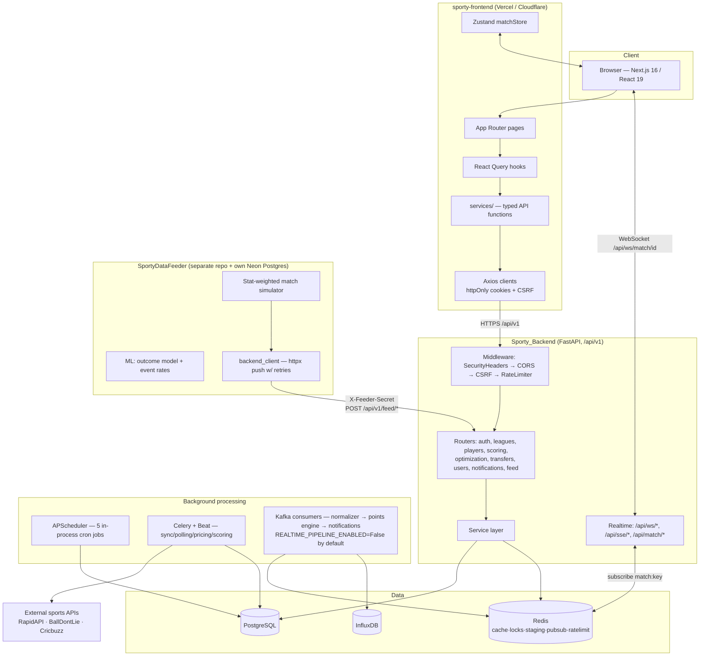
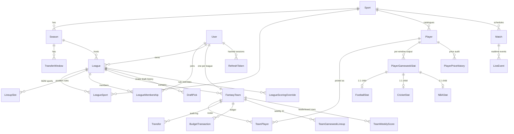
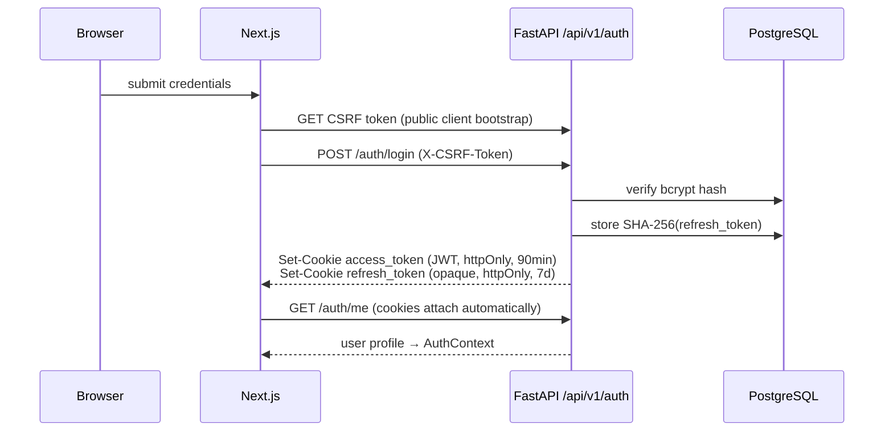
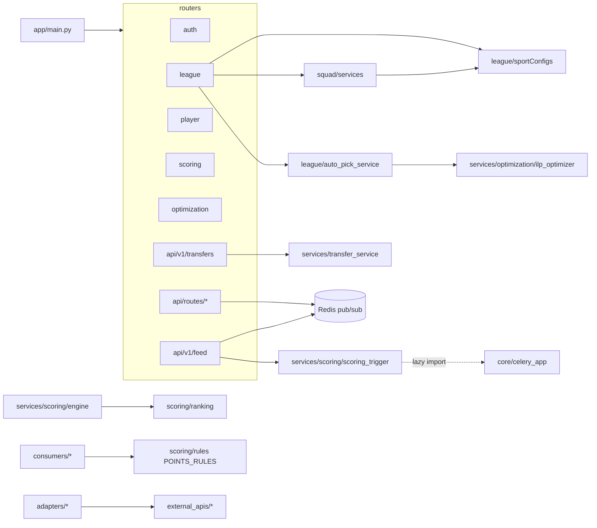
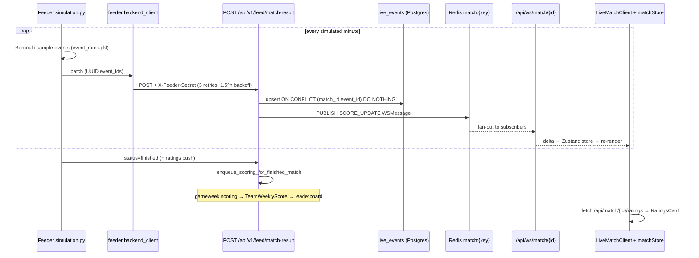
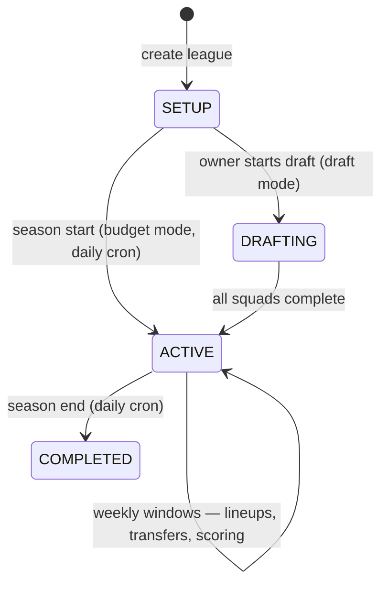

# Sporty — System Architecture & Engineering Onboarding Guide

> Generated 2026-06-12 from the actual codebase (commit `044d8a5` plus the in-flight SportyDataFeeder auth/Docker work). This document covers all **three** codebases that make up the platform:
>
> | Codebase | Path | Role |
> |---|---|---|
> | Sporty Backend | `Sporty_Backend/` | FastAPI API, workers, scoring, ingestion |
> | Sporty Frontend | `sporty-frontend/` | Next.js 16 user-facing app |
> | Sporty Data Feeder | `~/projects/SportyDataFeeder` (sibling repo) | Match simulation + live data push service |
>
> Companion docs: `PROJECT_CONTEXT.md` (living reference), `SYSTEM_DOCUMENTATION.md` (older status report — partially stale on auth/validation), `Sporty_Backend/CLAUDE.md`, `Sporty_Backend/docs/`, and the feeder's `README.md`/`PRD.md`.

---

## Table of Contents

1. [Executive Summary](#1-executive-summary)
2. [Technology Stack Deep Dive](#2-technology-stack-deep-dive)
3. [High-Level Architecture](#3-high-level-architecture)
4. [Project Structure Analysis](#4-project-structure-analysis)
5. [Frontend Deep Dive](#5-frontend-deep-dive)
6. [Backend Deep Dive](#6-backend-deep-dive)
7. [Database & Data Layer](#7-database--data-layer)
8. [Models, Algorithms & Business Logic](#8-models-algorithms--business-logic)
9. [Authentication & Security](#9-authentication--security)
10. [API Reference](#10-api-reference)
11. [Feature-by-Feature Breakdown](#11-feature-by-feature-breakdown)
12. [Infrastructure & Deployment](#12-infrastructure--deployment)
13. [Performance Analysis](#13-performance-analysis)
14. [Technical Debt & Improvement Opportunities](#14-technical-debt--improvement-opportunities)
15. [System Diagrams](#15-system-diagrams)
16. [Developer Onboarding Guide](#16-developer-onboarding-guide)

---

## 1. Executive Summary

### What the system does

**Sporty** is a multi-sport fantasy league platform supporting **Football (Soccer)**, **NBA Basketball**, and **Cricket**. Users create or join private/public leagues, assemble fantasy squads of real athletes under a budget (or via snake draft), set weekly lineups with captain/vice-captain choices, and earn points computed from real-world match performance. Leagues can be single-sport or **mixed** (e.g. football + basketball players in one squad), which is the platform's main differentiator from FPL-style products.

### Core business purpose

The core value loop: **create league → invite friends with a code → draft or buy players within budget → set weekly lineup before the deadline → score points from real matches → climb the leaderboard**. The product targets private friend groups (invite-code leagues) plus public discoverable leagues, with weekly cadence driven by *transfer windows* (gameweeks).

### Key features and modules

| Feature | Where it lives |
|---|---|
| Auth (email + Google OAuth, httpOnly-cookie JWT) | `Sporty_Backend/app/auth/`, `sporty-frontend/src/context/auth-context.tsx` |
| League lifecycle (SETUP → DRAFTING → ACTIVE → COMPLETED) | `app/league/`, `app/services/league_status_service.py` |
| Squad building: budget mode, snake draft, ILP auto-pick | `app/league/`, `app/services/optimization/ilp_optimizer.py`, `app/league/auto_pick_service.py` |
| Squad validation rules per sport | `app/squad/` (schemas + services), `app/league/sportConfigs.py` |
| Transfers (Redis-staged, confirm/cancel session) | `app/api/v1/transfers.py`, `app/services/transfer_service.py` |
| Gameweek scoring + leaderboards | `app/services/scoring/` (engine, player/team scoring, ranking) |
| Scoring rule configuration + per-league overrides | `app/scoring/` |
| Dynamic player pricing | `app/services/pricing/repricing.py` |
| Live match view (score, events, prediction, ratings) | feeder → `app/api/v1/feed.py` → Redis → WS → `src/components/live/` |
| Notifications (in-app + email) | `app/notification/`, `app/services/email_service.py` (Resend) |
| Data ingestion from external sports APIs | `app/external_apis/`, `app/ingestion/`, `app/services/sync/` |
| Match simulation & ML predictions (dev/demo data source) | `SportyDataFeeder` repo |

### Primary user flows

1. **Onboard**: register/login (or Google) → land on dashboard.
2. **League setup**: create league (choose sports, season, budget, squad size, draft vs budget mode) → share invite code → friends join.
3. **Team build**: budget mode (pick players under budget with position/club constraints, optionally "auto-pick" via ILP) or draft mode (turn-based snake picks).
4. **Weekly play**: set lineup + captain before the window's lineup deadline → matches happen → scoring engine computes points → leaderboard updates.
5. **Transfers**: between windows, stage players out/in (Redis session) → confirm → audit-logged swap.
6. **Live match**: open `/match/{id}` → snapshot + WebSocket stream shows live score, events, fantasy point deltas, outcome prediction, post-match player ratings.

### System goals and objectives

- **Multi-sport from day one** — sport-specific logic isolated behind adapters (`ISportAdapter`) and per-sport config (`sportConfigs.py`), so adding a sport touches a known small surface.
- **Correctness of money/points** — `Numeric` decimals everywhere, DB-level invariants (partial unique indexes, check constraints), immutable audit tables (`Transfer`, `BudgetTransaction`, `PlayerPriceHistory`, `DraftPick`).
- **Realtime experience without realtime fragility** — snapshot-first reads, WebSocket/SSE incrementally layered on top, and the heavy Kafka pipeline gated behind `REALTIME_PIPELINE_ENABLED` (default off).
- **Operable as a modular monolith** — one deployable API plus separable worker processes (Celery, Kafka consumers).

---

## 2. Technology Stack Deep Dive

### Backend (`Sporty_Backend/`)

| Layer | Technology | Version | Why / where / how |
|---|---|---|---|
| Framework | FastAPI | 0.129.1 | Async-capable HTTP + WebSocket in one app; Pydantic-native validation. Entry: `app/main.py`. All REST under `/api/v1`, realtime under `/api`. |
| ASGI server | Uvicorn + uvloop | 0.41.0 | Production server inside the Docker image; `--reload` in dev. |
| ORM | SQLAlchemy 2.0 | 2.0.46 | Declarative models per domain module. **Two engines**: sync (`app/database.py`, psycopg2) for routers/jobs, async (`app/core/database.py`, asyncpg) for realtime routes only. |
| DB | PostgreSQL | — | Source of truth. Postgres-specific features used deliberately: partial unique indexes, `ON CONFLICT` upserts, `RANK()` window functions, JSONB. |
| Migrations | Alembic | 1.18.4 | 17+ versions; autogenerate workflow documented in `migration_commands.sh`. |
| Validation | Pydantic v2 | 2.12.5 | Request/response schemas per module (`*/schemas.py`); `pydantic-settings` for config (`app/core/config.py`). |
| Cache / state | Redis | — | Five distinct jobs: rate-limit counters, player-list cache warming, transfer staging sessions, distributed locks (`app/core/redis_lock.py`), and pub/sub fan-out for live updates. Celery uses db 1 (broker) and db 2 (results). |
| Task queue | Celery + Beat | — | `app/core/celery_app.py`, schedule in `app/tasks/celery_schedule.py`. External-data sync, live polling, scoring refresh, pricing, transfers. |
| In-process cron | APScheduler | 3.11.0 | Five jobs started in the FastAPI lifespan (see §6). Chosen for jobs that must exist even in single-process deployments. |
| Event streaming | aiokafka (Kafka) | 0.12.0 | Realtime match-event pipeline (normalizer → points engine → notifications). **Gated by `REALTIME_PIPELINE_ENABLED=False`** — exists, not prod-tested. |
| Time series | influxdb-client | 1.49.0 | Live event telemetry for the Kafka pipeline. |
| Optimization | PuLP (ILP solver) | 2.9.0 | Auto-pick squad builder (`app/services/optimization/ilp_optimizer.py`). |
| Auth | python-jose + passlib/bcrypt | — | JWT (HS256) access tokens, bcrypt password hashes (`app/core/security.py`). |
| Email | Resend | 2.13.0 | Password reset + transfer-window notification emails (`app/services/email_service.py`). |
| Push | firebase-admin, APNS | — | Push notification delivery (notification consumer). |
| Resilience | tenacity + pybreaker | 1.4.1 | Retries and circuit breakers around external sports APIs. |
| Metrics | prometheus-fastapi-instrumentator | 7.1.0 | `/metrics` scrape endpoint. |

Python 3.14 locally (`venv/`), but **the production Docker image pins Python 3.11** — stick to 3.11-compatible syntax.

### Frontend (`sporty-frontend/`)

| Layer | Technology | Version | Why / where / how |
|---|---|---|---|
| Framework | Next.js (App Router) | 16.2.1 | Route groups `(auth)`/`(dashboard)`/`(public)` + `match/[matchId]`. `next.config.ts` proxies `/api/*` → backend in dev and redirects legacy `/league/:id*` → `/leagues/:id*`. |
| Runtime | React | 19.2.4 | Client components dominate; data fetching is client-side via React Query. |
| Language | TypeScript | ^5 | Strict; `@/*` → `src/*` path alias. |
| UI | Mantine Core ^9 + Tailwind ^4 | — | Convention: Mantine for components, Tailwind for layout/spacing (`AGENTS.md`). Lucide icons, @dnd-kit for drag-and-drop lineup building. |
| Server state | TanStack Query | ^5.95.2 | All API data. Generic wrappers `src/hooks/api/useApiQuery.ts` / `useApiMutation.ts`; domain hooks per folder. |
| Client state | Zustand | ^5.0.8 | `src/store/matchStore.ts` — transient live-match state driven by WebSocket messages. |
| Forms/validation | React Hook Form + Zod | ^7 / ^4 | Zod schemas in `src/lib/validations.ts` and per-feature. |
| HTTP | Axios | ^1.14.0 | Two instances: `src/api/auth-api-client.ts` (credentialed, auto-refresh on 401, CSRF header) and `src/api/public-api-client.ts` (CSRF token bootstrap). |
| Package manager | **Yarn 4** | 4.15.0 | Use `yarn`, never npm. |
| Deployment | Vercel + Cloudflare Workers | — | Production at `https://sporty-woad.vercel.app`; `yarn deploy` runs wrangler. |

### Data Feeder (`~/projects/SportyDataFeeder`)

| Layer | Technology | Why |
|---|---|---|
| FastAPI + SQLAlchemy 2.0 + Alembic | Same stack as backend, smaller footprint. Own Postgres (Neon); **no Redis** — the Sporty backend owns Redis. |
| scikit-learn | Match outcome model: `Pipeline(MinMaxScaler, LogisticRegression)` trained on per-player features; `event_rates.pkl` for simulation probabilities. |
| httpx | Authenticated async pushes to `{SPORTY_BACKEND_URL}/api/v1/feed/*` with retry/backoff. |
| asyncio | Live match simulation as background tasks (no worker processes needed). |

### Third-party services

- **RapidAPI Football**, **BallDontLie / nba_api** (basketball), **Cricbuzz** (cricket) — `app/external_apis/*`, wrapped in tenacity retries + pybreaker circuit breakers.
- **Google OAuth** — ID-token verification against `GOOGLE_CLIENT_ID`.
- **Resend** (email), **Firebase Admin / APNS** (push).
- **Neon** (feeder's Postgres), **Vercel** (frontend hosting).

---

## 3. High-Level Architecture

### Complete overview



### System boundaries

- **Frontend ↔ Backend**: HTTPS only, everything under `/api/v1` (REST) and `/api` (WS/SSE/snapshots). Contract is centralized in `sporty-frontend/src/api/apiPath.ts` — when a backend route changes, that file and the matching service must change with it.
- **Feeder ↔ Backend**: server-to-server HTTP, authenticated by the `X-Feeder-Secret` shared header (no cookies, no CSRF). The feeder never touches Sporty's database or Redis; it only knows three `/api/v1/feed/*` endpoints. Identity is reconciled through the feeder's `entity_links` table (feeder integer id → Sporty UUID).
- **Backend ↔ external APIs**: outbound only, isolated in `app/external_apis/` behind retries/circuit breakers; raw data lands in staging tables (`IngestionPlayer`, `IngestionTeam`) before promotion.

### Request lifecycle (authenticated REST call)

1. Component calls a domain hook (e.g. `useMyTeam`) → React Query → service function (`TeamService.ts`) → `authApiClient` (Axios).
2. Browser attaches `access_token`/`refresh_token` **httpOnly cookies** automatically; the Axios interceptor injects `X-CSRF-Token` for state-changing verbs.
3. In dev, Next.js rewrites `/api/:path*` → `BACKEND_SERVER_URL` (default `http://localhost:8000`) so cookies stay same-origin.
4. Backend middleware chain: SecurityHeaders → CORS → CSRF double-submit check → Redis sliding-window rate limit.
5. Router validates with Pydantic, opens a request-scoped sync DB session (`Depends(get_db)`), calls service functions (which **never commit**), commits, responds.
6. On 401, the Axios interceptor calls `/auth/refresh` once and replays the original request; refresh failure broadcasts an auth-invalidation event (`src/lib/auth-events.ts`) that logs the user out.

### Architectural patterns used

- **Modular monolith with vertical slices** — each backend domain owns `models.py / router.py / services.py / schemas.py`.
- **Adapter pattern** — `ISportAdapter` (`app/adapters/base.py`) normalizes per-sport external payloads; `ADAPTER_REGISTRY` keyed by sport name.
- **Strategy-by-config** — squad rules in `sportConfigs.py` dicts; scoring rules as data (`DefaultScoringRule` rows + `POINTS_RULES` lambdas).
- **Transaction ownership convention** — services never `db.commit()`; the router or scheduler job that opened the session owns the transaction.
- **Staged-session workflow** — transfers stage in Redis before an atomic confirm, letting the UI show pending state cheaply.
- **Snapshot + stream** — live pages fetch a REST snapshot first, then apply WS deltas (avoids cold-start race conditions).
- **Idempotent ingestion** — every live event carries a UUID `event_id`; the backend upserts `ON CONFLICT (match_id, event_id) DO NOTHING`, so feeder retries/replays are always safe.

### Design decisions and tradeoffs

| Decision | Tradeoff accepted |
|---|---|
| httpOnly-cookie JWT instead of localStorage tokens | Requires CSRF middleware + careful CORS/cookie-domain config per environment; immune to XSS token theft. |
| Sync SQLAlchemy for most routes, async only for realtime | Two session factories to maintain, but avoids an all-async rewrite and keeps Celery/scheduler code simple. |
| Kafka pipeline built but feature-flagged off | Live scoring currently flows through the simpler feeder→feed-API→Redis path; Kafka is ready for real provider webhooks but unproven. |
| Feeder as a separate repo/service with its own DB | Demo/live data generation can't corrupt production data; costs an entity-link mapping layer. |
| ILP (exact) optimizer instead of greedy heuristics | PuLP solve cost is fine at current candidate sizes; guarantees constraint-valid squads and explains infeasibility. |
| Scores derived from events in the feeder (never stored) | Replay always reproduces state; costs recomputation per read. |

---

## 4. Project Structure Analysis

### Monorepo root (`~/projects/Sporty/`)

```
Sporty/
├── Sporty_Backend/          # FastAPI app + workers (deployed independently)
├── sporty-frontend/         # Next.js app (deployed independently)
├── EPL/                     # Premier League CSV datasets (seeder input)
├── basketball/              # NBA CSV datasets (seeder input)
├── graphify-out/            # knowledge-graph tooling output (not app code)
├── merge_chunks.py          # data utility, not app code
├── PROJECT_CONTEXT.md       # living architecture reference
├── SYSTEM_DOCUMENTATION.md  # older status report (pre-cookie-auth; treat §5/§8 with care)
└── SYSTEM_ARCHITECTURE.md   # this document
```

### Backend (`Sporty_Backend/app/`) — folder by folder

| Folder | Responsibility |
|---|---|
| `main.py` | App factory: imports **every model module first** (so SQLAlchemy resolves string-based relationships), installs middleware, registers routers, starts APScheduler + optional Kafka producer in the lifespan, runs `settings.validate_production()`. |
| `database.py` | **Sync** engine, `SessionLocal`, `get_db` dependency (psycopg2). Default session for routers, services, jobs. |
| `core/` | `config.py` (pydantic-settings, all env), `database.py` (**async** engine for realtime, rewrites URL to `postgresql+asyncpg://`), `redis.py` (sync + async clients), `redis_lock.py` (distributed locks), `celery_app.py`, `security.py` (JWT/bcrypt/Google verification), `influx.py`, `metrics.py`. |
| `auth/` | Register/login/refresh/logout, Google OAuth + account linking, password reset. Sets/clears the auth cookies. |
| `league/` | The biggest module: league CRUD, membership, draft, budget team build, lineups, leaderboard endpoint, transfer-window generation, `sportConfigs.py` (squad rules), `auto_pick_service.py` (wraps the ILP optimizer). |
| `squad/` | Squad validation extracted into its own slice (`schemas.py`, `services.py`) — validates squad composition against sport configs (recently added; older docs claim it's empty). |
| `player/` | Player catalogue, filters, per-window stats, price history. `models.py` + `models_nba.py`. |
| `match/` | `Match` model (real-world fixture; `external_api_id` links to feeder/provider ids). |
| `scoring/` | Persistent rule config: `DefaultScoringRule`, `LeagueScoringOverride`, plus `rules.py` (realtime `POINTS_RULES` lambdas for the Kafka points engine). |
| `services/` | Cross-cutting business logic: `scoring/` (batch engine — see §8), `optimization/` (ILP), `pricing/` (repricing), `sync/` (live-data sync, partially stubbed), `transfer_service.py`, `transfer_window_service.py`, `league_status_service.py`, `cache_warming_service.py`, `email_service.py`, `notification_service.py`, `price_update_service.py`, `match_scheduler.py`, `budget_utils.py`. |
| `api/` | Non-slice routes: `v1/transfers.py` (staged transfers), `v1/feed.py` (feeder ingestion), `routes/match.py` (snapshot + prediction + ratings), `routes/websocket.py`, `routes/sse.py`, `deps.py` (current-user dependencies). |
| `adapters/` | `ISportAdapter` + football/cricket/basketball implementations + `registry.py`. |
| `consumers/` | Kafka consumers: `normalizer.py`, `points_engine.py`, `notifications.py`. |
| `workers/` | `entry_points.py` — CLI to run each Kafka consumer as its own process. |
| `tasks/` | Celery task modules: `sync_tasks.py`, `live_polling_tasks.py`, `scoring_tasks.py`, `pricing_tasks.py`, `transfer_tasks.py`, `celery_schedule.py` (Beat schedule). |
| `middleware/` | `security_headers.py`, `csrf.py` (double-submit), `rate_limiter.py` (Redis sliding window). |
| `external_apis/` | RapidAPI football, basketball (+ BallDontLie), cricket clients. |
| `ingestion/` | Orchestrator + staging models for external player/team data. |
| `models/` | Shared realtime models: `db/live_event.py` (LiveEvent table), `schemas/events.py` (`NormalizedEvent`, `WSMessage`). |
| `notification/`, `user/` | In-app notifications; user profiles/activity. |

Supporting directories: `alembic/` (migrations are the schema source of truth), `tests/` (pytest; SQLite shims in `conftest.py`), `scripts/` (seeders + one-off sync scripts), `docs/` (realtime pipeline architecture, RapidAPI guide, production checklist).

### Frontend (`sporty-frontend/src/`) — folder by folder

| Folder | Responsibility |
|---|---|
| `app/` | App Router. Route groups: `(auth)` login/signUp/forgot/reset + Google callback, `(dashboard)` all protected pages (`dashboard`, `create-league`, `join-league`, `create-team`, `leagues/[id]/...`, `my-team`, `transfers`, `profile`, `user/[id]`), `(public)` landing, `match/[matchId]` live view. |
| `api/` | `apiPath.ts` (the **endpoint registry** — every backend URL used anywhere), `auth-api-client.ts`, `public-api-client.ts`. |
| `services/` | Typed API functions per domain: `LeagueService`, `TeamService`, `PlayerService`, `ScoringService`, `OptimizationService`, `UserService`, `FeatureService`, plus `categories/` and `user/` submodules. UI never calls Axios directly. |
| `hooks/` | `api/` generic `useApiQuery`/`useApiMutation` wrappers; domain folders (`auth`, `leagues`, `my-team`, `players`, `scoring`, `users`, `dashboard`, `general`, `specific`); `useMatchSocket.ts` for the live WebSocket. |
| `store/` | `matchStore.ts` (Zustand) — live match state. |
| `context/` | `auth-context.tsx` (session bootstrap, login/logout), `Query-context.tsx` (QueryClient provider). |
| `features/` | Feature modules composing components + hooks: `create-league`, `create-team`, `join-league`, `leagues`, `my-team`, `transfers`, `profile`, `dashboard`, `auth`, `landing`, `gallery`, `users`, `user-profile`. |
| `components/` | Shared component trees: `auth/` (forms + route guards), `dashboard/`, `landing/`, `live/` (LiveMatchClient, ScoreTicker, PointsCard, LineupCard, PredictionCard, RatingsCard, LiveLeaderboard, ToastAlert), `ui/` primitives. |
| `lib/` | Cross-cutting utilities: `realtimeApi.ts` (snapshot/prediction/ratings fetchers), `socket.ts` (WS URL derivation + connection), `league-lifecycle.ts`, `route.config.ts`/`route.utils.ts` (protected route map), `storage.*` (typed local/session storage), `sanitize.ts`, `validations.ts` (Zod), `toastifier.ts`, `auth-events.ts`. |
| `types/`, `domain/`, `utils/` | API response types (`league.ts`, `player.ts`, `events.ts`), domain types, helpers. |

### Feeder (`~/projects/SportyDataFeeder/`) — folder by folder

| Path | Responsibility |
|---|---|
| `app/main.py` | FastAPI entry; **R-2.10 auth middleware** (every route except `/health`, `/docs`, `/openapi.json` requires `X-Feeder-Secret`); lifespan loads pkl models into `app.state`. |
| `app/config.py` | Single cached `Settings` (`DATABASE_URL`, `SPORTY_BACKEND_URL`, `FEEDER_SECRET`, `SIMULATION_SPEED`). |
| `app/database.py` | Models: `Sport`, `Team`, `Player`, `Match`, `Event`, `EntityLink`, `PlayerStat`, `MatchPrediction`, `PlayerMatchRating`. |
| `app/routers/` | CRUD + `/simulate`, `/matches/{id}/events`, `/matches/{id}/replay-push`, `/predict`, `/imports/*`, `/links`. |
| `app/services/` | `simulation.py` (asyncio Bernoulli-sampling loop), `scoring_rules.py` (single scoring truth), `backend_client.py` (push w/ retries), `features.py` (per-90 rates, EWMA form), `ml_models.py`, `rater.py` (rule-based ratings + man-of-match), `importer.py` (CSV), `links.py`, `sport_resolver.py`. |
| `scripts/` | `seed_sports.py`, `train_models.py`. |
| `alembic/` | Migrations 0001–0003 (`event_id` idempotency column added in 0003). |

### Configuration management

- **Backend**: everything via `app/core/config.py` (pydantic-settings reading `.env`). Required at boot: `DATABASE_URL`, `REDIS_URL`, `JWT_SECRET_KEY` (≥32 chars), `GOOGLE_CLIENT_ID`. `settings.validate_production()` refuses to boot on bad config. Key flags: `REALTIME_PIPELINE_ENABLED`, `FEEDER_SECRET`, `REDIS_PUBSUB_PREFIX` (default `"match"`), `CORS_PRODUCTION_ORIGINS`/`CORS_LOCAL_ORIGINS`, `COOKIE_DOMAIN`, per-endpoint `RATE_LIMIT_*_RPM`.
- **Frontend**: `NEXT_PUBLIC_API_URL` (e.g. `/api/v1`) — Axios base path; `BACKEND_SERVER_URL` — dev proxy target.
- **Feeder**: `app/config.py` only; no `os.getenv` anywhere else. `FEEDER_SECRET` **must be identical** in feeder and backend `.env`.

---

## 5. Frontend Deep Dive

### Routing architecture

App Router with three route groups plus the live-match route:

- `(auth)`: `/login`, `/signUp`, `/forgot-password`, `/reset-password`, Google OAuth callback. Wrapped by `GuestOnlyRoute` (`src/components/auth/`).
- `(dashboard)`: everything behind `ProtectedRoute` — `/dashboard`, `/create-league`, `/join-league`, `/create-team`, `/my-team`, `/transfers`, `/profile`, `/user/[id]`, and `/leagues/[id]` with nested `leaderboard`, `lineup`, `members`, roster and settings pages.
- `(public)`: landing/marketing.
- `match/[matchId]`: live match page (snapshot + WebSocket).

`next.config.ts` does two things that matter: dev rewrite `/api/:path*` → `BACKEND_SERVER_URL` (cookie same-origin trick), and permanent redirects `/league/:id*` → `/leagues/:id*` (legacy singular tree).

### State management architecture

Three deliberate layers, each owning a different change frequency:

1. **React Query** (server state, seconds-to-minutes): all REST data. Generic wrappers in `src/hooks/api/` standardize keys/options; domain hooks (e.g. `hooks/leagues/`, `hooks/my-team/`) call services and define cache keys + invalidations.
2. **Auth Context** (session, app lifetime): `auth-context.tsx` bootstraps the session on mount — since tokens are httpOnly cookies it simply calls `/auth/me` (after a CSRF bootstrap via the public client) and stores the user object; it listens for auth-invalidation events from the Axios layer to force logout.
3. **Zustand** (`matchStore.ts`, sub-second): live match state — score, events feed, per-player fantasy points, lineup, match status — mutated directly by WebSocket message handlers, keeping high-frequency updates out of React Query's cache.

### Data fetching strategy & API integration layer

```
component → domain hook (React Query) → service function → axios instance → /api/v1/*
```

- `apiPath.ts` is the single URL registry (`API_PATHS.LEAGUES.LEADERBOARD(id, windowId)` etc.).
- `auth-api-client.ts`: `withCredentials`, request interceptor injects `X-CSRF-Token` on state-changing verbs, response interceptor performs **one** silent `/auth/refresh` then replays the failed request; a second failure emits the logout event.
- `public-api-client.ts`: unauthenticated calls + fetching/holding the in-memory CSRF token.
- The live-match page bypasses Axios deliberately: `lib/realtimeApi.ts` uses bare `fetch` for snapshot/prediction/ratings (`/api/match/{id}/state|prediction|ratings`) and `lib/socket.ts` derives the WS URL from `NEXT_PUBLIC_API_URL` (`/api/ws/match/{id}`).

### Component hierarchy & reusable patterns

- `features/<name>/` composes screens from `components/` + domain hooks (logic/presentation separation per `AGENTS.md`).
- The live view: `match/[matchId]/page.tsx` → `LiveMatchClient.tsx` (orchestrates snapshot fetch, store hydration, `useMatchSocket` subscription, prediction/ratings polling) → presentational cards (`ScoreTicker`, `PointsCard`, `LineupCard`, `PredictionCard`, `RatingsCard`, `LiveLeaderboard`).
- Forms: React Hook Form + Zod schemas (newer screens); some older forms still validate manually — a known inconsistency (§14).

### Error handling strategy

- Axios interceptor normalizes 401 (refresh-or-logout) globally.
- React Query exposes `isError`/`error` per hook; screens render error and empty states (convention enforced by `AGENTS.md`).
- `toastifier.ts` + Mantine notifications for mutation feedback; `sanitize.ts` for user-content safety.
- WebSocket: `useMatchSocket` handles reconnects; the snapshot fetch on mount means a dropped socket degrades to "slightly stale" rather than blank.

### Performance practices

- React Query caching dedupes per-key requests across components; mutation-driven invalidation rather than polling for most data.
- Zustand isolates high-frequency live updates from the query cache (no cache-thrash during matches).
- Backend cache-warming (player lists in Redis) keeps the heaviest list endpoint fast.
- Note: there is **no frontend test runner wired up** (`__tests__/example.spec.ts` is Playwright with no config/script).

---

## 6. Backend Deep Dive

### API architecture

Vertical-slice routers wired in `app/main.py`, all REST under `/api/v1`:
`auth`, `leagues` (33 routes — the gameplay core), `players` (5), `scoring` (4), `optimization` (1), `notifications` (2), `users` (6), `transfers` (4), `feed` (3 + health), plus realtime under `/api`: match snapshot/prediction/ratings (3), WebSockets (2), SSE (1). `/health` (no auth, no DB) and `/metrics` (Prometheus) round it out.

Routers are thin HTTP adapters: parse/validate with Pydantic → call service functions → commit → map to response schemas. Business rules raise domain exceptions translated to 4xx HTTPExceptions at the router.

### Service layer & transaction ownership

The single most important backend convention: **service functions never call `db.commit()`**. The router (or scheduler job, or Celery task) that opened the session owns the transaction. This makes services composable — e.g. confirming a transfer can call budget, roster, and audit services inside one atomic transaction.

### Middleware (order matters — outermost first)

1. **SecurityHeaders** (`middleware/security_headers.py`): CSP, HSTS, X-Frame-Options, X-Content-Type-Options.
2. **CORS**: env-driven origins (production: the Vercel domain + preview subdomains; local: localhost list). Credentialed, since auth is cookie-based.
3. **CSRF** (`middleware/csrf.py`): double-submit cookie — state-changing requests must carry `X-CSRF-Token` matching the CSRF cookie. Exempt: `/health`, `/docs`, and the server-to-server `/api/v1/feed/*`.
4. **RateLimiter** (`middleware/rate_limiter.py`): Redis sliding-window counters per IP; global default plus per-endpoint overrides for `/auth/login`, `/auth/register`, `/auth/refresh`, `/auth/forgot-password`, `/auth/reset-password` (settings-driven RPMs; defaults documented as global 120 / login 10 / register 5).

There is also a `_cors_diagnostics_middleware` in `main.py` that logs every request/response — flagged for removal before high traffic (§14).

### Background processing — three systems

| System | Runs where | Jobs |
|---|---|---|
| **APScheduler** (`BackgroundScheduler`, UTC) | In-process, started in lifespan | `daily_transfer_window_notifications` (08:00), `daily_league_lifecycle` (00:00), `daily_cache_warming` (00:05), `price_update_every_4h` (`*/4`), `gameweek_ranking_update` (02:00). Each job opens its own `SessionLocal` and commits itself. |
| **Celery + Beat** | Separate worker process(es), Redis broker db 1 / results db 2 | External-data sync, live polling (protected by `redis_lock` so only one worker polls), scoring refresh, pricing, transfer maintenance (`app/tasks/*`). |
| **Kafka pipeline** | Separate consumer processes via `app/workers/entry_points.py` | `normalizer` (raw → `NormalizedEvent`) → `points-engine` (applies `POINTS_RULES`, publishes to Redis) → `notifications`. Gated by `REALTIME_PIPELINE_ENABLED=False`; uses InfluxDB for time-series. |

### Feeder ingestion endpoint (`app/api/v1/feed.py`) — the live-data entry point

- `verify_feeder_secret` dependency: 503 if `FEEDER_SECRET` unset, 401 on mismatch (constant-time compare; value never logged).
- `POST /feed/match-result`: idempotent upsert of `live_events` (`ON CONFLICT (match_id, event_id) DO NOTHING`), updates match score/status, publishes a `SCORE_UPDATE` `WSMessage` to Redis channel `{REDIS_PUBSUB_PREFIX}:{external_api_id or match.id}`, and on the live→finished transition **immediately** enqueues gameweek scoring (`enqueue_scoring_for_finished_match` — imported lazily inside the handler because `scoring.trigger ↔ celery_app ↔ tasks` form an import cycle).
- `POST /feed/prediction` / `POST /feed/player-ratings`: `SETEX prediction:match:{id}` / `ratings:match:{id}`, 24h TTL — served back by `/api/match/{id}/prediction|ratings`.

### Validation & error handling

- Pydantic schemas per module for request/response shapes.
- DB-level guard rails as the last line: check constraints, partial unique indexes, FKs (§7).
- External API calls wrapped in tenacity retries + pybreaker circuit breakers — a dead provider degrades the sync job, never the API process.
- Squad/team building validated by `app/squad/services.py` against `sportConfigs.py` rules before any persistence.

---

## 7. Database & Data Layer

### Conventions

All models use **UUID primary keys**, timezone-aware timestamps, and `Numeric(12,2)` for money (never Float). String-based ORM relationships avoid circular imports; `app/main.py` imports every model module before routers so SQLAlchemy can resolve them. **Alembic is the schema source of truth** (17+ migrations); the app never `create_all`s in production.

### Entity hierarchy (Sporty backend, PostgreSQL)



Plus: `DefaultScoringRule` (sport-wide rules), `Notification`, `IngestionPlayer`/`IngestionTeam` (external-API staging tables).

### Key invariants enforced in the database

| Invariant | Mechanism |
|---|---|
| One FantasyTeam per user per league | `uq_team_league_user` unique constraint |
| One *active* TeamPlayer per player per team | partial unique index on `released_window_id IS NULL` (`uix_team_player_active`) |
| One captain / one vice per team per window | partial unique indexes on `TeamGameweekLineup` |
| Budget never negative | `ck_team_budget_non_negative` check constraint |
| Window ordering sane | check: `transfer_deadline_at < lineup_deadline_at <= end_at` |
| League names unique per season | unique constraint |
| Draft positions unique per league, NULL allowed pre-draft | partial unique index |
| Live event idempotency | unique `(match_id, event_id)` + `ON CONFLICT DO NOTHING` |

Season/TransferWindow **overlap** prevention is currently service-layer only; `btree_gist` `ExcludeConstraint`s are a documented TODO (§14).

### Query patterns & caching

- Request-scoped sync sessions for REST; async sessions only on WS/SSE/snapshot paths.
- Leaderboards: denormalized `TeamWeeklyScore` rows (points per window, `rank_in_league`) — ranks computed by SQL `RANK()` in `app/services/scoring/ranking.py`, refreshed by the scoring engine and the 02:00 ranking cron.
- Redis caching: warmed player lists (00:05 daily), leaderboard cache keys invalidated by the scoring engine, prediction/ratings snapshots with 24h TTL.
- Live match state: Redis (pub/sub channel `match:{key}` + snapshot keys read by `/api/match/{id}/state`).

### Feeder database (separate Neon Postgres)

`sports`, `teams`, `players`, `matches`, `events` (with UUID `event_id`, `extra` as JSON-in-TEXT), `entity_links` (feeder id ↔ Sporty UUID, unique `(feeder_entity, feeder_id)`), `player_stats` (per-gameweek, unique `(player_id, gameweek, season)`), `match_predictions`, `player_match_ratings`. Scores are **never stored** — always derived by replaying events through `scoring_rules.score_events`.

### Data lifecycle

1. **Reference data in**: CSV seeders (`EPL/`, `basketball/` → `scripts/`) or external API ingestion → staging tables → promotion to `Player`/`RealTeam`.
2. **Live data in**: feeder pushes events per simulated minute → `live_events` + match score → Redis publish.
3. **Scoring out**: on match finish (or scheduled), the scoring engine writes `PlayerGameweekStat` (+ sport child rows) → `TeamWeeklyScore` → ranks.
4. **Pricing feedback**: every 4h, repricing reads recent `PlayerGameweekStat` form and adjusts `Player.cost`, appending `PlayerPriceHistory`.

---

## 8. Models, Algorithms & Business Logic

### 8.1 ILP squad optimizer (the "auto-pick" brain)

- **Location**: `app/services/optimization/ilp_optimizer.py` (182 lines), exposed via `POST /api/v1/optimization/lineup` and `app/league/auto_pick_service.py`.
- **Purpose**: select a constraint-valid squad maximizing projected points.
- **Inputs**: `CandidatePlayer[]` (id, sport, position, club, cost, projected_points, availability) + `OptimizerConstraints` (budget, squad_size, per-position min/max/exact, per-sport min/max — this is how mixed leagues work — `max_per_club` (default 3, `DEFAULT_MAX_PER_CLUB` in `sportConfigs.py`), locked/banned player sets, vice bonus multiplier).
- **Method**: binary decision variable per candidate; PuLP CBC solve; objective = Σ projected_points·x. On infeasibility, `_diagnose_infeasible` explains *why* (e.g. locked∩banned, not enough available defenders, budget too small) instead of a bare error — this string surfaces to the UI.
- **Complexity**: NP-hard in general; trivial at real sizes (hundreds of candidates, one binary var each — CBC solves in milliseconds).

### 8.2 Gameweek scoring engine (batch layer)

- **Location**: `app/services/scoring/engine.py` → `player_scoring.py`, `team_scoring.py`, `ranking.py`.
- **Algorithm** (`score_transfer_window_for_league`): acquire Redis lock `lock:score:{league}:{window}` (TTL 300s, skip if held) → score player stats per sport rules for the window (football/cricket/NBA scorers write `fantasy_points` onto `PlayerGameweekStat`) → upsert `TeamWeeklyScore` per fantasy team (sums starters, applies captain/vice multipliers from `TeamGameweekLineup`) → apply SQL `RANK()` rankings → invalidate the leaderboard cache key.
- **Triggers**: feeder match-finish (`enqueue_scoring_for_finished_match`), Celery scoring tasks, and the 02:00 ranking cron.
- **Complexity**: O(players-in-window + teams-in-league) per league-window; lock prevents duplicate concurrent runs.

### 8.3 Dynamic player repricing

- **Location**: `app/services/pricing/repricing.py` (206 lines), run by `price_update_every_4h`.
- **Inputs**: recent `PlayerGameweekStat` fantasy points per player; per-sport `PricingPolicy` (football: cost 4.0–20.0, baseline 6.0 pts, factor 0.15; basketball: 5.0–22.0, baseline 8.0, factor 0.12; cricket: 4.0–20.0, baseline 7.0, factor 0.13; all capped at `max_step_per_run = 1.50`).
- **Method**: weighted recent form vs. the sport baseline → target cost delta = (form − baseline) × points_to_cost_factor → clamp to policy bounds and per-run step cap → write new `Player.cost` + immutable `PlayerPriceHistory` row (delta + `algorithm_version`).
- **Why step caps**: prevents one monster gameweek from doubling a price; price discovery is gradual and auditable.

### 8.4 Realtime event scoring (stream layer)

- **Location**: `app/scoring/rules.py` (31 lines) — `POINTS_RULES: dict[SportType, dict[EventType, lambda]]` mapping a `NormalizedEvent` to points; consumed by the Kafka `points_engine` consumer. Kept deliberately tiny and pure so the streaming path has no DB dependency.

### 8.5 League lifecycle state machine

- **Location**: `app/services/league_status_service.py`, daily 00:00 cron.
- `SETUP → DRAFTING → ACTIVE → COMPLETED`, keyed off Season/TransferWindow dates; budget-mode leagues skip DRAFTING. `allow_midseason_join=True` permits late joins on ACTIVE budget leagues (with eligibility recorded on the membership).

### 8.6 Transfer staging workflow

- **Location**: `app/api/v1/transfers.py` + `app/services/transfer_service.py`.
- Stage-out and stage-in operations accumulate in a Redis session keyed to the user+league; `confirm` validates window state, budget, and squad legality, then atomically writes `Transfer` audit rows, `TeamPlayer` release/acquire rows, and `BudgetTransaction` ledger entries in one DB transaction. `cancel` just drops the Redis session.

### 8.7 Feeder: simulation, features, ML

| Algorithm | Location | What it does |
|---|---|---|
| Stat-weighted live simulation | `app/services/simulation.py` | Per simulated minute, Bernoulli-samples each player's per-minute event probabilities from `event_rates.pkl` (league-average fallback for cold starts); writes events with UUID `event_id`; pushes one HTTP batch per minute; sleeps `SIMULATION_SPEED` real seconds per minute (0 = max speed). Match-scoped registry keeps concurrent simulations independent; duplicate `/simulate` → 409. |
| Feature engineering | `app/services/features.py` | `compute_player_features`: per-90 rates, **EWMA form index (α=0.4, newest heaviest)**, per-minute event rates, never-raising cold-start fallbacks. `compute_team_strength`: mean form/15 clamped 0..1 (0.5 when empty). |
| Outcome prediction | `app/services/ml_models.py`, `scripts/train_models.py` | sklearn `Pipeline(MinMaxScaler, LogisticRegression)` → home/draw/away probabilities (labels mapped via `model.classes_`); heuristic fallback from team strengths when the pkl is missing. Trains only with ≥5 finished matches; ≥20 adds a stratified 80/20 split + classification report. |
| Post-match ratings | `app/services/rater.py` | Rule-based: base 6.0, event-weighted adjustments, clamp 1–10; `find_man_of_match` (ties → lowest player id). |
| Event scoring | `app/services/scoring_rules.py` | The feeder's single scoring truth: football counts goals; basketball sums `points` from `extra` (canonical fallbacks for `point_2`/`point_3`/`free_throw`). Scores derived, never stored. |
| Sport resolution | `app/services/sport_resolver.py` | Alias map → `SportType` enum; the only place sport-name matching lives. |

---

## 9. Authentication & Security

### Login flow (email/password)



### Token lifecycle

- **Access token**: JWT HS256, 90-minute TTL, httpOnly+Secure cookie. No token ever exists in JavaScript.
- **Refresh token**: opaque random string, 7 days, stored server-side **only as SHA-256 hash** — a leaked DB row reveals nothing usable. Rotation on refresh; `/auth/logout/all` revokes every session.
- **401 handling**: the Axios interceptor refreshes once and replays; a failed refresh emits a logout event that clears AuthContext.
- **Password reset**: short-lived (30 min) token, SHA-256 hash in `User.password_reset_token_hash`, delivered via Resend.
- **Google OAuth**: ID token verified against `GOOGLE_CLIENT_ID`; providers `LOCAL`/`GOOGLE` with a DB CHECK constraint enforcing provider-specific non-null fields; `/auth/google/link` attaches Google to an existing account.

### Authorization model

- Coarse: authenticated vs. not (`app/api/deps.py` current-user dependencies).
- Domain-level: league ownership checks (only owners mutate league settings/scoring overrides), membership checks (only members read league internals), draft-turn enforcement. There is no separate RBAC table — authorization derives from ownership/membership rows.
- Frontend mirrors this with `ProtectedRoute`/`GuestOnlyRoute` and `route.config.ts`, but the backend is the enforcement point.

### Machine-to-machine auth

- Feeder→backend: `X-Feeder-Secret` shared header, constant-time compare, 503 when unconfigured (fails closed), CSRF-exempt.
- Backend-of-feeder: same header required on the feeder's own API (R-2.10 middleware), so a feeder instance exposed to the network is not an open CRUD surface.

### Security best practices in place

httpOnly cookies (XSS-immune token storage); CSRF double-submit; per-endpoint rate limiting; security headers (CSP/HSTS/XFO/XCTO); hashed refresh + reset tokens; constant-time secret comparison; secrets never logged; `validate_production()` boot check; idempotent ingestion (no replay attacks via duplicate events).

### Known weaknesses / watch items

- `SYSTEM_DOCUMENTATION.md` §8 still describes localStorage tokens — **stale**; the cookie migration already happened. Trust this document and `PROJECT_CONTEXT.md` §8.
- CORS must list exact origins per environment; `COOKIE_DOMAIN` misconfiguration silently breaks auth in new deployments.
- Rate limiting is per-IP via Redis — fine until you're behind a proxy that collapses IPs; ensure `X-Forwarded-For` handling matches the deployment topology.
- The CORS diagnostics middleware logs every request (verbosity + potential PII in logs) — remove before scale.
- No 2FA; no account-lockout beyond rate limiting.

---

## 10. API Reference

All REST under `/api/v1` (cookie auth + CSRF unless noted). The frontend-consumed contract is mirrored in `src/api/apiPath.ts`.

### Auth (`/auth`)

| Method | Path | Purpose |
|---|---|---|
| POST | `/auth/register` | Create account (rate-limited) |
| POST | `/auth/login` | Set auth cookies (rate-limited) |
| POST | `/auth/google` | Google ID-token sign-in |
| POST | `/auth/google/link` | Link Google to existing account |
| POST | `/auth/refresh` | Rotate tokens (rate-limited) |
| POST | `/auth/logout` / `/auth/logout/all` | Revoke session(s), clear cookies |
| POST | `/auth/forgot-password` / `/auth/reset-password` | Reset flow (rate-limited) |
| POST | `/auth/change-password` | Authenticated change |
| GET | `/auth/me` | Current user profile |

### Leagues (`/leagues`) — the gameplay core (33 routes)

| Group | Endpoints |
|---|---|
| CRUD/discovery | `GET/POST /leagues`, `GET /leagues/discover`, `GET /leagues/{id}`, `DELETE /leagues/{id}`, `PATCH /leagues/{id}/status`, `PATCH /leagues/{id}/midseason-join` |
| Reference | `GET /leagues/seasons`, `GET /leagues/sports` |
| Membership | `POST /leagues/join` (invite code), `POST /leagues/{id}/leave`, `GET /leagues/{id}/members` |
| Sports config | `GET/POST /leagues/{id}/sports`, `DELETE /leagues/{id}/sports/{sport}`, `GET /leagues/{id}/lineup-slots` |
| Draft | `POST /leagues/{id}/draft/start`, `POST /leagues/{id}/draft/pick`, `GET /leagues/{id}/draft/turn` (polled) |
| Team build | `POST /leagues/{id}/teams/build`, `POST /leagues/{id}/auto-pick` (ILP), `DELETE /leagues/{id}/teams/players/{playerId}`, `GET /leagues/{id}/my-team`, `GET/POST /leagues/{id}/my-team/lineup` |
| Windows/scores | `POST /leagues/{id}/transfer-windows/generate`, `GET /leagues/{id}/active-window`, `GET /leagues/{id}/leaderboard?window_id=&historical=`, `GET /leagues/{id}/transfers`, `GET /leagues/me/transfers`, `GET /leagues/{id}/dashboard/stats` |
| Scoring overrides | `GET/POST /leagues/{id}/scoring-overrides`, `DELETE /leagues/{id}/scoring-overrides/{overrideId}` |

### Players, scoring, optimization, transfers, users, notifications

| Method | Path | Purpose |
|---|---|---|
| GET | `/players` | Filterable catalogue (sport, position, club, price, search) |
| GET | `/players/{id}` · `/players/stats` · `/players/{id}/stats/{windowId}` | Detail + per-window stats |
| GET | `/scoring/rules/{sport}` | Default rules per sport |
| POST | `/optimization/lineup` | ILP auto-pick (constraints in body) |
| POST | `/transfers/stage-out` · `/transfers/stage-in` · `/transfers/confirm` | Redis-staged transfer session |
| DELETE | `/transfers/cancel` | Drop staging session |
| GET/PATCH/DELETE | `/users`, `/users/{id}`, `/users/me/activity`, `/users/{id}/activity` | Profiles + activity |
| GET/PATCH | `/notifications`, `/notifications/{id}/read` | In-app notifications |

### Feeder ingestion (`/feed` — X-Feeder-Secret, CSRF-exempt)

| Method | Path | Purpose |
|---|---|---|
| POST | `/feed/match-result` | Batch of events + score/status; idempotent on `event_id`; publishes WS update; triggers scoring on finish |
| POST | `/feed/prediction` | Cache outcome probabilities (24h TTL) |
| POST | `/feed/player-ratings` | Cache ratings + MOTM (24h TTL) |

### Realtime (`/api`, no `/v1`)

| Method | Path | Purpose |
|---|---|---|
| GET | `/api/match/{id}/state` | Snapshot: score, status, events, fantasy points |
| GET | `/api/match/{id}/prediction` · `/ratings` | Cached feeder artifacts (404/204 until pushed) |
| WS | `/api/ws/match/{id}` | Live match channel (subscribes Redis `match:{key}`) |
| WS | `/api/ws/leaderboard/{id}` | Live leaderboard channel |
| GET | `/api/match/{id}/leaderboard/stream` | SSE alternative |

### Error responses

Consistent FastAPI shape `{"detail": "..."}` with: 401 (unauthenticated / bad feeder secret), 403 (CSRF failure, not-your-league), 404, 409 (duplicate simulate, draft turn conflicts), 422 (Pydantic validation), 429 (rate limit), 503 (feeder integration unconfigured).

### Feeder's own API (port 8010 in dev; all routes need `X-Feeder-Secret` except `/health`, `/docs`, `/openapi.json`)

CRUD: `/sports`, `/teams`, `/players`, `/matches` · Events: `/matches/{id}/events` · Simulation: `POST /simulate` (202), `GET /simulate/{id}/status`, `POST /simulate/{id}/stop` · Recovery: `POST /matches/{id}/replay-push` · ML: `POST /predict` · Data: `POST /imports/premier-league`, `POST /imports/nba`, `POST /links`.

---

## 11. Feature-by-Feature Breakdown

### 11.1 League creation & joining

- **Journey**: dashboard → `/create-league` (multi-step: sports, season, mode, budget, squad size) → invite code shown → friends `/join-league` with code; public leagues discoverable via `GET /leagues/discover`.
- **Pieces**: `features/create-league`, `features/join-league` → `LeagueService` → `app/league/router.py` + `services.py`. League creation also writes `LeagueSport` rows and `LineupSlot` defaults from `SPORT_CONFIG_REGISTRY`.
- **Edge cases**: sport validation on creation (mixed leagues get merged position minimums via `derive_sport_type`); name uniqueness per season; midseason join only when `allow_midseason_join` and budget mode.
- **Limitation**: no league capacity/visibility moderation features yet.

### 11.2 Team building (budget mode)

- **Journey**: `/create-team` → browse/filter players → add under budget with live constraint feedback → save squad → set lineup.
- **Pieces**: `features/create-team` (+ dnd-kit), `TeamService`, `PlayerService` → `POST /leagues/{id}/teams/build`; validation through `app/squad/services.py`; budget ledger via `BudgetTransaction`.
- **Auto-pick**: "fill my squad" calls `POST /leagues/{id}/auto-pick` → `auto_pick_service.py` builds candidates + constraints (respecting players already owned/locked and per-club quota, default `maxPerClub=3`) → ILP. Users control auto-pick/saving (commit `a176d57`).
- **Edge cases**: infeasible constraints return the diagnostic explanation; transfer-window state changes mid-build are re-checked server-side (commits `8cbc86e`, `dd156fc`).

### 11.3 Draft mode

- **Journey**: owner starts draft → snake order assigned → each member picks on their turn (`GET /draft/turn` polled) → league activates when squads complete.
- **Pieces**: draft endpoints in `app/league/router.py`; `DraftPick` append-only history; `LeagueMembership.draft_position` (unique per league, NULL pre-draft).
- **Edge case**: picking out of turn → 409; draft state machine guards transitions.

### 11.4 Weekly lineups & captaincy

- **Journey**: `/leagues/{id}/lineup` → drag starters/bench, pick captain + vice → save before `lineup_deadline_at`.
- **Pieces**: `TeamGameweekLineup` rows per window; partial unique indexes guarantee exactly one captain/vice; scoring applies multipliers in `team_scoring.py`.
- **Edge case**: lineup edits after the deadline rejected by window checks; captain who doesn't play → vice multiplier logic (`vice_bonus_multiplier` also appears as an optimizer hint).

### 11.5 Transfers

- **Journey**: `/transfers` → stage out a player (Redis) → stage in a replacement → review cost delta → confirm.
- **Pieces**: `features/transfers` → `TRANSFERS.*` paths → `app/api/v1/transfers.py` → `transfer_service.py`. Confirm writes `Transfer` + `TeamPlayer` (release/acquire with window ids) + `BudgetTransaction` atomically.
- **Edge cases**: staging session expiry; transfer-deadline enforcement; budget insufficiency → 4xx with detail; cancel is free.

### 11.6 Scoring & leaderboards

- **Journey**: matches finish → engine scores the window → `/leagues/{id}/leaderboard` shows ranked teams (current or historical windows).
- **Pieces**: §8.2 engine; leaderboard endpoint reads denormalized `TeamWeeklyScore` (Redis-cached); league owners can tweak point values via scoring overrides UI → `LeagueScoringOverride`.
- **Edge case**: concurrent scoring runs collapse via the Redis lock; re-scoring is idempotent upsert.

### 11.7 Live match experience (the feeder-connected path)

- **Journey**: user opens `/match/{matchId}` → snapshot renders instantly → WS deltas animate score/events/points → prediction card (probabilities) → final whistle → ratings card + MOTM.
- **Pieces**: end-to-end trace in §15.2. Feeder pushes only when `entity_links` maps the match (`POST /links`), otherwise skipped with WARNING; `replay-push` recovers after backend outages.
- **Edge cases**: WS drop → snapshot refetch on reconnect; prediction/ratings endpoints empty until the feeder pushes them; duplicate event batches deduped by `event_id`.
- **Limitation**: leaderboard WS/SSE exist but the live-leaderboard UI is younger than the match view; the Kafka pipeline (for real provider data) is still feature-flagged off.

### 11.8 Notifications

- In-app: `Notification` rows + list/mark-read endpoints. Email: transfer-window reminders (08:00 cron) and password resets via Resend. Push scaffolding (Firebase/APNS) exists in the Kafka notifications consumer — effectively dormant until the pipeline is enabled.

---

## 12. Infrastructure & Deployment

### Build & deploy

| App | How |
|---|---|
| Backend | `Sporty_Backend/Dockerfile` (Python **3.11** base). Run: uvicorn for API; separate processes for Celery worker, Celery beat, and (optionally) Kafka consumers via `python -m app.workers.entry_points <name>`. |
| Frontend | Vercel auto-deploy (production `https://sporty-woad.vercel.app`); alternative Cloudflare Workers via `yarn deploy` (wrangler); `docker-compose.yml` + Dockerfile for containerized dev. |
| Feeder | `SportyDataFeeder/Dockerfile` — container runs `alembic upgrade head` + sports seeding on start; `models_pkl/` deliberately excluded from the image (env-specific); works under podman (`--network=host` if rootless port-forward misbehaves). |

### Environment variables (the ones that break things)

| Var | Where | Notes |
|---|---|---|
| `DATABASE_URL`, `REDIS_URL`, `JWT_SECRET_KEY` (≥32), `GOOGLE_CLIENT_ID` | backend | Required at boot; `validate_production()` enforces. |
| `FEEDER_SECRET` | backend **and** feeder | Must match exactly; backend feed endpoints 503 when unset. |
| `CORS_PRODUCTION_ORIGINS` / `CORS_LOCAL_ORIGINS`, `COOKIE_DOMAIN` | backend | Environment-specific; wrong values silently kill cookie auth. |
| `REALTIME_PIPELINE_ENABLED` | backend | Default `False`; enables Kafka producer + MatchScheduler. |
| `REDIS_PUBSUB_PREFIX` | backend | Default `match`; WS routes and feed publisher must agree (they both read it). |
| `NEXT_PUBLIC_API_URL`, `BACKEND_SERVER_URL` | frontend | Axios base path; dev proxy target (**backend must run on :8000** for the default proxy — note the backend CLAUDE.md example uses :10000). |
| `SPORTY_BACKEND_URL`, `SIMULATION_SPEED` | feeder | Push target; real seconds per simulated minute. |

### CI/CD, monitoring, backup

- **There is no CI pipeline** (no `.github/` in either repo) — tests and lint run manually. This is the single biggest infra gap.
- Monitoring: Prometheus `/metrics`; `/health` liveness (backend: no DB touch; feeder: DB ping + model status + running simulations); InfluxDB time-series for the realtime pipeline; structured `logging` everywhere (feeder bans `print`).
- Backup/recovery: delegated to managed Postgres (e.g. Neon for the feeder). No documented backup automation for the backend DB — worth adding. Feeder→backend delivery has an explicit recovery story (replay-push + idempotent upserts).

---

## 13. Performance Analysis

### Current bottleneck candidates (ordered by likelihood of biting first)

1. **CORS diagnostics middleware logs every request/response** (`main.py`) — synchronous log I/O on the hot path; remove before traffic.
2. **Match snapshot reads use Redis wildcard scans** (`/api/match/{id}/state`) — fine at demo scale, degrades as live keys multiply; replace with deterministic key lookups.
3. **Leaderboard reads** — mitigated by denormalized `TeamWeeklyScore` + caching, but invalidate-then-recompute storms are possible when many leagues score simultaneously after a popular match; consider staggering or per-league jitter (some jitter already added — commit `449f450`).
4. **Player list endpoint** — the widest query (filters × stats join); cache warming helps the cold path, but filtered/searching paths bypass cache.
5. **Draft turn polling** (`GET /draft/turn`) — polling per drafting client; acceptable for friend-sized leagues, a WS upgrade candidate later.
6. **ILP solve** — milliseconds now; would only matter if candidate pools grow 100×.
7. **Feeder push latency** — one HTTP batch per simulated minute with 3×1.5ⁿ backoff retries; an unreachable backend costs ~3.75s per batch in retries (by design, simulation never blocks on it).

### Scalability concerns

- APScheduler is in-process: running multiple API replicas duplicates cron jobs (the Redis locks in scoring protect correctness, but e.g. notifications could double-send). Move cron to Celery Beat before scaling horizontally.
- Two DB session systems mean connection-pool budgets must be set for sync + async pools together.
- WebSocket fan-out is single-process via Redis pub/sub — fine behind one instance; multiple instances work (each subscribes Redis) but connection counts need a proxy strategy.

---

## 14. Technical Debt & Improvement Opportunities

### Confirmed-current debt (verified against code on 2026-06-12)

| # | Item | Evidence | Suggested fix |
|---|---|---|---|
| 1 | Season/TransferWindow overlap prevention is service-layer only | TODO'd `btree_gist` ExcludeConstraints in `app/league/models.py` | Add the exclusion constraints via Alembic |
| 2 | Live stats sync for real providers is stubbed | `app/services/sync/{football,cricket,nba}_live_sync.py` return "not implemented"; TODOs in `stats_sync.py` | Implement per-sport parsers; the feeder currently fills this gap for demos |
| 3 | Kafka pipeline not prod-tested | `REALTIME_PIPELINE_ENABLED=False` | Load-test before enabling; until then the feed-API path is the live path |
| 4 | CORS diagnostics middleware | `main.py` logs every request | Delete or gate behind a debug flag |
| 5 | `Player.real_team` string + nullable `real_team_id` FK coexist | `app/player/models.py` | Backfill + migrate to FK-only |
| 6 | Duplicate sport-config dicts (`SPORT_CONFIGS` vs `SPORT_CONFIG_REGISTRY`) | `app/league/sportConfigs.py` | Consolidate into one registry |
| 7 | No CI; pytest not in `requirements.txt`; no frontend test runner | absence of `.github/`, `package.json` scripts | Add GitHub Actions: backend pytest, frontend lint+build, feeder pytest |
| 8 | No DB integration tests (SQLite shims mask Postgres-only behavior) | `tests/conftest.py` DDL shims | testcontainers-postgres suite for constraint-dependent paths |
| 9 | OpenAPI 3.0.3 downgrade override | `_custom_openapi()` in `main.py` | Remove when Swagger UI handles 3.1 |
| 10 | Mixed form-validation styles on frontend | older manual-validation forms vs newer Zod ones | Migrate remaining forms to RHF+Zod |
| 11 | Feeder `Event.extra` is JSON-in-TEXT | feeder `database.py` | Migrate to JSONB (planned Phase 4+) |
| 12 | Port-convention mismatch (backend docs example :10000 vs frontend proxy :8000) | both CLAUDE.md files | Standardize on :8000 |

**Stale-debt note**: older docs list "`app/squad/` is empty" and "ranking job not wired" — both are now resolved (`app/squad/{schemas,services}.py` exists; `gameweek_ranking_update` runs at 02:00).

### Architectural improvement opportunities

- **Promote domain events**: league status changes, transfer confirmations, and score updates are implicit today; explicit events would decouple notifications and open the door to an activity feed.
- **Single scheduling system**: APScheduler + Celery Beat + Kafka is three brains; collapsing cron into Celery Beat removes the multi-replica cron hazard.
- **Contest abstraction**: "league" currently carries all competitive semantics; a separate contest/tournament entity would be needed for anything beyond season-long leagues.
- **Settlement/prizes**: no payment/payout module exists anywhere — a product decision, but the schema (immutable ledgers) is settlement-friendly.

---

## 15. System Diagrams

### 15.1 Module dependency sketch (backend)



### 15.2 Live match data flow (the critical realtime path)



### 15.3 Authentication flow — see §9. Database relationships — see §7. High-level architecture & request lifecycle — see §3.

### 15.4 League lifecycle



---

## 16. Developer Onboarding Guide

### Day-1 local setup

```bash
# 1. Backend (Sporty_Backend/) — venv already at venv/, no pyproject
cp .env.example .env        # fill DATABASE_URL, REDIS_URL, JWT_SECRET_KEY (≥32 chars), GOOGLE_CLIENT_ID, FEEDER_SECRET
venv/bin/alembic upgrade head
venv/bin/uvicorn app.main:app --reload --port 8000     # ← 8000, not the 10000 some docs show

# 2. Frontend (sporty-frontend/) — Yarn 4, never npm
yarn install && yarn dev    # :3000, proxies /api/* → localhost:8000

# 3. Optional workers
venv/bin/celery -A app.core.celery_app.celery_app worker --loglevel=INFO
venv/bin/celery -A app.core.celery_app.celery_app beat --loglevel=INFO

# 4. Optional live-data feeder (~/projects/SportyDataFeeder)
#    See its README "End-to-end with Sporty" runbook: run on :8010,
#    SPORTY_BACKEND_URL=http://localhost:8000, matching FEEDER_SECRET,
#    seed sports, import CSVs, create /links, POST /simulate.
```

### Testing workflow

```bash
# Backend: pytest is NOT in requirements.txt
cd Sporty_Backend && venv/bin/pip install pytest && venv/bin/python -m pytest
# Most tests are pure-function unit tests (scoring, ILP, adapters); conftest provides
# env defaults + SQLite DDL shims. New required Settings fields go in conftest.

# Feeder: self-contained, throwaway SQLite
cd ~/projects/SportyDataFeeder && .venv/bin/pytest    # 115 tests

# Frontend: yarn lint only — no test runner is wired up yet
```

### Development workflow & conventions you must follow

1. **Backend route changes ripple to the frontend**: update `src/api/apiPath.ts` + the matching service + hook.
2. **Services never commit** — the caller owns the transaction.
3. **New model module?** Import it in `app/main.py`'s model block *and* `alembic/env.py`, or relationships/migrations silently break.
4. **Always read autogenerated Alembic migrations** before upgrading (`migration_commands.sh` checklist; enum ordering is a known trap).
5. **Money/points are `Decimal`** — never float. **Sport names resolve via config/adapters** — never substring checks.
6. Python code must stay **3.11-compatible** (prod image) despite the 3.14 venv.
7. Frontend: Mantine for components, Tailwind for layout; Zod for validation; no API calls outside `services/`.

### Debugging guide

| Symptom | First place to look |
|---|---|
| 401s in the browser, login "works" but session dies | CORS origins / `COOKIE_DOMAIN` / dev proxy — is the backend on :8000? Is `NEXT_PUBLIC_API_URL=/api/v1`? |
| 403 on POST/PUT | Missing `X-CSRF-Token` — did the public client bootstrap the CSRF token? |
| Live match page static | Is the feeder pushing? (`/simulate/{id}/status` push_failures) Is the match linked (`entity_links`)? Is the WS connected (network tab)? Does `REDIS_PUBSUB_PREFIX` match on both ends? |
| Feed pushes 503 | `FEEDER_SECRET` unset on the backend. 401 → secrets differ. |
| Scoring didn't run after a match | Check the Redis lock `lock:score:{league}:{window}`; check Celery worker is up; the feed handler only triggers on the live→finished *transition*. |
| SQLAlchemy "relationship not found" at boot | A model module wasn't imported in `main.py`'s import block. |
| Import error mentioning `scoring.trigger`/`celery_app` | You imported the scoring trigger at module level somewhere — it must stay lazy (import cycle). |

### Common pitfalls (each has bitten someone)

- Running the backend on :10000 (old docs) and wondering why the frontend proxy 502s.
- Using npm instead of Yarn 4.
- Writing a service that commits, then double-committing in the router.
- Testing Postgres-only behavior (partial indexes, `ON CONFLICT`) against the SQLite test shims and believing the green.
- Forgetting that `SYSTEM_DOCUMENTATION.md` predates the cookie-auth migration — this document and `PROJECT_CONTEXT.md` are current.
- Editing feeder scoring values anywhere but `app/services/scoring_rules.py`.

---

*Maintained alongside `PROJECT_CONTEXT.md`. When architecture changes (new module, new job, auth changes, pipeline enablement), update both.*
