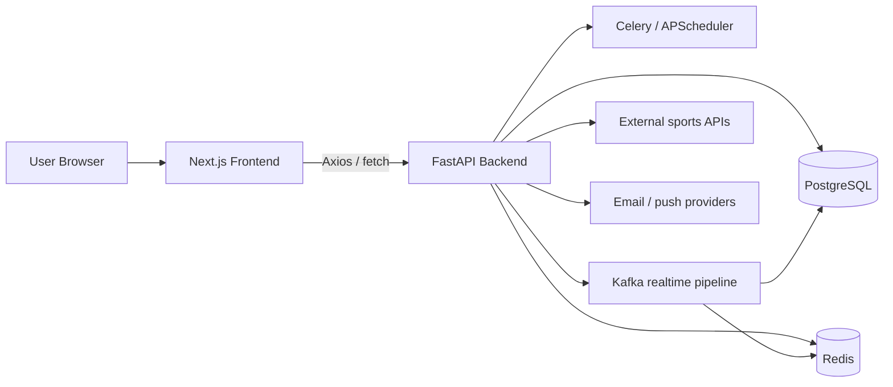
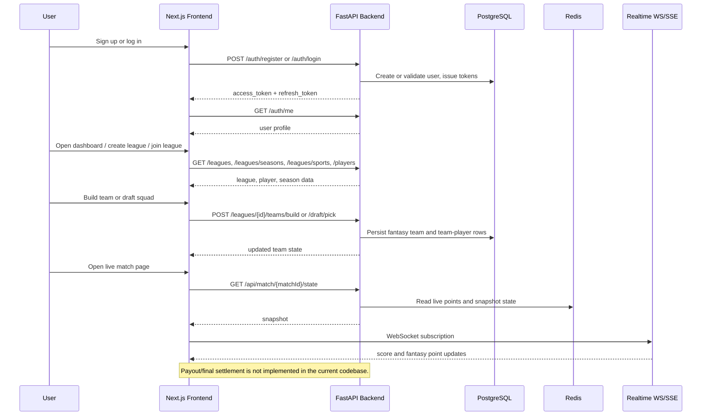

# Sporty System Documentation

This document is based on the actual code in the repository, not a generic fantasy-sports template. It covers the backend, frontend, realtime flow, implementation status, gaps, and the next steps that would move the platform toward a production-ready multi-sport fantasy product.

## 1. System Overview

Sporty is a two-part application:

- A FastAPI backend that behaves as a modular monolith.
- A Next.js App Router frontend that consumes the backend through a centralized service layer.

The codebase is organized around fantasy-league concepts rather than a separate contest engine. In practice, the current product model is:

- User account and session management.
- League creation and joining.
- Player browsing and team assembly.
- Draft mode and budget mode.
- Transfer windows, lineup state, leaderboard state, and realtime match updates.

The core entrypoints are [Sporty_Backend/app/main.py](Sporty_Backend/app/main.py) and [sporty-frontend/src/app/layout.tsx](sporty-frontend/src/app/layout.tsx).

### Architecture Diagram

## 2. Backend Architecture

The backend is a single FastAPI application with feature-based modules under [Sporty_Backend/app](Sporty_Backend/app). It is not split into independent microservices. The app is built as a modular monolith with the following major domains:

- [Sporty_Backend/app/auth](Sporty_Backend/app/auth)
- [Sporty_Backend/app/league](Sporty_Backend/app/league)
- [Sporty_Backend/app/player](Sporty_Backend/app/player)
- [Sporty_Backend/app/scoring](Sporty_Backend/app/scoring)
- [Sporty_Backend/app/notification](Sporty_Backend/app/notification)
- [Sporty_Backend/app/optimization](Sporty_Backend/app/optimization)
- [Sporty_Backend/app/user](Sporty_Backend/app/user)
- [Sporty_Backend/app/api](Sporty_Backend/app/api)
- [Sporty_Backend/app/services](Sporty_Backend/app/services)
- [Sporty_Backend/app/external_apis](Sporty_Backend/app/external_apis)

### Tech Stack

- FastAPI for HTTP APIs and WebSocket routes.
- SQLAlchemy 2.x for ORM and relational mapping.
- PostgreSQL as the primary database.
- Pydantic v2 for request and response validation.
- Redis for caching, session-like transfer staging, locks, pub/sub, and live state.
- Celery for scheduled and background tasks.
- APScheduler for in-process scheduled maintenance jobs.
- Kafka for the realtime event pipeline.
- InfluxDB for time-series monitoring of live events.
- Prometheus FastAPI Instrumentator for metrics.
- Google OAuth verification for social login.
- Resend, Firebase Admin, and APNS for notification delivery.

The declared backend dependencies are visible in [Sporty_Backend/requirements.txt](Sporty_Backend/requirements.txt).

### App Wiring

The backend bootstrap in [Sporty_Backend/app/main.py](Sporty_Backend/app/main.py) does the following:

- Imports all ORM models up front so SQLAlchemy relationships are registered.
- Creates the FastAPI app with docs, OpenAPI, and lifespan hooks.
- Installs CORS middleware with localhost-friendly defaults.
- Registers routers under `/api/v1` for business APIs.
- Registers realtime routes under `/api` for match snapshots, WebSockets, and SSE.
- Exposes `/health` as a lightweight infrastructure health check.

### Router Map

| Module                                                                                   | Main Responsibility                                                             |
| ---------------------------------------------------------------------------------------- | ------------------------------------------------------------------------------- |
| [Sporty_Backend/app/auth/router.py](Sporty_Backend/app/auth/router.py)                   | Register/login/logout, refresh tokens, Google OAuth, password reset             |
| [Sporty_Backend/app/league/router.py](Sporty_Backend/app/league/router.py)               | League lifecycle, membership, draft, team build, lineup, leaderboard, transfers |
| [Sporty_Backend/app/player/router.py](Sporty_Backend/app/player/router.py)               | Player browsing, details, stats, price history                                  |
| [Sporty_Backend/app/scoring/router.py](Sporty_Backend/app/scoring/router.py)             | Default scoring rules and league-specific overrides                             |
| [Sporty_Backend/app/optimization/router.py](Sporty_Backend/app/optimization/router.py)   | ILP squad optimization                                                          |
| [Sporty_Backend/app/notification/router.py](Sporty_Backend/app/notification/router.py)   | User notifications                                                              |
| [Sporty_Backend/app/user/router.py](Sporty_Backend/app/user/router.py)                   | User profile and activity                                                       |
| [Sporty_Backend/app/api/v1/transfers.py](Sporty_Backend/app/api/v1/transfers.py)         | Transfer staging and confirmation                                               |
| [Sporty_Backend/app/api/routes/match.py](Sporty_Backend/app/api/routes/match.py)         | Match snapshot endpoint for live state                                          |
| [Sporty_Backend/app/api/routes/websocket.py](Sporty_Backend/app/api/routes/websocket.py) | Live match and leaderboard WebSockets                                           |
| [Sporty_Backend/app/api/routes/sse.py](Sporty_Backend/app/api/routes/sse.py)             | SSE leaderboard stream                                                          |

### Backend Validation and Error Handling

Validation is done mostly through Pydantic schemas and ORM constraints:

- Auth request and response models are defined in [Sporty_Backend/app/auth/schemas.py](Sporty_Backend/app/auth/schemas.py).
- League schemas are defined in [Sporty_Backend/app/league/schemas.py](Sporty_Backend/app/league/schemas.py).
- Player filter and response schemas are defined in [Sporty_Backend/app/player/schemas.py](Sporty_Backend/app/player/schemas.py).
- Scoring schemas are defined in [Sporty_Backend/app/scoring/schemas.py](Sporty_Backend/app/scoring/schemas.py).
- User profile and activity schemas are defined in [Sporty_Backend/app/user/schemas.py](Sporty_Backend/app/user/schemas.py).

The backend also uses database-level guard rails such as uniqueness, check constraints, and foreign keys in the ORM models. When business rules fail, routers and services raise HTTP exceptions with clear status codes.

### Auth and Security Model

The auth model is implemented in [Sporty_Backend/app/auth/models.py](Sporty_Backend/app/auth/models.py) and [Sporty_Backend/app/core/security.py](Sporty_Backend/app/core/security.py):

- Access tokens are JWTs.
- Refresh tokens are opaque random strings.
- Refresh tokens are hashed before persistence.
- Google ID tokens are verified against the configured Google client ID.
- Password reset flows use short-lived reset JWTs.

This is a solid design choice because stolen refresh-token rows do not reveal usable tokens. However, the frontend still stores tokens in browser storage, which has security implications discussed later.

## 3. Backend Domain Model

The domain model is centered on sports, seasons, leagues, teams, players, and match statistics.

### Core Entities

- [Sport](Sporty_Backend/app/league/models.py) is the top-level sport catalog entry. It uses a machine-friendly `name` like `football` and a display name for the UI.
- [Season](Sporty_Backend/app/league/models.py) belongs to a sport and defines the season date range.
- [TransferWindow](Sporty_Backend/app/league/models.py) belongs to a season and defines transfer and lineup deadlines.
- [League](Sporty_Backend/app/league/models.py) is the primary gameplay container. It stores invite code, status, budget, squad size, draft mode, midseason joining, and transfer settings.
- [LeagueSport](Sporty_Backend/app/league/models.py) is the many-to-many table connecting leagues and sports.
- [LineupSlot](Sporty_Backend/app/league/models.py) defines per-league positional constraints.
- [LeagueMembership](Sporty_Backend/app/league/models.py) stores who belongs to a league and draft position eligibility.
- [FantasyTeam](Sporty_Backend/app/league/models.py) stores the user-owned squad, current budget, and team-level data.
- [TeamPlayer](Sporty_Backend/app/league/models.py) stores acquisition and release history for a player on a fantasy team.
- [Transfer](Sporty_Backend/app/league/models.py) stores the actual swap records.
- [TeamWeeklyScore](Sporty_Backend/app/league/models.py) stores leaderboard material for a transfer window.
- [Player](Sporty_Backend/app/player/models.py) stores the fantasy-eligible athlete and cost.
- [PlayerGameweekStat](Sporty_Backend/app/player/models.py) stores per-window fantasy scoring output.
- [FootballStat](Sporty_Backend/app/player/models.py), [CricketStat](Sporty_Backend/app/player/models.py), and [NBAStat](Sporty_Backend/app/player/models_nba.py) store sport-specific stat details.
- [Match](Sporty_Backend/app/match/models.py) stores the real-world fixture that drives scoring.
- [DefaultScoringRule](Sporty_Backend/app/scoring/models.py) and [LeagueScoringOverride](Sporty_Backend/app/scoring/models.py) define points logic.
- [Notification](Sporty_Backend/app/notification/models.py) stores user-facing notifications.

### Relationship Summary

- One user can own or join multiple leagues.
- One league can include multiple sports.
- One league has many memberships, many fantasy teams, and many lineup slot definitions.
- One fantasy team has many team-player records and transfer records.
- One player belongs to one sport and has many price-history records and many gameweek stat rows.
- One gameweek stat row may have one football, cricket, or NBA child record depending on sport.
- One scoring override belongs to one league and one sport.
- One match belongs to one sport and can feed one or more realtime streams.

### Model-Level Rules That Matter

- League names are unique per season.
- Transfer windows cannot overlap in simple ways because of check constraints, though some overlap protection is still documented as a TODO.
- Team budgets are stored as exact decimals, not floats.
- Team-player acquisition is tracked with explicit window ids and release state.
- Draft positions are unique per league while allowing `NULL` before draft assignment.

The most important model file is [Sporty_Backend/app/league/models.py](Sporty_Backend/app/league/models.py), which contains most of the fantasy gameplay state.

## 4. Backend Business Logic

### Authentication Flow

The auth router in [Sporty_Backend/app/auth/router.py](Sporty_Backend/app/auth/router.py) exposes:

- `POST /auth/register`
- `POST /auth/login`
- `POST /auth/google`
- `POST /auth/refresh`
- `POST /auth/forgot-password`
- `POST /auth/reset-password`
- `POST /auth/logout`
- `POST /auth/logout/all`
- `POST /auth/google/link`
- `GET /auth/me`
- `POST /auth/change-password`

The frontend bootstrap on login is:

1. Send credentials to `/auth/login` or Google token to `/auth/google`.
2. Store access and refresh tokens locally.
3. Call `/auth/me` to hydrate the user profile.
4. Keep the session alive via refresh-token bootstrap and 401 retry logic.

### League Lifecycle

The league router in [Sporty_Backend/app/league/router.py](Sporty_Backend/app/league/router.py) contains the core gameplay API:

- Create a league.
- List leagues for the current user.
- Discover public leagues.
- Join a league by invite code.
- Leave or delete a league.
- Start a draft.
- Make draft picks.
- Build a budget-mode team.
- Update lineup state.
- Read the leaderboard.
- Read transfer-window state.

The league status machine is explicit and simple:

- `setup`
- `drafting`
- `active`
- `completed`

The scheduled lifecycle update in [Sporty_Backend/app/services/league_status_service.py](Sporty_Backend/app/services/league_status_service.py) transitions budget-mode leagues from setup to active and active to completed when date conditions are satisfied.

### Team Creation and Transfers

Team and transfer logic is split across [Sporty_Backend/app/league/router.py](Sporty_Backend/app/league/router.py) and [Sporty_Backend/app/services/transfer_service.py](Sporty_Backend/app/services/transfer_service.py).

What the code actually does:

- Budget-mode team building uses the chosen squad and budget constraints.
- Draft mode uses turn-based picks and turn polling.
- Transfer actions are staged in Redis before commit.
- Transfers are confirmed only when the user meets league, window, and budget constraints.
- Stage-out and stage-in are designed as a session-based workflow, not as one-shot mutations.

The staged-transfer design is important because it lets the UI show a temporary pending state before the user confirms changes.

### Scoring and Optimization

Scoring-related code lives in [Sporty_Backend/app/scoring](Sporty_Backend/app/scoring) and [Sporty_Backend/app/optimization](Sporty_Backend/app/optimization).

- Default scoring rules are sport-wide.
- League owners can override points for their own league.
- The optimization endpoint returns an ILP-based best lineup under budget and positional constraints.

That optimization flow is paired with the frontend lineup builder so managers can choose manually or use a recommendation path.

### Background Jobs and Scheduled Work

The backend does have a real background job layer, not just HTTP endpoints:

- [Sporty_Backend/app/main.py](Sporty_Backend/app/main.py) starts APScheduler jobs on startup.
- The scheduler runs transfer-window notifications, league lifecycle updates, cache warming, and player price updates.
- [Sporty_Backend/app/tasks/live_polling_tasks.py](Sporty_Backend/app/tasks/live_polling_tasks.py) registers Celery tasks for live polling.
- Redis locks are used so only one worker executes live polling at a time.

However, several realtime sync implementations remain stubbed, which is an important distinction for the implementation-status section.

### External Integrations

The backend integrates with several external systems:

- Football data via RapidAPI Football in [Sporty_Backend/app/external_apis/football_api.py](Sporty_Backend/app/external_apis/football_api.py).
- Basketball data via [Sporty_Backend/app/external_apis/basketball_api.py](Sporty_Backend/app/external_apis/basketball_api.py) and BallDontLie in [Sporty_Backend/app/external_apis/basketball_balldontlie.py](Sporty_Backend/app/external_apis/basketball_balldontlie.py).
- Cricket data via [Sporty_Backend/app/external_apis/cricket_api.py](Sporty_Backend/app/external_apis/cricket_api.py).
- Google OAuth verification in [Sporty_Backend/app/core/security.py](Sporty_Backend/app/core/security.py).
- Email notifications via Resend.
- Push notifications via Firebase Admin and APNS.
- Redis for state, pub/sub, and cache.
- Kafka for event flow.
- InfluxDB for timeseries telemetry.

### Realtime Transport

Realtime match state is delivered through a three-part surface:

- [Sporty_Backend/app/api/routes/match.py](Sporty_Backend/app/api/routes/match.py) returns a snapshot of score and player points.
- [Sporty_Backend/app/api/routes/websocket.py](Sporty_Backend/app/api/routes/websocket.py) provides live WebSocket channels for match and leaderboard updates.
- [Sporty_Backend/app/api/routes/sse.py](Sporty_Backend/app/api/routes/sse.py) provides an SSE leaderboard stream.

The frontend uses the snapshot first, then subscribes to WebSocket updates.

## 5. Frontend Architecture

The frontend is a Next.js 16 App Router application with TypeScript, React Query, Zustand, Mantine, Tailwind, and Axios. The package manifest is in [sporty-frontend/package.json](sporty-frontend/package.json).

### Core Structure

The app tree in [sporty-frontend/src/app](sporty-frontend/src/app) is split into route groups:

- `(auth)` for login, signup, forgot-password, and reset-password.
- `(dashboard)` for authenticated user flows.
- `(public)` for landing pages.
- `match/[matchId]` for live match pages.

The root layout is [sporty-frontend/src/app/layout.tsx](sporty-frontend/src/app/layout.tsx), which wires providers and global styles.

### Frontend Providers and State

The frontend uses three different state layers for different purposes:

- React Query for server state and caching.
- Context for auth bootstrap and login/logout actions.
- Zustand for live match state.

Relevant files:

- [sporty-frontend/src/context/Query-context.tsx](sporty-frontend/src/context/Query-context.tsx)
- [sporty-frontend/src/context/auth-context.tsx](sporty-frontend/src/context/auth-context.tsx)
- [sporty-frontend/src/store/matchStore.ts](sporty-frontend/src/store/matchStore.ts)

This is a reasonable separation:

- React Query owns fetch lifecycles and cache invalidation.
- Auth context owns session bootstrap and token refresh side effects.
- Zustand owns transient realtime state that changes many times per minute.

### API Layer

The frontend does not call backend routes directly from most UI components. Instead it routes through:

- [sporty-frontend/src/api/apiPath.ts](sporty-frontend/src/api/apiPath.ts)
- [sporty-frontend/src/api/auth-api-client.ts](sporty-frontend/src/api/auth-api-client.ts)
- [sporty-frontend/src/api/public-api-client.ts](sporty-frontend/src/api/public-api-client.ts)
- [sporty-frontend/src/services/UserService.ts](sporty-frontend/src/services/UserService.ts)
- [sporty-frontend/src/services/LeagueService.ts](sporty-frontend/src/services/LeagueService.ts)
- [sporty-frontend/src/services/PlayerService.ts](sporty-frontend/src/services/PlayerService.ts)
- [sporty-frontend/src/services/ScoringService.ts](sporty-frontend/src/services/ScoringService.ts)
- [sporty-frontend/src/services/OptimizationService.ts](sporty-frontend/src/services/OptimizationService.ts)

This is a good architecture choice because it keeps backend contracts centralized and makes the UI easier to maintain.

### Auth Flow in the Frontend

Auth bootstrap is implemented in [sporty-frontend/src/context/auth-context.tsx](sporty-frontend/src/context/auth-context.tsx):

1. Read the refresh token from local storage.
2. If a refresh token exists, call the refresh endpoint.
3. Fetch `/auth/me` to hydrate the user object.
4. Subscribe to invalidation events so the app can force logout on refresh failure.

Token refresh and 401 retry behavior is implemented in [sporty-frontend/src/api/auth-api-client.ts](sporty-frontend/src/api/auth-api-client.ts).

The route guards are:

- [sporty-frontend/src/components/auth/ProtectedRoute.tsx](sporty-frontend/src/components/auth/ProtectedRoute.tsx)
- [sporty-frontend/src/components/auth/GuestOnlyRoute.tsx](sporty-frontend/src/components/auth/GuestOnlyRoute.tsx)

### Frontend Routing and UX Surface

The major user-facing routes are:

| Route                       | Purpose                    |
| --------------------------- | -------------------------- |
| `/login`                    | Sign in                    |
| `/signUp`                   | Sign up                    |
| `/forgot-password`          | Request password reset     |
| `/reset-password`           | Complete reset             |
| `/dashboard`                | Authenticated landing area |
| `/create-league`            | Create a league            |
| `/join-league`              | Join or discover a league  |
| `/create-team`              | Build a fantasy team       |
| `/leagues/[id]`             | League home                |
| `/leagues/[id]/lineup`      | Lineup management          |
| `/leagues/[id]/leaderboard` | League standings           |
| `/leagues/[id]/members`     | Member list                |
| `/match/[matchId]`          | Live match view            |

There is also an older parallel route tree under [sporty-frontend/src/app/(dashboard)/league](<sporty-frontend/src/app/(dashboard)/league>) and the newer plural tree under [sporty-frontend/src/app/(dashboard)/leagues](<sporty-frontend/src/app/(dashboard)/leagues>). That duplication matters in the gaps section.

### UI and Styling

The frontend uses:

- Tailwind for utility styling.
- Mantine for component primitives.
- Lucide for icons.
- DnD Kit for drag-and-drop workflows.

The auth pages show polished but hand-authored UI, with background accents, hero panels, and password-strength feedback.

### Frontend Validation

The codebase does not currently show a Zod-based client validation layer. Instead, the forms use local state and ad hoc validation inside components such as:

- [sporty-frontend/src/components/auth/login/LoginForm.tsx](sporty-frontend/src/components/auth/login/LoginForm.tsx)
- [sporty-frontend/src/components/auth/signup/SignUpForm.tsx](sporty-frontend/src/components/auth/signup/SignUpForm.tsx)
- [sporty-frontend/src/components/dashboard/create-league/CreateLeague.tsx](sporty-frontend/src/components/dashboard/create-league/CreateLeague.tsx)
- [sporty-frontend/src/components/dashboard/join-league/JoinLeague.tsx](sporty-frontend/src/components/dashboard/join-league/JoinLeague.tsx)
- [sporty-frontend/src/components/dashboard/create-team/CreateTeam.tsx](sporty-frontend/src/components/dashboard/create-team/CreateTeam.tsx)

That is functional, but it is one of the clearest deviations from the frontend conventions file [sporty-frontend/AGENTS.md](sporty-frontend/AGENTS.md).

### Realtime Frontend Flow

The live match page is implemented in [sporty-frontend/src/app/match/[matchId]/page.tsx](sporty-frontend/src/app/match/[matchId]/page.tsx) and [sporty-frontend/src/components/live/LiveMatchClient.tsx](sporty-frontend/src/components/live/LiveMatchClient.tsx).

Flow:

1. Fetch an initial match snapshot with `fetchMatchSnapshot`.
2. Hydrate Zustand match state.
3. Subscribe to the WebSocket channel with `useMatchSocket`.
4. Apply score updates, fantasy point deltas, and lineup changes into the store.

The supporting realtime files are [sporty-frontend/src/lib/realtimeApi.ts](sporty-frontend/src/lib/realtimeApi.ts), [sporty-frontend/src/lib/socket.ts](sporty-frontend/src/lib/socket.ts), and [sporty-frontend/src/hooks/useMatchSocket.ts](sporty-frontend/src/hooks/useMatchSocket.ts).

## 6. End-to-End System Flow

The most useful mental model for the current product is the following flow:

### Practical Data Flow

The main API calls that the frontend already makes are:

- `POST /auth/login`, `POST /auth/register`, `POST /auth/google`, `POST /auth/refresh`, `GET /auth/me`
- `GET /leagues`, `GET /leagues/discover`, `GET /leagues/seasons`, `GET /leagues/sports`
- `POST /leagues`, `POST /leagues/join`, `POST /leagues/{id}/sports`, `POST /leagues/{id}/scoring-overrides`
- `GET /leagues/{id}/my-team`, `GET /leagues/{id}/lineup`, `GET /leagues/{id}/leaderboard`, `GET /leagues/{id}/active-window`
- `GET /players`, `GET /players/{id}`, `GET /players/{id}/stats/{windowId}`
- `POST /optimization/lineup`
- `POST /transfers/stage-out`, `POST /transfers/stage-in`, `POST /transfers/confirm`, `DELETE /transfers/cancel`

## 7. Current Implementation Status

| Area                                               | Status                 | Evidence                                                                                                                                                                                                                                                                                                                                                                   |
| -------------------------------------------------- | ---------------------- | -------------------------------------------------------------------------------------------------------------------------------------------------------------------------------------------------------------------------------------------------------------------------------------------------------------------------------------------------------------------------- |
| Authentication and refresh-token session bootstrap | Implemented            | [Sporty_Backend/app/auth/router.py](Sporty_Backend/app/auth/router.py), [sporty-frontend/src/context/auth-context.tsx](sporty-frontend/src/context/auth-context.tsx), [sporty-frontend/src/api/auth-api-client.ts](sporty-frontend/src/api/auth-api-client.ts)                                                                                                             |
| League creation, discovery, join, leave, delete    | Implemented            | [Sporty_Backend/app/league/router.py](Sporty_Backend/app/league/router.py), [sporty-frontend/src/components/dashboard/create-league/CreateLeague.tsx](sporty-frontend/src/components/dashboard/create-league/CreateLeague.tsx), [sporty-frontend/src/components/dashboard/join-league/JoinLeague.tsx](sporty-frontend/src/components/dashboard/join-league/JoinLeague.tsx) |
| Draft mode and budget mode team assembly           | Implemented but uneven | [Sporty_Backend/app/league/router.py](Sporty_Backend/app/league/router.py), [sporty-frontend/src/components/dashboard/create-team/CreateTeam.tsx](sporty-frontend/src/components/dashboard/create-team/CreateTeam.tsx)                                                                                                                                                     |
| Player browsing and filtering                      | Implemented            | [Sporty_Backend/app/player/router.py](Sporty_Backend/app/player/router.py), [sporty-frontend/src/services/PlayerService.ts](sporty-frontend/src/services/PlayerService.ts)                                                                                                                                                                                                 |
| Leaderboard and lineup UI                          | Implemented            | [sporty-frontend/src/app/(dashboard)/leagues/[id]/leaderboard/page.tsx](<sporty-frontend/src/app/(dashboard)/leagues/[id]/leaderboard/page.tsx>), [sporty-frontend/src/app/(dashboard)/leagues/[id]/lineup/page.tsx](<sporty-frontend/src/app/(dashboard)/leagues/[id]/lineup/page.tsx>)                                                                                   |
| Realtime match snapshot and live updates           | Implemented            | [Sporty_Backend/app/api/routes/match.py](Sporty_Backend/app/api/routes/match.py), [Sporty_Backend/app/api/routes/websocket.py](Sporty_Backend/app/api/routes/websocket.py), [sporty-frontend/src/components/live/LiveMatchClient.tsx](sporty-frontend/src/components/live/LiveMatchClient.tsx)                                                                             |
| Scoring rules and league overrides                 | Implemented            | [Sporty_Backend/app/scoring/router.py](Sporty_Backend/app/scoring/router.py), [sporty-frontend/src/services/ScoringService.ts](sporty-frontend/src/services/ScoringService.ts)                                                                                                                                                                                             |
| Optimization API and lineup suggestion flow        | Implemented            | [Sporty_Backend/app/optimization/router.py](Sporty_Backend/app/optimization/router.py), [sporty-frontend/src/services/OptimizationService.ts](sporty-frontend/src/services/OptimizationService.ts)                                                                                                                                                                         |
| Realtime stats ingestion pipeline                  | Partially implemented  | [Sporty_Backend/app/services/sync/stats_sync.py](Sporty_Backend/app/services/sync/stats_sync.py), [Sporty_Backend/app/tasks/live_polling_tasks.py](Sporty_Backend/app/tasks/live_polling_tasks.py)                                                                                                                                                                         |
| Player sync pipeline for all sports                | Partially implemented  | [Sporty_Backend/app/services/sync/player_sync.py](Sporty_Backend/app/services/sync/player_sync.py)                                                                                                                                                                                                                                                                         |
| Client-side form validation                        | Partially implemented  | Manual validation in login, signup, create-league, join-league, and create-team forms                                                                                                                                                                                                                                                                                      |
| Payout and payment settlement                      | Missing                | No payout/payment module or endpoint found in the current codebase                                                                                                                                                                                                                                                                                                         |

### What is functionally complete today

- Session-based auth and route protection.
- League lifecycle operations.
- Team assembly workflows.
- Player browsing and stats lookups.
- Realtime match snapshots and live UI updates.
- Scoring configuration and leaderboards.

### What is only partially complete

- Realtime stats ingestion for football, basketball, and cricket.
- Cross-sport player sync and stat normalization.
- Some lifecycle guard rails around overlap and relationship wiring.
- Client validation consistency.

### What is missing or not visible in code

- Payments and payout settlement.
- Prize distribution or escrow logic.
- A dedicated contest abstraction separate from league.
- A production-grade Zod schema layer on the frontend.

## 8. Issues and Gaps

### Architecture Issues

- The backend is a tightly coupled modular monolith. That is fine for the current stage, but it means `main.py` imports a large number of modules and acts as a central wiring point.
- Some logic is split between ORM properties, services, and Redis sessions, which makes debugging a live transfer flow harder than it should be.
- The frontend has route duplication under both `league` and `leagues`, which suggests either a migration in progress or stale pages that were not fully removed.

### Security Risks

- Browser storage is used for tokens in the frontend auth flow. That is workable, but it increases exposure to XSS compared with httpOnly cookies.
- CORS is permissive by default for localhost and local network development, which is convenient but should be locked down in production.
- The auth layer is solid on token hashing and Google verification, but the frontend session storage choice is still the most obvious risk.

### Performance and Scalability Concerns

- The live polling and stats sync pipeline is not yet fully implemented, so realtime scoring quality will lag until the ingestion layer is finished.
- Several frontend queries refetch on intervals or rely on cache invalidation. That is acceptable now, but it will need tighter tuning as leagues and match volume grow.
- Match snapshot requests read Redis keys with wildcard scans, which is practical at small scale but should be monitored carefully if the realtime footprint grows significantly.

### Code Smells and Inconsistencies

- The auth route naming is inconsistent: the app tree includes `/signUp`, while the route config treats registration as `/register`. The login form also links to `/signUp` directly.
- The frontend uses ad hoc validation instead of a shared schema library, which makes validation rules easy to drift.
- Some backend files contain explicit TODOs for relationships and overlap constraints, which means the model is coherent but not fully hardened.
- Realtime ingestion files still contain stub logic and placeholder comments, which is a clear signal that live scoring is not production-complete.

### Concrete Stub and TODO Evidence

- [Sporty_Backend/app/services/sync/stats_sync.py](Sporty_Backend/app/services/sync/stats_sync.py) still says football parsing and basketball/cricket sync are not implemented.
- [Sporty_Backend/app/services/sync/player_sync.py](Sporty_Backend/app/services/sync/player_sync.py) still leaves cricket player sync as a placeholder.
- [Sporty_Backend/app/tasks/live_polling_tasks.py](Sporty_Backend/app/tasks/live_polling_tasks.py) registers Celery tasks that call stub sync services.
- [Sporty_Backend/app/league/models.py](Sporty_Backend/app/league/models.py) still documents a TODO for stricter overlap constraints and a TODO for additional relationships.

## 9. Recommendations and Prioritized Roadmap

### Priority 1: Finish the Core Gameplay Loop

1. Implement the missing stats ingestion paths for football, basketball, and cricket.
2. Connect match events to player gameweek stats and leaderboard updates end to end.
3. Add the missing payout or settlement workflow, even if the first version is only a post-season ledger and admin reconciliation screen.
4. Harden league and transfer-window overlap constraints at the database level.

### Priority 2: Clean Up Platform Consistency

1. Remove or unify the duplicate `league` and `leagues` route trees in the frontend.
2. Normalize auth route naming so registration is one canonical path.
3. Replace manual form validation with a shared schema layer on the frontend.
4. Align all response and request shapes around the same backend contract names.

### Priority 3: Improve Fantasy-Sports Product Depth

1. Add true contest support if the product should eventually support tournaments separate from leagues.
2. Expand realtime scoring into richer live event cards, per-player deltas, and timeline playback.
3. Add richer roster management such as bench rotation, captain strategy insights, and injury alerts.
4. Expand multi-sport support beyond football and basketball once the ingestion pipeline is stable.

### Priority 4: Backend Architecture Improvements

1. Split ingestion, scoring, and notifications into clearer service boundaries if the backend grows further.
2. Add stronger idempotency around transfer confirmation and live stat ingestion.
3. Introduce explicit domain events for league status changes, transfers, and score updates.
4. Add integration tests around the most important cross-module flows.

### Priority 5: Frontend UX and Reliability

1. Standardize route naming and navigation hierarchy.
2. Introduce typed client validation schemas for auth, league creation, and team building.
3. Improve empty states, skeletons, and failure recovery on dashboard and leaderboard views.
4. Reduce friction in create-team and join-league flows by making state transitions more explicit.

### Priority 6: DevOps and Observability

1. Add CI jobs for backend tests, frontend linting, and end-to-end flow validation.
2. Add deployment health checks for the API, Celery workers, and realtime consumers.
3. Monitor Redis, Kafka, and background-job lag separately.
4. Track leaderboard latency and match-snapshot freshness as first-class SLOs.

## 10. Bottom Line

The codebase is already beyond a prototype. The auth, league, team, leaderboard, and realtime presentation layers are real and connected. The biggest remaining gap is not the UI, but the live-data pipeline and product-level settlement logic. Once those are finished, the current structure should support a credible multi-sport fantasy platform.
