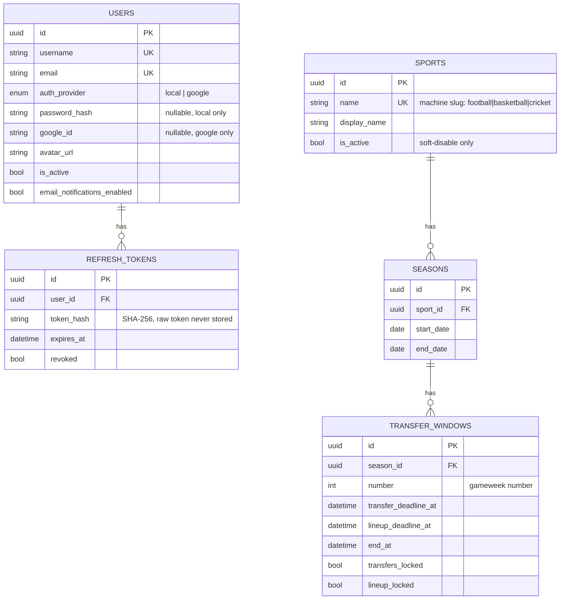
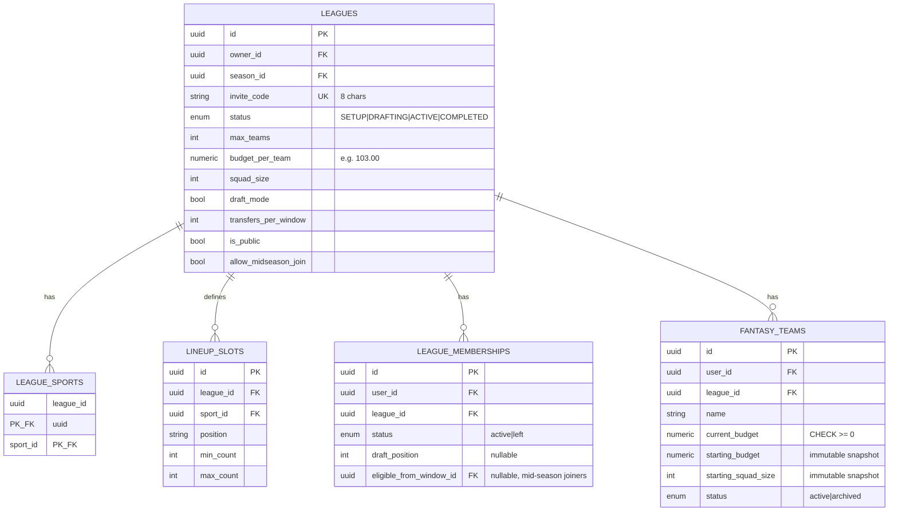
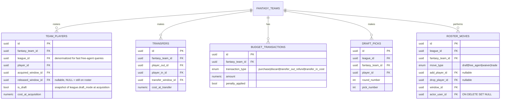
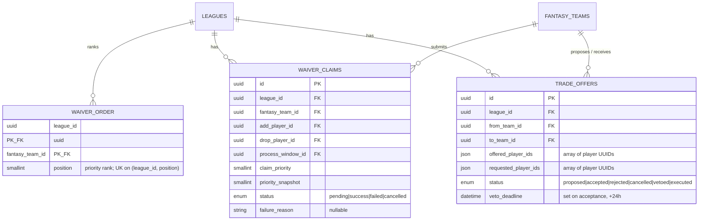
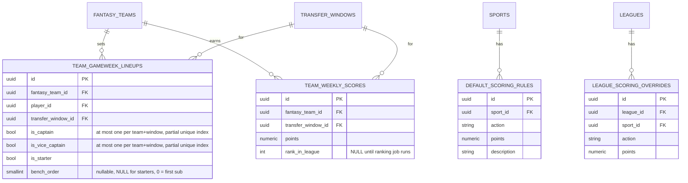
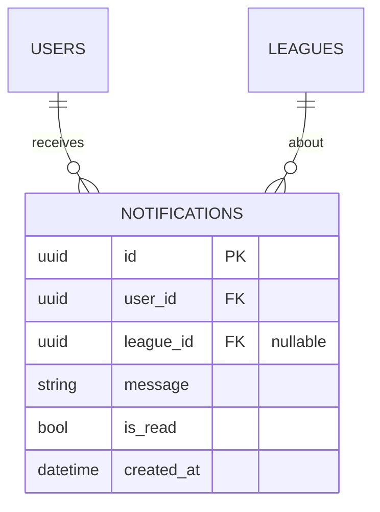

# Sporty — Database Design Diagram

Entity-relationship diagrams for the `Sporty_Backend` PostgreSQL schema (the
single source of truth for the platform — see `presentation_guide.md` Section 6
for the narrative walkthrough). Diagrams use Mermaid `erDiagram` notation:

- `||` = exactly one, `o|` = zero or one, `}o` = zero or many, `}|` = one or many
- `PK` = primary key, `FK` = foreign key, `UK` = unique key/constraint

All tables use a UUID primary key (`id`) unless noted otherwise. Money and
points columns are `Numeric`/`Decimal`, never `float`. A companion sibling
repo, `SportyDataFeeder`, has its **own, completely separate** PostgreSQL
database (integer primary keys, no shared schema) — the two are bridged only by
an `entity_links` table inside the Feeder's own database mapping its integer
IDs to Sporty's UUID strings; that database is out of scope for this diagram.

---

## 1. Master overview — how every subsystem connects

```mermaid
erDiagram
    SPORTS ||--o{ SEASONS : has
    SPORTS ||--o{ PLAYERS : has
    SPORTS ||--o{ MATCHES : has
    SPORTS ||--o{ DEFAULT_SCORING_RULES : has
    SEASONS ||--o{ TRANSFER_WINDOWS : has
    SEASONS ||--o{ LEAGUES : "played in"

    USERS ||--o{ LEAGUES : owns
    USERS ||--o{ LEAGUE_MEMBERSHIPS : has
    USERS ||--o{ FANTASY_TEAMS : owns
    USERS ||--o{ REFRESH_TOKENS : has
    USERS ||--o{ NOTIFICATIONS : receives

    LEAGUES ||--o{ LEAGUE_MEMBERSHIPS : has
    LEAGUES ||--o{ FANTASY_TEAMS : has
    LEAGUES ||--o{ LEAGUE_SPORTS : has
    LEAGUES ||--o{ LINEUP_SLOTS : defines
    LEAGUES ||--o{ LEAGUE_SCORING_OVERRIDES : has
    LEAGUES ||--o{ WAIVER_ORDER : has
    LEAGUES ||--o{ WAIVER_CLAIMS : has
    LEAGUES ||--o{ TRADE_OFFERS : has
    LEAGUES ||--o{ ROSTER_MOVES : logs

    FANTASY_TEAMS ||--o{ TEAM_PLAYERS : rosters
    FANTASY_TEAMS ||--o{ TRANSFERS : makes
    FANTASY_TEAMS ||--o{ DRAFT_PICKS : makes
    FANTASY_TEAMS ||--o{ TEAM_GAMEWEEK_LINEUPS : sets
    FANTASY_TEAMS ||--o{ TEAM_WEEKLY_SCORES : earns

    PLAYERS ||--o{ TEAM_PLAYERS : "owned as"
    PLAYERS ||--o{ DRAFT_PICKS : "picked as"
    PLAYERS ||--o{ PLAYER_GAMEWEEK_STATS : records
    PLAYERS ||--o{ PLAYER_PRICE_HISTORY : has
    PLAYERS ||--o{ TEAM_GAMEWEEK_LINEUPS : "listed in"
    PLAYERS }o--o| REAL_TEAMS : "plays for"

    PLAYER_GAMEWEEK_STATS ||--o| FOOTBALL_STATS : extends
    PLAYER_GAMEWEEK_STATS ||--o| CRICKET_STATS : extends
    PLAYER_GAMEWEEK_STATS ||--o| NBA_STATS : extends

    TRANSFER_WINDOWS ||--o{ TEAM_PLAYERS : "acquired/released in"
    TRANSFER_WINDOWS ||--o{ TRANSFERS : "occurs in"
    TRANSFER_WINDOWS ||--o{ TEAM_GAMEWEEK_LINEUPS : "for window"
    TRANSFER_WINDOWS ||--o{ TEAM_WEEKLY_SCORES : "for window"
    TRANSFER_WINDOWS ||--o{ PLAYER_GAMEWEEK_STATS : "for window"
    TRANSFER_WINDOWS ||--o{ WAIVER_CLAIMS : "processed in"

    MATCHES ||--o{ LIVE_EVENTS : streams
    MATCHES ||--o{ MATCH_FEED_CACHE : caches
```



> 🎤 **The one sentence to remember:** `TransferWindow` (the gameweek) is the hub
> almost every time-scoped table hangs off — lineups, scores, stats, and
> eligibility are all keyed to a window.

---

## 2. Identity, platform config, and time structure



**Constraints not visible in the diagram shape itself:**
- `users`: `CheckConstraint` enforces a `local` user has `password_hash` and a
  `google` user has `google_id` — never both null, never both set.
- `seasons`: overlap prevented **three ways** — a check constraint, a unique
  constraint, and a PostgreSQL GiST `ExcludeConstraint` on `daterange(...) &&`
  per sport, so the database physically refuses an overlapping season.
- `transfer_windows`: `CHECK (transfer_deadline_at < lineup_deadline_at <=
  end_at)`; a `tstzrange` `ExcludeConstraint` prevents overlapping windows
  within one season. `is_current`/lock state is **explicit**, not derived from
  "now," so an operator can lock early or extend manually.

---

## 3. Leagues, membership, and squads



**Notes:** `league_sports` is the join table that makes **mixed-sport leagues**
possible (e.g. football + basketball in one squad). `lineup_slots` is the
per-league, per-sport position quota table that both the ILP optimizer and
lineup validation read as their source of truth for "how many defenders are
required."

---

## 4. Squad ownership, transfers, and audit history



**Key invariant (partial unique index, not visible in the diagram shape):**
`uq_draft_active_player_ownership` on `team_players(league_id, player_id) WHERE
released_window_id IS NULL AND is_draft = true` — a player belongs to **at most
one team per league at any instant**, but **only for draft leagues**. Budget
leagues intentionally allow the same real player to be owned by multiple
managers' squads simultaneously (there's no scarcity model there). A second
partial index, `uix_team_player_active` (`WHERE released_window_id IS NULL`),
prevents a player being active on the *same* team twice.

`transfers.CHECK (player_out_id != player_in_id)`. `draft_picks` is unique on
`(league_id, pick_number)` and `(league_id, player_id)` — an immutable,
append-only audit log, like `roster_moves`.

---

## 5. Draft-league roster management — waivers and trades

*(Draft leagues only — budget leagues use the Transfers flow in Section 4
instead.)*



**Design notes:** `waiver_order` is initialized in **reverse draft order** when
a draft completes; a successful claim rotates that team to the back of the
queue (rolling waivers — the standard FPL-Draft mechanic, not a bidding/FAAB
system). `trade_offers` uses plain `JSON` arrays rather than a join table
because a trade offer is a single atomic proposal, not a queryable many-to-many
relationship — **though this is inconsistent** with the rest of the schema,
which uses `JSONB` elsewhere (`live_events.meta`, `match_feed_cache.payload`);
could not determine from the codebase whether that was deliberate.

---

## 6. Weekly lineups and scoring



**Effective scoring resolution** (not a foreign key, a runtime lookup):
`league override → platform default → hardcoded fallback → 0`. `team_players`
storing bench order (added in a later migration) is what makes formation-aware
**automatic substitution** possible — before that migration, only starters were
persisted at all.

---

## 7. Players and per-sport statistics

```mermaid
erDiagram
    REAL_TEAMS {
        uuid id PK
        string name
        string abbreviation
        string external_id
        string logo_url "nullable"
    }
    PLAYERS {
        uuid id PK
        uuid sport_id FK
        string external_api_id UK "nullable"
        string name
        string position "free string, not an enum"
        uuid real_team_id FK "nullable"
        string real_team "legacy string, denormalized"
        string real_team_logo_url "nullable, denormalized copy of crest"
        numeric cost
        bool is_available
        string photo_url "nullable"
    }
    PLAYER_PRICE_HISTORY {
        uuid id PK
        uuid player_id FK
        uuid transfer_window_id FK
        numeric old_cost
        numeric new_cost
        numeric delta
        numeric weighted_points
        string algorithm_version
    }
    PLAYER_GAMEWEEK_STATS {
        uuid id PK
        uuid player_id FK
        uuid transfer_window_id FK
        int minutes_played
        numeric fantasy_points "denormalized"
    }
    FOOTBALL_STATS {
        uuid base_stat_id PK_FK "1:1, unique FK"
        int goals
        int assists
        int clean_sheets
        int yellow_cards
        int red_cards
        int own_goals
        int penalties_saved
        int penalties_missed
        int saves
        int goals_conceded
        int bonus
    }
    CRICKET_STATS {
        uuid base_stat_id PK_FK "1:1, unique FK, all columns nullable"
        int runs "NULL = did not bat"
        int wickets "NULL = did not bowl"
        int catches
        int run_outs
        int maidens
    }
    NBA_STATS {
        uuid base_stat_id PK_FK "1:1, unique FK"
        int points
        int assists
        int rebounds
        int steals
        int blocks
    }

    REAL_TEAMS ||--o{ PLAYERS : fields
    PLAYERS ||--o{ PLAYER_PRICE_HISTORY : has
    PLAYERS ||--o{ PLAYER_GAMEWEEK_STATS : records
    PLAYER_GAMEWEEK_STATS ||--o| FOOTBALL_STATS : extends
    PLAYER_GAMEWEEK_STATS ||--o| CRICKET_STATS : extends
    PLAYER_GAMEWEEK_STATS ||--o| NBA_STATS : extends
```

**Why table-per-subtype:** `player_gameweek_stats` is one sport-agnostic base
row (minutes, fantasy points) with three 1:1 child tables — chosen over one
wide table with hundreds of mostly-null columns, or single-table inheritance
(same width problem). Cricket columns are nullable **by design**: `NULL` (did
not bat/bowl) is a different fact from `0` (batted/bowled and scored nothing),
which matters for correct leaderboard sorting.

**A real, documented data-quality incident:** different importers assigned
different `external_api_id` namespaces to the *same* real player (roster syncs
vs. the Feeder), and each importer only deduped against its own namespace —
producing duplicate player rows with different costs. A migration
(`e6f7a8b9c0d1_dedupe_players`) cleaned this up by grouping on normalized
name+team, but deliberately did **not** add a permanent uniqueness constraint
yet, since the importers themselves still need to be fixed first.

---

## 8. Matches, live events, and the Feeder bridge

```mermaid
erDiagram
    MATCHES {
        uuid id PK
        uuid sport_id FK
        string external_api_id UK "e.g. feeder:<uuid5> or a real provider id"
        string home_team
        string away_team
        date match_date
        enum status "scheduled|live|finished|postponed|cancelled"
        int home_score "nullable"
        int away_score "nullable"
        string competition
        string season
    }
    LIVE_EVENTS {
        uuid id PK
        string match_id "the live key: external_api_id or UUID string"
        string event_id UK_with_match_id "idempotency key, from the Feeder"
        string event_type
        string player_id
        string team_id
        jsonb meta
        datetime ts
    }
    MATCH_FEED_CACHE {
        uuid id PK
        uuid match_id FK "ON DELETE CASCADE"
        string kind UK_with_match_id "prediction|ratings|lineups"
        jsonb payload
        datetime created_at
        datetime updated_at
    }

    SPORTS ||--o{ MATCHES : has
    MATCHES ||--o{ LIVE_EVENTS : streams
    MATCHES ||--o{ MATCH_FEED_CACHE : caches
```

**Why `match_feed_cache` exists:** the Feeder pushes prediction/ratings/lineup
data that's normally served straight from a 24-hour-TTL Redis key (the fast hot
path). This table is the **durable Postgres backstop** — once a Redis entry
expires, a read falls back here instead of returning nothing. `live_events` is
idempotent on `(match_id, event_id)` — `event_id` is a UUID minted once by the
Feeder, so a retried push of the same minute's events is a no-op.

---

## 9. Notifications



---

## Legend — constraint types used across this schema (not native to ER notation)

| Constraint type | Example | What it guards |
|---|---|---|
| `CheckConstraint` | `users`: local↔password_hash / google↔google_id | A row can't be in a half-valid state |
| `UniqueConstraint` | `(league_id, pick_number)` on `draft_picks` | No duplicate picks |
| **Partial** unique index | `uix_team_player_active` (`WHERE released_window_id IS NULL`) | Index/constrain only the rows that matter — active rosters, not history |
| `ExcludeConstraint` (GiST) | `seasons`/`transfer_windows` date-range overlap | The database physically refuses overlapping ranges, even if application code has a bug |
| `ON DELETE CASCADE` | `league_sports.league_id`, `match_feed_cache.match_id` | Child rows are cleaned up automatically when the parent is deleted |
| `ON DELETE SET NULL` | `roster_moves.actor_user_id` | The audit row survives even if the acting user is later deleted |

> Two sessions read/write this schema: a **sync** engine (`psycopg2`, used by
> nearly every router/service/scheduled job) and an **async** engine
> (`asyncpg`, used only by the realtime WebSocket/SSE routes). Both point at
> the same `DATABASE_URL`.
