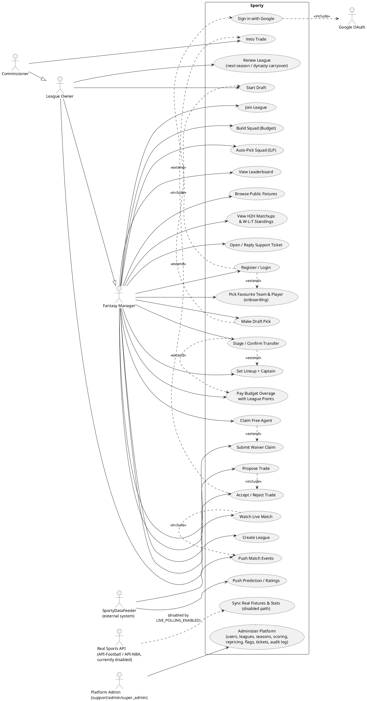

# Use Case Diagram

```plantuml
@startuml
left to right direction
actor "Fantasy Manager" as Manager
actor "League Owner" as Owner
actor "Commissioner" as Commissioner
actor "SportyDataFeeder\n(external system)" as Feeder
actor "Real Sports API\n(API-Football / API-NBA,\ncurrently disabled)" as RealAPI
actor "Google OAuth" as Google
actor "Platform Admin\n(support/admin/super_admin)" as Admin

Owner --|> Manager
Commissioner --|> Owner

rectangle Sporty {
  usecase "Register / Login" as UC1
  usecase "Sign in with Google" as UC1a
  usecase "Create League" as UC2
  usecase "Join League" as UC3
  usecase "Start Draft" as UC4
  usecase "Make Draft Pick" as UC5
  usecase "Build Squad (Budget)" as UC6
  usecase "Auto-Pick Squad (ILP)" as UC7
  usecase "Stage / Confirm Transfer" as UC8
  usecase "Set Lineup + Captain" as UC9
  usecase "Claim Free Agent" as UC10
  usecase "Submit Waiver Claim" as UC11
  usecase "Propose Trade" as UC12
  usecase "Accept / Reject Trade" as UC13
  usecase "Veto Trade" as UC14
  usecase "View Leaderboard" as UC15
  usecase "Browse Public Fixtures" as UC16
  usecase "Watch Live Match" as UC17
  usecase "Renew League\n(next season / dynasty carryover)" as UC18
  usecase "Push Match Events" as UC19
  usecase "Push Prediction / Ratings" as UC20
  usecase "Sync Real Fixtures & Stats\n(disabled path)" as UC21
  usecase "Pick Favourite Team & Player\n(onboarding)" as UC22
  usecase "View H2H Matchups\n& W-L-T Standings" as UC23
  usecase "Pay Budget Overage\nwith League Points" as UC24
  usecase "Open / Reply Support Ticket" as UC25
  usecase "Administer Platform\n(users, leagues, seasons, scoring,\nrepricing, flags, tickets, audit log)" as UC26

  UC1 .> UC1a : <<extend>>
  UC1 .> UC22 : <<extend>>
  UC5 .> UC4 : <<include>>
  UC8 .> UC9 : <<extend>>
  UC8 .> UC24 : <<extend>>
  UC10 .> UC11 : <<extend>>
  UC12 .> UC13 : <<include>>
  UC13 .> UC14 : <<extend>>
  UC17 .> UC19 : <<include>>
}

Manager --> UC1
Manager --> UC3
Manager --> UC5
Manager --> UC6
Manager --> UC7
Manager --> UC8
Manager --> UC9
Manager --> UC10
Manager --> UC11
Manager --> UC12
Manager --> UC13
Manager --> UC15
Manager --> UC16
Manager --> UC17
Manager --> UC22
Manager --> UC23
Manager --> UC24
Manager --> UC25

Owner --> UC2
Owner --> UC4
Owner --> UC18

Commissioner --> UC14

Admin --> UC26

UC1a ..> Google : <<include>>

Feeder --> UC19
Feeder --> UC20
RealAPI ..> UC21 : (disabled by\nLIVE_POLLING_ENABLED)
@enduml
```
