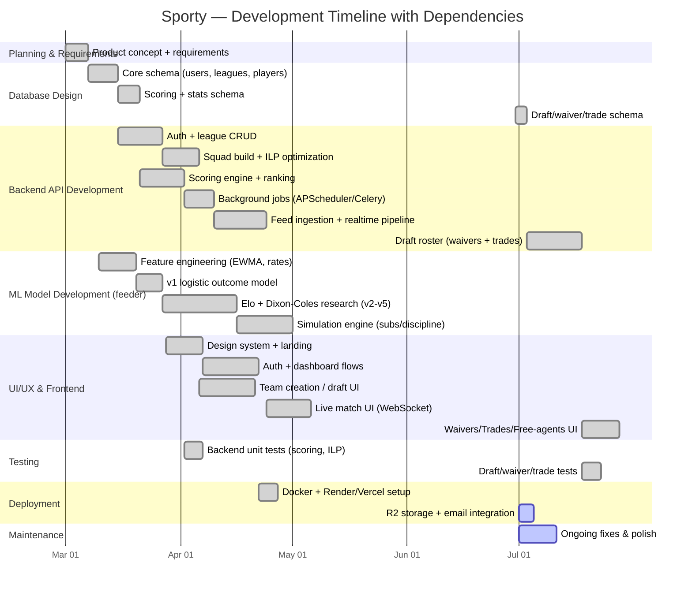

# Software Development Timeline (Gantt Chart)

```mermaid
gantt
    dateFormat  YYYY-MM-DD
    title Sporty — Development Timeline with Dependencies
    axisFormat  %b %d

    section Planning & Requirements
    Product concept + requirements     :done, plan1, 2026-03-01, 6d

    section Database Design
    Core schema (users, leagues, players) :done, db1, after plan1, 8d
    Scoring + stats schema                :done, db2, after db1, 6d
    Draft/waiver/trade schema             :done, db3, 2026-06-30, 3d

    section Backend API Development
    Auth + league CRUD                    :done, be1, after db1, 12d
    Squad build + ILP optimization         :done, be2, after be1, 10d
    Scoring engine + ranking               :done, be3, after db2, 12d
    Background jobs (APScheduler/Celery)   :done, be4, after be3, 8d
    Feed ingestion + realtime pipeline     :done, be5, after be4, 14d
    Draft roster (waivers + trades)        :done, be6, after db3, 15d

    section ML Model Development (feeder)
    Feature engineering (EWMA, rates)      :done, ml1, 2026-03-10, 10d
    v1 logistic outcome model              :done, ml2, after ml1, 7d
    Elo + Dixon-Coles research (v2-v5)     :done, ml3, after ml2, 20d
    Simulation engine (subs/discipline)    :done, ml4, after ml3, 15d

    section UI/UX & Frontend
    Design system + landing                :done, fe1, 2026-03-28, 10d
    Auth + dashboard flows                 :done, fe2, after fe1, 15d
    Team creation / draft UI               :done, fe3, after be2, 15d
    Live match UI (WebSocket)              :done, fe4, after be5, 12d
    Waivers/Trades/Free-agents UI          :done, fe5, after be6, 10d

    section Testing
    Backend unit tests (scoring, ILP)      :done, test1, after be3, 5d
    Draft/waiver/trade tests               :done, test2, after be6, 5d

    section Deployment
    Docker + Render/Vercel setup           :done, dep1, after fe2, 5d
    R2 storage + email integration         :active, dep2, 2026-07-01, 4d

    section Maintenance
    Ongoing fixes & polish                 :active, maint1, 2026-07-01, 10d
```
