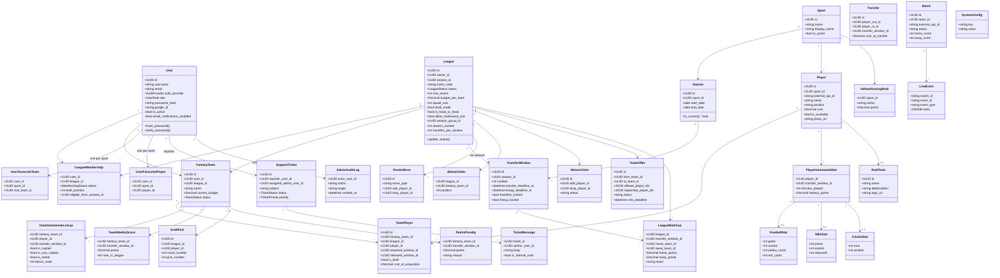

# Class Diagram — Core Domain Model

```mermaid
classDiagram
    class User {
        +UUID id
        +string username
        +string email
        +AuthProvider auth_provider
        +UserRole role
        +string password_hash
        +string google_id
        +bool is_active
        +bool email_notifications_enabled
        +hash_password()
        +verify_password()
    }

    class League {
        +UUID id
        +UUID owner_id
        +UUID season_id
        +string invite_code
        +LeagueStatus status
        +int max_teams
        +Decimal budget_per_team
        +int squad_size
        +bool draft_mode
        +bool is_head_to_head
        +bool allow_midseason_join
        +UUID season_group_id
        +int season_number
        +int transfers_per_window
        +update_status()
    }

    class Season {
        +UUID id
        +UUID sport_id
        +date start_date
        +date end_date
        +is_current() bool
    }

    class Sport {
        +UUID id
        +string name
        +string display_name
        +bool is_active
    }

    class TransferWindow {
        +UUID id
        +UUID season_id
        +int number
        +datetime transfer_deadline_at
        +datetime lineup_deadline_at
        +bool transfers_locked
        +bool lineup_locked
    }

    class LeagueMembership {
        +UUID user_id
        +UUID league_id
        +MembershipStatus status
        +int draft_position
        +UUID eligible_from_window_id
    }

    class FantasyTeam {
        +UUID id
        +UUID user_id
        +UUID league_id
        +string name
        +Decimal current_budget
        +TeamStatus status
    }

    class Player {
        +UUID id
        +UUID sport_id
        +string external_api_id
        +string name
        +string position
        +Decimal cost
        +bool is_available
        +string photo_url
    }

    class RealTeam {
        +UUID id
        +string name
        +string abbreviation
        +string logo_url
    }

    class TeamPlayer {
        +UUID id
        +UUID fantasy_team_id
        +UUID league_id
        +UUID player_id
        +UUID acquired_window_id
        +UUID released_window_id
        +bool is_draft
        +Decimal cost_at_acquisition
    }

    class DraftPick {
        +UUID id
        +UUID league_id
        +UUID player_id
        +int round_number
        +int pick_number
    }

    class Transfer {
        +UUID id
        +UUID player_out_id
        +UUID player_in_id
        +UUID transfer_window_id
        +Decimal cost_at_transfer
    }

    class RosterMove {
        +UUID id
        +string move_type
        +UUID add_player_id
        +UUID drop_player_id
    }

    class WaiverOrder {
        +UUID league_id
        +UUID fantasy_team_id
        +int position
    }

    class WaiverClaim {
        +UUID id
        +UUID add_player_id
        +UUID drop_player_id
        +string status
    }

    class TradeOffer {
        +UUID id
        +UUID from_team_id
        +UUID to_team_id
        +JSON offered_player_ids
        +JSON requested_player_ids
        +string status
        +datetime veto_deadline
    }

    class TeamGameweekLineup {
        +UUID fantasy_team_id
        +UUID player_id
        +UUID transfer_window_id
        +bool is_captain
        +bool is_vice_captain
        +bool is_starter
        +int bench_order
    }

    class TeamWeeklyScore {
        +UUID fantasy_team_id
        +UUID transfer_window_id
        +Decimal points
        +int rank_in_league
    }

    class PlayerGameweekStat {
        +UUID player_id
        +UUID transfer_window_id
        +int minutes_played
        +Decimal fantasy_points
    }

    class FootballStat {
        +int goals
        +int assists
        +int yellow_cards
        +int red_cards
    }

    class NBAStat {
        +int points
        +int assists
        +int rebounds
    }

    class CricketStat {
        +int runs
        +int wickets
    }

    class Match {
        +UUID id
        +UUID sport_id
        +string external_api_id
        +string status
        +int home_score
        +int away_score
    }

    class LiveEvent {
        +string match_id
        +string event_id
        +string event_type
        +JSONB meta
    }

    class DefaultScoringRule {
        +UUID sport_id
        +string action
        +Decimal points
    }

    class LeagueMatchup {
        +UUID league_id
        +UUID transfer_window_id
        +UUID home_team_id
        +UUID away_team_id
        +Decimal home_points
        +Decimal away_points
        +string result
    }

    class PointsPenalty {
        +UUID fantasy_team_id
        +UUID transfer_window_id
        +Decimal points
        +string reason
    }

    class UserFavouriteTeam {
        +UUID user_id
        +UUID sport_id
        +UUID real_team_id
    }

    class UserFavouritePlayer {
        +UUID user_id
        +UUID sport_id
        +UUID player_id
    }

    class SupportTicket {
        +UUID id
        +UUID reporter_user_id
        +UUID assigned_admin_user_id
        +string subject
        +TicketStatus status
        +TicketPriority priority
    }

    class TicketMessage {
        +UUID ticket_id
        +UUID author_user_id
        +string body
        +bool is_internal_note
    }

    class SystemConfig {
        +string key
        +string value
    }

    class AdminAuditLog {
        +UUID actor_user_id
        +string action
        +string target
        +datetime created_at
    }

    User "1" --> "*" LeagueMembership
    User "1" --> "*" FantasyTeam
    League "1" --> "*" LeagueMembership
    League "1" --> "*" FantasyTeam
    League "1" --> "*" TransferWindow : via Season
    Season "1" --> "*" TransferWindow
    Sport "1" --> "*" Season
    Sport "1" --> "*" Player
    FantasyTeam "1" --> "*" TeamPlayer
    FantasyTeam "1" --> "*" TeamGameweekLineup
    FantasyTeam "1" --> "*" TeamWeeklyScore
    FantasyTeam "1" --> "*" DraftPick
    Player "1" --> "*" TeamPlayer
    Player "1" --> "*" PlayerGameweekStat
    Player "1" --> "0..1" RealTeam
    PlayerGameweekStat "1" --> "0..1" FootballStat
    PlayerGameweekStat "1" --> "0..1" NBAStat
    PlayerGameweekStat "1" --> "0..1" CricketStat
    League "1" --> "*" RosterMove
    League "1" --> "*" WaiverOrder
    League "1" --> "*" WaiverClaim
    League "1" --> "*" TradeOffer
    Match "1" --> "*" LiveEvent
    Sport "1" --> "*" DefaultScoringRule
    League "1" --> "*" LeagueMatchup
    TransferWindow "1" --> "*" LeagueMatchup
    FantasyTeam "1" --> "*" PointsPenalty
    User "1" --> "*" UserFavouriteTeam : one per sport
    User "1" --> "*" UserFavouritePlayer : one per sport
    User "1" --> "*" SupportTicket : reporter
    SupportTicket "1" --> "*" TicketMessage
    User "1" --> "*" AdminAuditLog : actor
```

*(`LeagueScoringOverride` removed — per-league scoring overrides were retired
2026-07; scoring is `DefaultScoringRule`-only.)*
