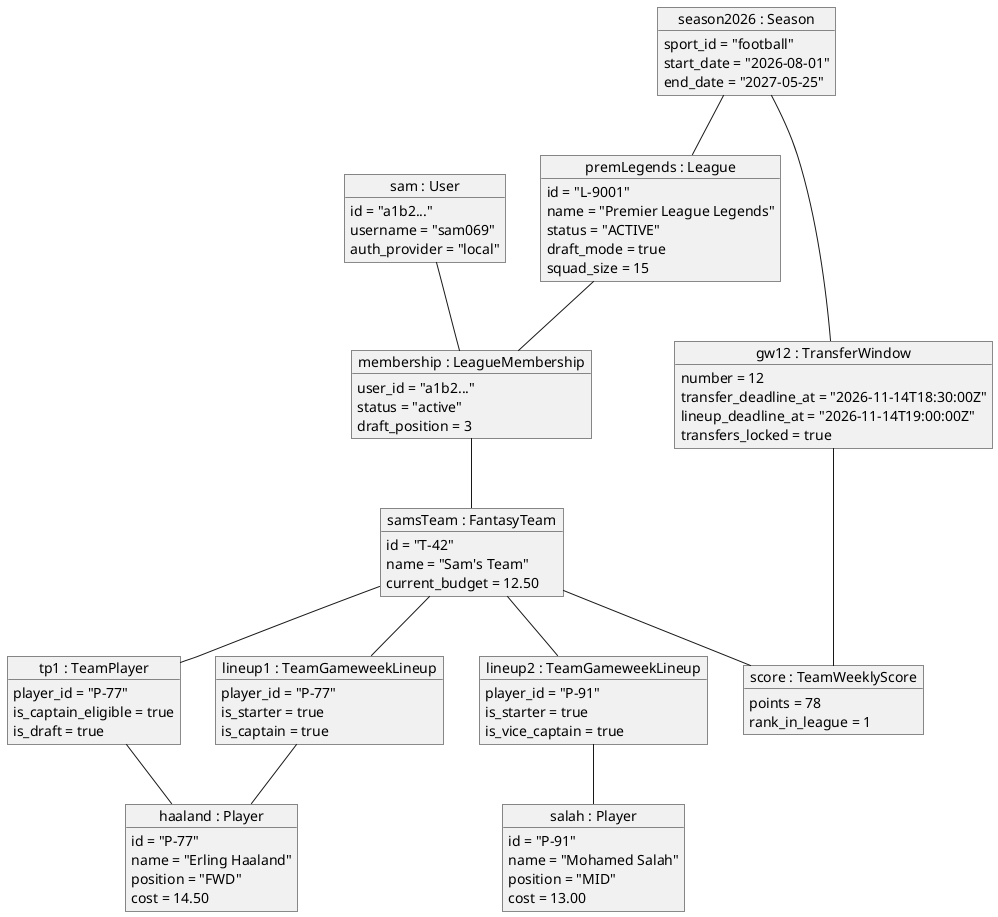

# Object Diagram — Runtime Instances

```plantuml
@startuml
object "sam : User" as sam {
  id = "a1b2..."
  username = "sam069"
  auth_provider = "local"
}

object "premLegends : League" as league {
  id = "L-9001"
  name = "Premier League Legends"
  status = "ACTIVE"
  draft_mode = true
  squad_size = 15
}

object "season2026 : Season" as season {
  sport_id = "football"
  start_date = "2026-08-01"
  end_date = "2027-05-25"
}

object "gw12 : TransferWindow" as gw12 {
  number = 12
  transfer_deadline_at = "2026-11-14T18:30:00Z"
  lineup_deadline_at = "2026-11-14T19:00:00Z"
  transfers_locked = true
}

object "samsTeam : FantasyTeam" as team {
  id = "T-42"
  name = "Sam's Team"
  current_budget = 12.50
}

object "membership : LeagueMembership" as member {
  user_id = "a1b2..."
  status = "active"
  draft_position = 3
}

object "haaland : Player" as p1 {
  id = "P-77"
  name = "Erling Haaland"
  position = "FWD"
  cost = 14.50
}

object "salah : Player" as p2 {
  id = "P-91"
  name = "Mohamed Salah"
  position = "MID"
  cost = 13.00
}

object "tp1 : TeamPlayer" as tp1 {
  player_id = "P-77"
  is_captain_eligible = true
  is_draft = true
}

object "lineup1 : TeamGameweekLineup" as lu1 {
  player_id = "P-77"
  is_starter = true
  is_captain = true
}

object "lineup2 : TeamGameweekLineup" as lu2 {
  player_id = "P-91"
  is_starter = true
  is_vice_captain = true
}

object "score : TeamWeeklyScore" as score {
  points = 78
  rank_in_league = 1
}

sam -- member
league -- member
member -- team
season -- league
season -- gw12
team -- tp1
tp1 -- p1
team -- lu1
team -- lu2
lu1 -- p1
lu2 -- p2
team -- score
gw12 -- score
@enduml
```
