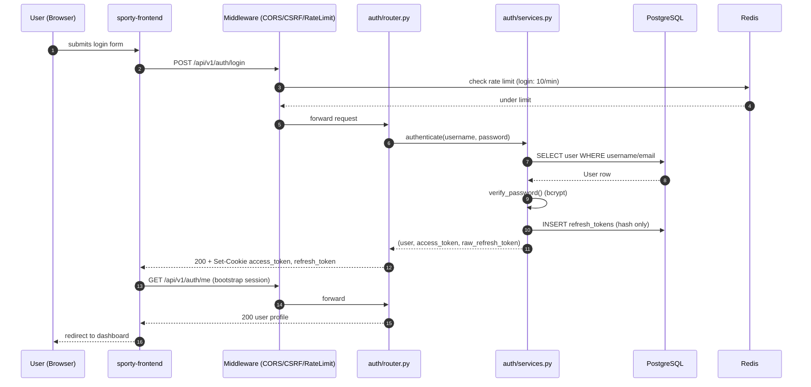
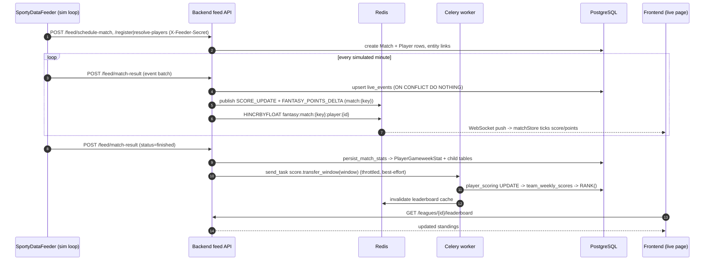

# Sequence Diagrams

## A. Login (User → Frontend → API → Auth → DB → Cache → Response)

```mermaid
sequenceDiagram
    autonumber
    participant U as User (Browser)
    participant FE as sporty-frontend
    participant MW as Middleware (CORS/CSRF/RateLimit)
    participant API as auth/router.py
    participant SVC as auth/services.py
    participant DB as PostgreSQL
    participant R as Redis

    U->>FE: submits login form
    FE->>MW: POST /api/v1/auth/login
    MW->>R: check rate limit (login: 10/min)
    R-->>MW: under limit
    MW->>API: forward request
    API->>SVC: authenticate(username, password)
    SVC->>DB: SELECT user WHERE username/email
    DB-->>SVC: User row
    SVC->>SVC: verify_password() (bcrypt)
    SVC->>DB: INSERT refresh_tokens (hash only)
    SVC-->>API: (user, access_token, raw_refresh_token)
    API-->>FE: 200 + Set-Cookie access_token, refresh_token
    FE->>MW: GET /api/v1/auth/me (bootstrap session)
    MW->>API: forward
    API-->>FE: 200 user profile
    FE-->>U: redirect to dashboard
```

## B. Full live-match flow (Feeder → Backend → Worker → Frontend)

```mermaid
sequenceDiagram
    autonumber
    participant F as SportyDataFeeder (sim loop)
    participant BE as Backend feed API
    participant R as Redis
    participant W as Celery worker
    participant PG as PostgreSQL
    participant FE as Frontend (live page)

    F->>BE: POST /feed/schedule-match, /register|resolve-players (X-Feeder-Secret)
    BE->>PG: create Match + Player rows, entity links
    loop every simulated minute
        F->>BE: POST /feed/match-result (event batch)
        BE->>PG: upsert live_events (ON CONFLICT DO NOTHING)
        BE->>R: publish SCORE_UPDATE + FANTASY_POINTS_DELTA (match:{key})
        BE->>R: HINCRBYFLOAT fantasy:match:{key}:player:{id}
        R-->>FE: WebSocket push -> matchStore ticks score/points
    end
    F->>BE: POST /feed/match-result (status=finished)
    BE->>PG: persist_match_stats -> PlayerGameweekStat + child tables
    BE->>W: send_task score.transfer_window(window) (throttled, best-effort)
    W->>PG: player_scoring UPDATE -> team_weekly_scores -> RANK()
    W->>R: invalidate leaderboard cache
    FE->>BE: GET /leagues/{id}/leaderboard
    BE-->>FE: updated standings
```
