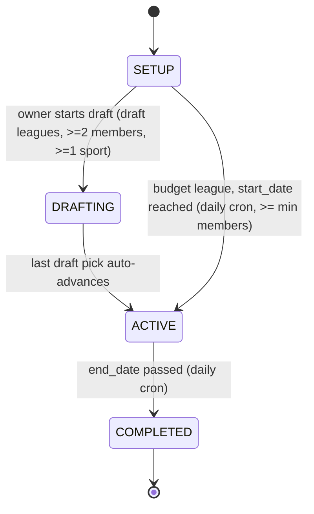
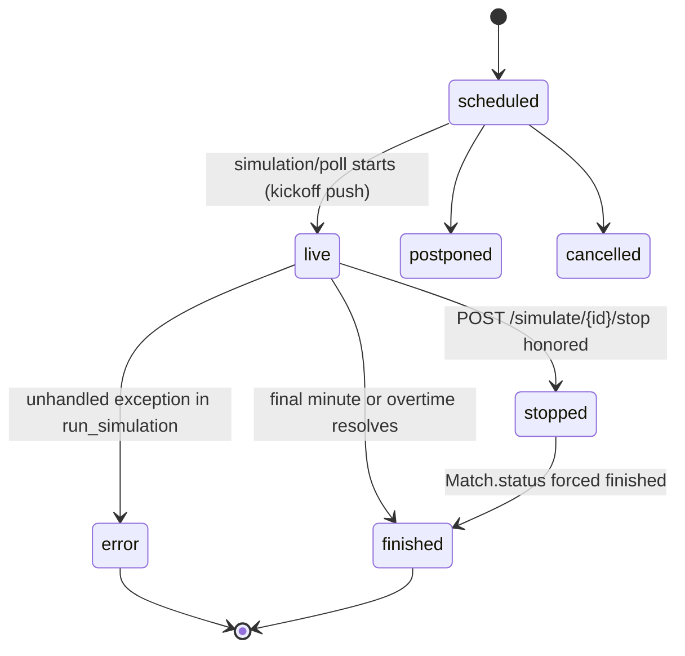
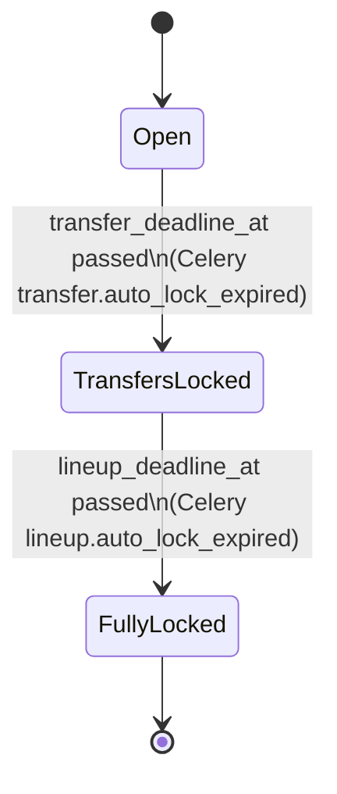
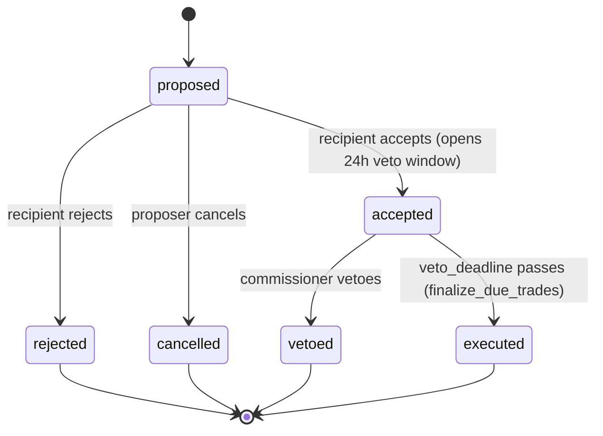
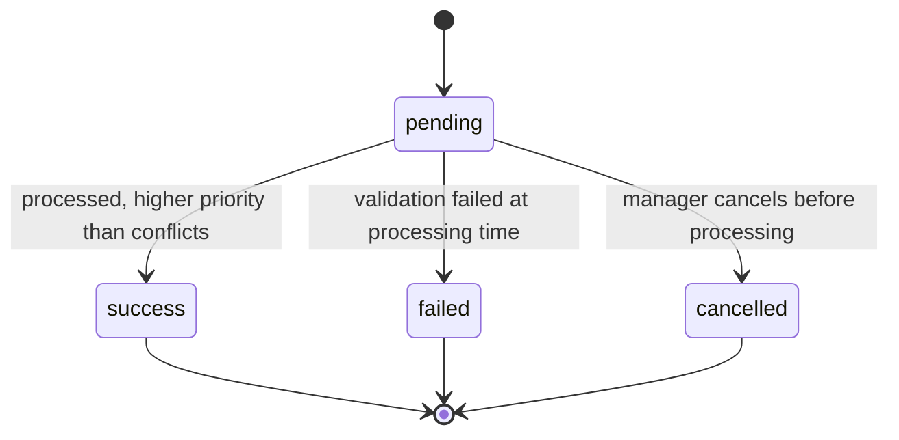

# State Diagrams

## League lifecycle (`League.status`)

## Match status (Sporty `Match.status` + feeder `SimulationState.status`)

## Transfer Window lock states

## Trade Offer (`trade_offers.status`)

## Waiver Claim (`waiver_claims.status`)

