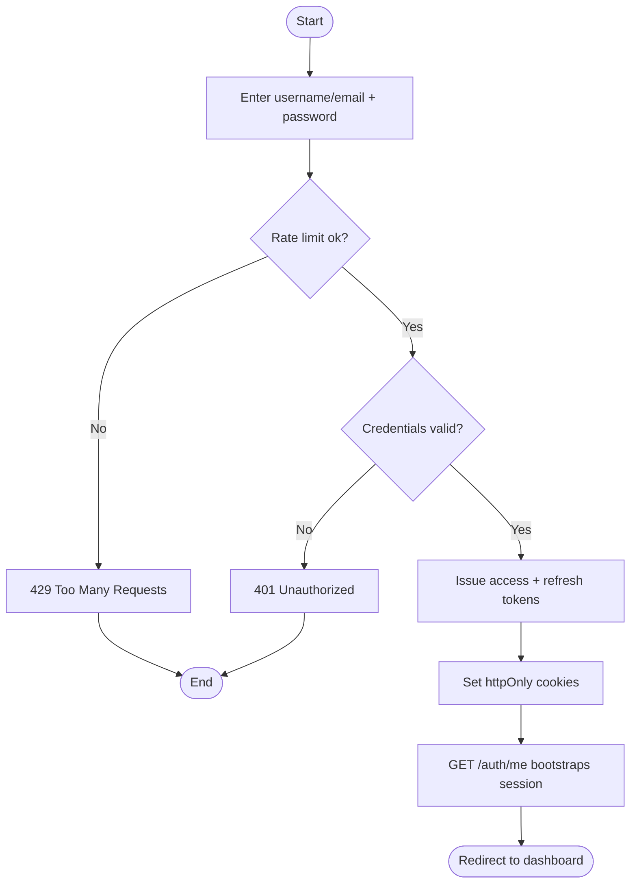
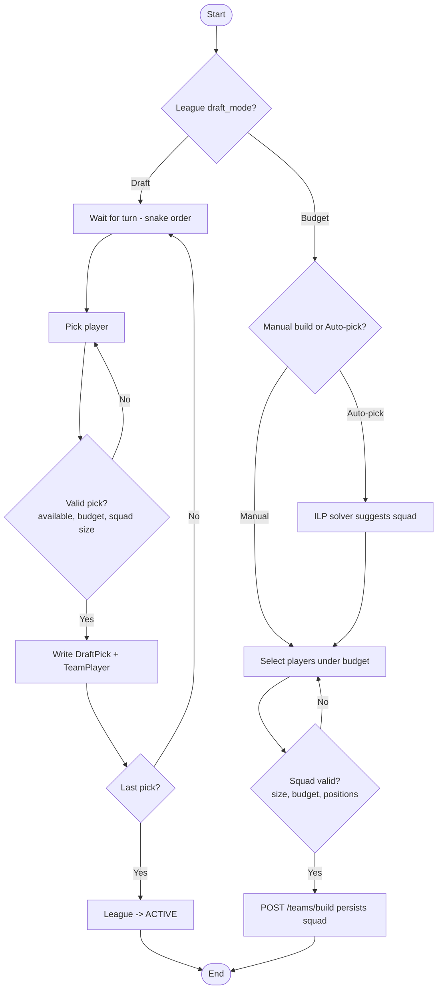
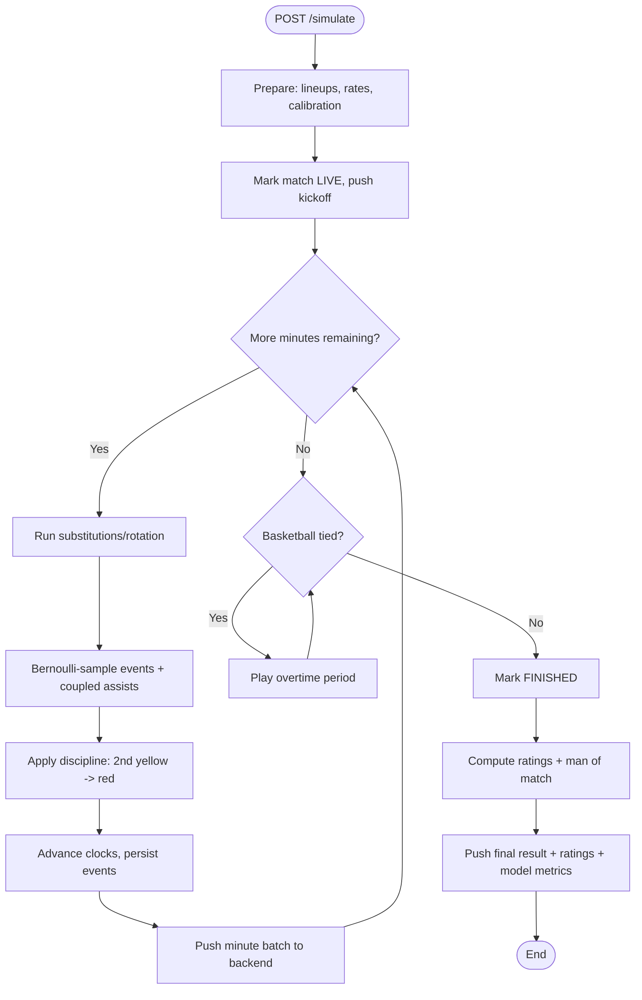
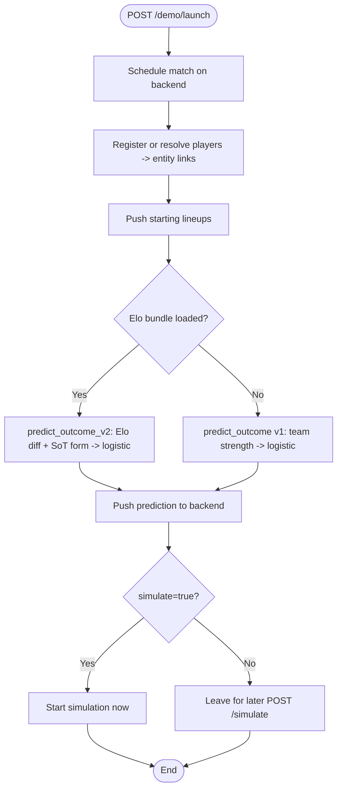
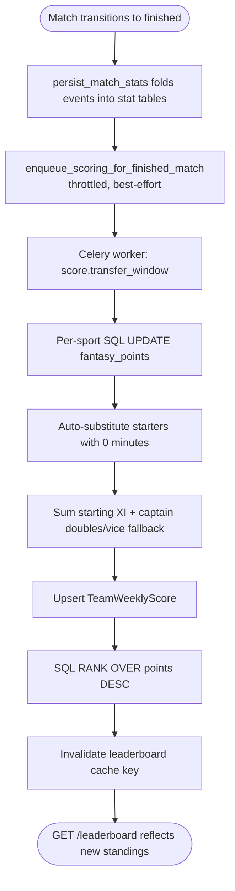

# Activity Diagrams

## Login

```mermaid
flowchart TD
    A([Start]) --> B[Enter username/email + password]
    B --> C{Rate limit ok?}
    C -- No --> Z1[429 Too Many Requests] --> End1([End])
    C -- Yes --> D{Credentials valid?}
    D -- No --> Z2[401 Unauthorized] --> End1
    D -- Yes --> E[Issue access + refresh tokens]
    E --> F[Set httpOnly cookies]
    F --> G[GET /auth/me bootstraps session]
    G --> H([Redirect to dashboard])
```

## Team Creation (draft or budget)

```mermaid
flowchart TD
    A([Start]) --> B{League draft_mode?}
    B -- Draft --> C[Wait for turn - snake order]
    C --> D[Pick player]
    D --> E{Valid pick?\navailable, budget, squad size}
    E -- No --> D
    E -- Yes --> F[Write DraftPick + TeamPlayer]
    F --> G{Last pick?}
    G -- No --> C
    G -- Yes --> H[League -> ACTIVE]
    B -- Budget --> I{Manual build or Auto-pick?}
    I -- Manual --> J[Select players under budget]
    I -- Auto-pick --> K[ILP solver suggests squad]
    K --> J
    J --> L{Squad valid?\nsize, budget, positions}
    L -- No --> J
    L -- Yes --> M[POST /teams/build persists squad]
    H --> N([End])
    M --> N
```

## Match Simulation

```mermaid
flowchart TD
    A([POST /simulate]) --> B[Prepare: lineups, rates, calibration]
    B --> C[Mark match LIVE, push kickoff]
    C --> D{More minutes remaining?}
    D -- Yes --> E[Run substitutions/rotation]
    E --> F[Bernoulli-sample events + coupled assists]
    F --> G[Apply discipline: 2nd yellow -> red]
    G --> H[Advance clocks, persist events]
    H --> I[Push minute batch to backend]
    I --> D
    D -- No --> J{Basketball tied?}
    J -- Yes --> K[Play overtime period]
    K --> J
    J -- No --> L[Mark FINISHED]
    L --> M[Compute ratings + man of match]
    M --> N[Push final result + ratings + model metrics]
    N --> O([End])
```

## Prediction Generation (feeder demo launch)

```mermaid
flowchart TD
    A([POST /demo/launch]) --> B[Schedule match on backend]
    B --> C[Register or resolve players -> entity links]
    C --> D[Push starting lineups]
    D --> E{Elo bundle loaded?}
    E -- Yes --> F[predict_outcome_v2: Elo diff + SoT form -> logistic]
    E -- No --> G[predict_outcome v1: team strength -> logistic]
    F --> H[Push prediction to backend]
    G --> H
    H --> I{simulate=true?}
    I -- Yes --> J[Start simulation now]
    I -- No --> K[Leave for later POST /simulate]
    J --> L([End])
    K --> L
```

## Leaderboard Update

```mermaid
flowchart TD
    A([Match transitions to finished]) --> B[persist_match_stats folds events into stat tables]
    B --> C[enqueue_scoring_for_finished_match\nthrottled, best-effort]
    C --> D[Celery worker: score.transfer_window]
    D --> E[Per-sport SQL UPDATE fantasy_points]
    E --> F[Auto-substitute starters with 0 minutes]
    F --> G[Sum starting XI + captain doubles/vice fallback]
    G --> H[Upsert TeamWeeklyScore]
    H --> I[SQL RANK OVER points DESC]
    I --> J[Invalidate leaderboard cache key]
    J --> K([GET /leaderboard reflects new standings])
```
