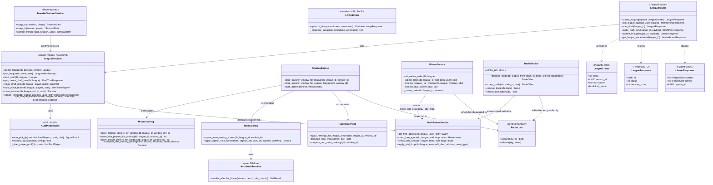

# Refined Class Diagram — Services, Schemas, and Domain Classes

```mermaid
classDiagram
    class LeagueRouter {
        <<FastAPI router>>
        +create_league(payload: LeagueCreate) LeagueResponse
        +join_league(payload: JoinRequest) MembershipResponse
        +start_draft(league_id) LeagueResponse
        +make_draft_pick(league_id, payload) DraftPickResponse
        +update_lineup(league_id, payload) LineupResponse
        +get_league_leaderboard(league_id) LeaderboardResponse
    }

    class LeagueServices {
        <<service module, no commit>>
        +create_league(db, payload, owner) League
        +join_league(db, code, user) LeagueMembership
        +start_draft(db, league) League
        +get_current_draft_turn(db, league) DraftTurnResponse
        +make_draft_pick(db, league, player, user) DraftPick
        +build_initial_team(db, league, players, user) list~TeamPlayer~
        +make_transfer(db, league, out, in, user) Transfer
        +update_lineup(db, league, payload, user) list~TeamGameweekLineup~
        +get_league_leaderboard(db, league, window, historical) LeaderboardResponse
    }

    class AutoPickService {
        <<ILP - PuLP>>
        +auto_pick_ilp(pool: list~PoolPlayer~, config: dict) SquadResult
        +validate_squad(squad, config) bool
        -_load_player_pool(db, sport) list~PoolPlayer~
    }

    class ILPOptimizer {
        <<stateless ILP - PuLP>>
        +optimize_lineup(candidates, constraints) OptimizeLineupResponse
        -_diagnose_infeasible(candidates, constraints) str
    }

    class ScoringEngine {
        +score_transfer_window_for_league(db, league_id, window_id)
        +score_transfer_window_for_season_leagues(db, window_id)
        +score_active_transfer_windows(db)
    }

    class PlayerScoring {
        +score_football_players_for_window(db, league_id, window_id) int
        +score_nba_players_for_window(db, league_id, window_id) int
        +score_cricket_players_for_window(db, league_id, window_id) int
        +compute_nba_fantasy_points(points, assists, rebounds, steals, blocks) Decimal
    }

    class AutoSubsResolver {
        <<pure, DB-free>>
        +resolve_effective_lineup(starters, bench, slot_bounds) SubResult
    }

    class TeamScoring {
        +upsert_team_weekly_scores(db, league_id, window_id)
        +apply_captain_vice_bonus(base, captain_pts, vice_pts, capMin, viceMin) Decimal
    }

    class RankingService {
        +apply_rankings_for_league_window(db, league_id, window_id)
        +compute_rank_map(scores: dict) dict
        +compute_and_store_rankings(db, window_id)
    }

    class DraftRosterService {
        +get_free_agents(db, league, user) list~Player~
        +claim_free_agent(db, league, add, drop, user) RosterMove
        +check_add_drop(db, league, team, add, drop) tuple
        +apply_add_drop(db, league, team, add, drop, window, move_type)
    }

    class WaiverService {
        +init_waiver_order(db, league)
        +submit_claim(db, league_id, add, drop, user) dict
        +process_waivers_for_window(db, league, window) dict
        +process_due_waivers(db) dict
        -_rotate_order(db, league_id, winners)
    }

    class TradeService {
        +propose_trade(db, league, from_team, to_team, offered, requested) TradeOffer
        +accept_trade(db, trade_id, user) TradeOffer
        +execute_trade(db, trade) None
        +finalize_due_trades(db) dict
        +VETO_HOURS int
    }

    class RedisLock {
        <<context manager>>
        +acquire(key, ttl) bool
        +release(key, token)
    }

    class TransferSessionService {
        <<Redis-backed>>
        +stage_out(session, player) SessionState
        +stage_in(session, player) SessionState
        +confirm_transfers(db, session, user) list~Transfer~
    }

    class LeagueCreate {
        <<Pydantic DTO>>
        +str name
        +UUID season_id
        +list~str~ sports
        +bool draft_mode
    }

    class LeagueResponse {
        <<Pydantic DTO>>
        +UUID id
        +str status
        +int member_count
    }

    class LineupResponse {
        <<Pydantic DTO>>
        +list~PlayerSlot~ starters
        +list~PlayerSlot~ bench
        +UUID captain_id
    }

    LeagueRouter --> LeagueServices : calls
    LeagueServices --> AutoPickService : uses
    LeagueServices --> DraftRosterService : delegates (waiver init)
    LeagueRouter ..> LeagueCreate : consumes
    LeagueRouter ..> LeagueResponse : returns
    LeagueRouter ..> LineupResponse : returns
    ScoringEngine --> PlayerScoring : orchestrates
    ScoringEngine --> TeamScoring : orchestrates
    ScoringEngine --> RankingService : orchestrates
    ScoringEngine --> RedisLock : wraps run in
    TeamScoring --> AutoSubsResolver : uses
    WaiverService --> DraftRosterService : reuses check_add_drop/apply_add_drop
    TradeService --> DraftRosterService : reuses squad validation
    WaiverService --> RedisLock : scheduler job guarded by
    TradeService --> RedisLock : scheduler job guarded by
    TransferSessionService --> LeagueServices : confirm writes via
```
