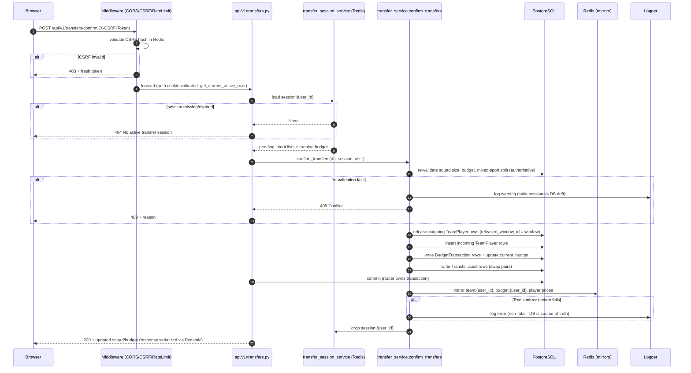

# Refined Sequence Diagrams — Validation, Auth, Logging, Error Handling, Cache, Retry, Queue

## A. Confirm a staged transfer



## B. Feeder match-result ingestion with retry and queue publishing

```mermaid
sequenceDiagram
    autonumber
    participant F as Feeder simulation loop
    participant BE as backend api/v1/feed.py
    participant AUTH as verify_feeder_secret
    participant DB as PostgreSQL
    participant R as Redis (pub/sub + hash)
    participant TRIG as scoring/trigger.py
    participant Q as Celery (Redis broker)
    participant W as Celery worker
    participant LOG as Logger

    loop up to 3 attempts, backoff 1.5^n
        F->>BE: POST /feed/match-result (X-Feeder-Secret)
        alt push fails (network/5xx)
            F->>LOG: log error, sleep backoff
        end
    end
    BE->>AUTH: compare_digest(header, FEEDER_SECRET)
    alt secret missing
        AUTH-->>F: 503 Service Unavailable
    else mismatch
        AUTH-->>F: 401 Unauthorized
    end
    AUTH-->>BE: ok
    BE->>DB: INSERT live_events ... ON CONFLICT (match_id,event_id) DO NOTHING
    BE->>DB: update Match.home_score/away_score/status
    BE->>R: PUBLISH SCORE_UPDATE (match:{key})
    BE->>R: HINCRBYFLOAT fantasy:match:{key}:player:{id}
    BE->>R: PUBLISH FANTASY_POINTS_DELTA
    alt live -> finished transition
        BE->>DB: persist_match_stats (fold events into stat tables)
        BE->>DB: commit
        BE->>TRIG: enqueue_scoring_for_finished_match(window)
        TRIG->>R: SET score:enqueue:{window} NX EX 300 (throttle)
        alt throttle key already set
            TRIG->>LOG: log skip (already enqueued)
        else acquired
            TRIG->>Q: send_task score.transfer_window(window_id) ignore_result=True
            alt broker error
                TRIG->>LOG: log error, release throttle key for retry
            end
        end
    end
    BE-->>F: 200 ack (best-effort; ingestion never fails on downstream push/enqueue errors)
    Q-->>W: deliver task
    W->>R: acquire redis_lock(lock:score:{league}:{window})
    W->>DB: player_scoring UPDATE, upsert_team_weekly_scores, RANK()
    W->>DB: resolve_matchups_for_window (H2H leagues: compare points → win/loss/tie)
    W->>R: invalidate leaderboard cache
    W->>R: release lock (Lua: delete if token matches)
```
