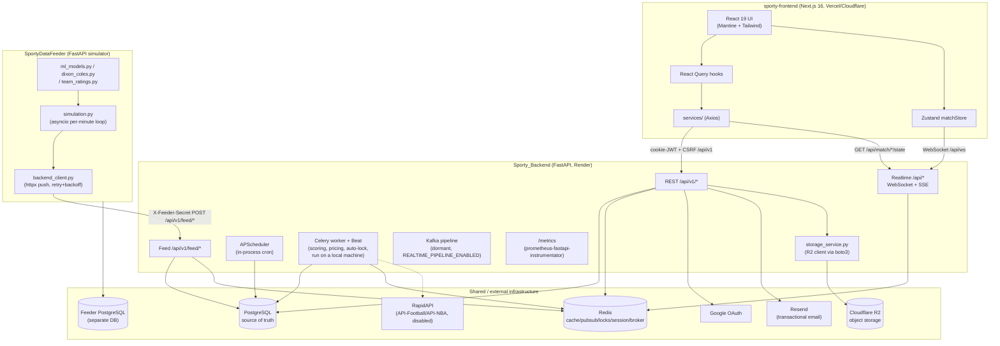

# Component Diagram

```mermaid
flowchart TB
    subgraph FE["sporty-frontend (Next.js 16, Vercel/Cloudflare)"]
        UI["React 19 UI\n(Mantine + Tailwind)"]
        SVC["services/ (Axios)"]
        RQ["React Query hooks"]
        ZS["Zustand matchStore"]
        UI --> RQ --> SVC
        UI --> ZS
    end

    subgraph BE["Sporty_Backend (FastAPI, Render)"]
        API["REST /api/v1/*"]
        RT["Realtime /api/*\nWebSocket + SSE"]
        FEED["Feed /api/v1/feed/*"]
        APS["APScheduler\n(in-process cron)"]
        CEL["Celery worker + Beat\n(scoring, pricing, auto-lock,\nrun on a local machine)"]
        KAFKA["Kafka pipeline\n(dormant, REALTIME_PIPELINE_ENABLED)"]
        METRICS["/metrics\n(prometheus-fastapi-instrumentator)"]
        STORAGE["storage_service.py\n(R2 client via boto3)"]
    end

    subgraph FEEDER["SportyDataFeeder (FastAPI simulator)"]
        SIM["simulation.py\n(asyncio per-minute loop)"]
        ML["ml_models.py / dixon_coles.py\n/ team_ratings.py"]
        PUSH["backend_client.py\n(httpx push, retry+backoff)"]
        ML --> SIM --> PUSH
    end

    subgraph DATA["Shared / external infrastructure"]
        PG[("PostgreSQL\nsource of truth")]
        REDIS[("Redis\ncache/pubsub/locks/session/broker")]
        FDB[("Feeder PostgreSQL\n(separate DB)")]
        R2[("Cloudflare R2\nobject storage")]
        GOOGLE["Google OAuth"]
        RAPIDAPI["RapidAPI\n(API-Football/API-NBA, disabled)"]
        RESEND["Resend\n(transactional email)"]
    end

    SVC -- "cookie-JWT + CSRF /api/v1" --> API
    ZS -- "WebSocket /api/ws" --> RT
    SVC -- "GET /api/match/*/state" --> RT
    PUSH -- "X-Feeder-Secret POST /api/v1/feed/*" --> FEED

    API --> PG
    FEED --> PG
    CEL --> PG
    APS --> PG
    RT --> REDIS
    FEED --> REDIS
    CEL --> REDIS
    API --> REDIS
    API --> GOOGLE
    API --> RESEND
    CEL -.-> RAPIDAPI
    STORAGE --> R2
    API --> STORAGE
    FEEDER --> FDB
```
