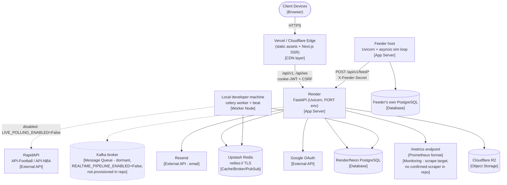

# Deployment Diagram

**Not evidenced in the repository** (so intentionally omitted as concrete nodes
above rather than invented): a dedicated reverse proxy/load balancer in front of
Render (Render terminates TLS and load-balances internally, but no separate
proxy/LB config exists in this repo), a logging aggregation stack, a backup-service
integration, and a Kubernetes/container-orchestration layer — this is a
platform-as-a-service deployment (Render + Vercel/Cloudflare + Upstash + R2), not a
self-managed cluster.
