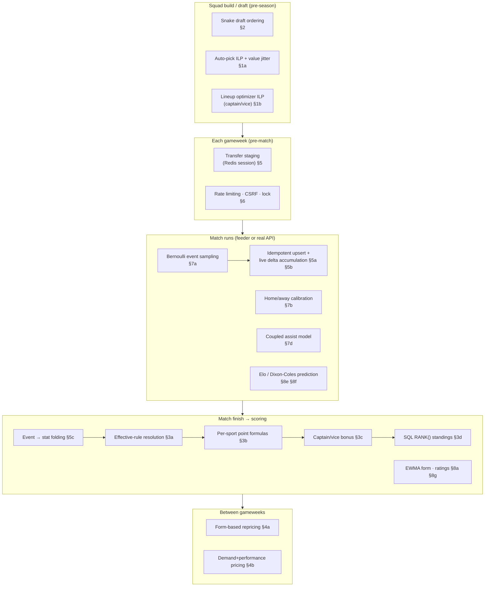

# 12 — Algorithms Index (detailed)

This chapter explains every non-trivial algorithm in the system: **what** it does, **why** that
approach was chosen (over the obvious alternatives), and **how** it works step by step. Each entry
names the exact file/function. Where an algorithm has real math, the math is spelled out.

## Where each algorithm fires

This map shows, along the life of a match/gameweek, which algorithm runs where. Read it top-to-bottom
as time passes; each box links to a section below.



Contents:
1. [Optimization — the two PuLP ILP solvers](#1-optimization--the-two-pulp-ilp-solvers)
2. [Snake draft ordering](#2-snake-draft-ordering)
3. [Scoring, captain/vice, ranking](#3-scoring-captainvice-and-ranking)
4. [Pricing — two different models](#4-pricing--two-different-models)
5. [Live ingestion & the scoring bridge](#5-live-ingestion--the-scoring-bridge)
6. [Concurrency & infrastructure algorithms](#6-concurrency--infrastructure-algorithms)
7. [The feeder — simulation](#7-the-feeder--match-simulation)
8. [The feeder — ML models](#8-the-feeder--ml-models)
9. [Resilience patterns](#9-resilience-patterns)

---

## 1. Optimization — the two PuLP ILP solvers

Both solvers are **Integer Linear Programs (ILP)** solved with PuLP's bundled CBC solver. An ILP is
an optimization problem where you **maximize a linear objective subject to linear constraints, with
variables forced to be integers** — here, 0/1 (binary) "is this player picked?" decisions.

**Why ILP at all?** Squad selection is a *constrained combinatorial* problem: "pick the best 15
players under a budget, with at least 3 defenders, no more than 3 from one club, exactly 8 football +
7 basketball…". A greedy "sort by value and take the top players" fails because it can't respect
multiple simultaneous constraints (you might blow the budget, or end up with 6 goalkeepers). Brute
force is `C(500, 15)` combinations — astronomically infeasible. ILP is the textbook tool for this
class (it's the fantasy-football knapsack-with-side-constraints problem): the solver explores the
solution space intelligently (branch-and-bound) and returns a **provably optimal** squad, in
milliseconds for these sizes.

### 1a. Auto-pick squad — `app/league/auto_pick_service.py:auto_pick_ilp`

**What:** given a pool of candidate players and a league's sport config, return an optimal, valid
starting squad (it *suggests*, it doesn't persist).

**How:**
- One binary variable `x_i ∈ {0,1}` per available player (`_player_var_name`).
- **Objective:** `maximize Σ jittered_value_i · x_i`.
  - `value_i` = the player's historical **average fantasy points ÷ cost** (a "points per unit money"
    proxy — `PoolPlayer.value`). This is what makes the squad *good* rather than just *legal*.
- **Constraints** added to the `pulp.LpProblem`:
  - `Σ x_i == squad_size` (pick exactly the right count);
  - `Σ cost_i · x_i ≤ budget (+ 1e-8)` — the epsilon absorbs floating-point rounding so a squad that
    costs *exactly* the budget isn't rejected;
  - per sport: `Σ_{i in sport} x_i == quota` (football 8 / basketball 7 in mixed, or the full 15/13);
  - per position: `Σ_{i in position} x_i ≥ minimum` (e.g. ≥1 GKP, ≥3 DEF);
  - per club: `Σ_{i in club} x_i ≤ maxPerClub` (default 3);
  - locked players: `x_i == 1` (force-include a player the user pinned).
- Solve with `PULP_CBC_CMD(msg=0)`. A non-`Optimal` status raises a descriptive `ValueError`.
- `validate_squad` re-checks the result against the same constraints as a belt-and-braces guard.

**The jitter — and why it exists:** an ILP is *deterministic* — the same pool always yields the exact
same optimal squad. That's bad UX for an "auto-pick" button (press it twice, get the same team). So
before solving, each player's value is multiplied by a random factor `1 ± 0.55`
(`AUTO_PICK_JITTER_STRENGTH`):

```
jittered_value_i = value_i · (1 + uniform(-0.55, 0.55))
```

This perturbs the objective enough to surface *different near-optimal* squads on each press, while the
hard constraints still guarantee every result is legal. It trades a little optimality for variety —
deliberately, because a fantasy manager wants suggestions, not one dictated answer.

### 1b. Lineup optimizer with captain/vice — `app/services/optimization/ilp_optimizer.py:optimize_lineup`

**What:** a stateless endpoint (`POST /api/v1/optimization/lineup`) that takes candidates + constraints
and returns the optimal squad **and** who to captain/vice.

**How it differs:** three binary variables per player — `x_i` (selected), `c_i` (captain), `v_i`
(vice). The objective encodes the captain bonus directly:

```
maximize  Σ  [ x_i·pts_i  +  c_i·pts_i  +  v_i·(pts_i · vice_multiplier) ]  −  0.000001 · Σ cost_i·x_i
```

- The captain's points are counted **twice** (once through `x`, once through `c`) — this is the
  fantasy "captain scores double" rule expressed as a linear term, so the solver *chooses the captain
  that maximizes total points*, not just any starter.
- The `-0.000001·Σ cost` term is a **tie-breaker**: among equally-good squads, prefer the cheaper one.
- **Coupling constraints** make the captain/vice coherent: `Σ c_i == 1`, `Σ v_i == 1` (exactly one
  each), `c_i ≤ x_i` and `v_i ≤ x_i` (must be in the squad), `c_i + v_i ≤ 1` (can't be both).

**Why an infeasibility diagnostic** (`_diagnose_infeasible`): when a solver returns "infeasible" it
gives no reason, which is useless to a user. So on failure the code re-checks each constraint in plain
Python and returns a human reason — "Budget too low for minimum feasible squad", "Insufficient players
for required position 'GKP'", "Locked and banned player sets overlap", etc. That turns an opaque solver
failure into an actionable 422.

---

## 2. Snake draft ordering

**Location:** `app/league/services.py:get_current_draft_turn` / `make_draft_pick`.

**What:** determine whose turn it is in a live draft, in **serpentine** order.

**Why serpentine (not fixed order)?** In a fixed order (1,2,…,N every round), the player with the first
pick always picks first — a permanent, compounding advantage. A **snake** reverses the order each round
so the person who picked *last* in round 1 picks *first* in round 2. Over the whole draft this balances
out the advantage of an early pick — it's the standard fairness mechanism in fantasy drafts.

**How:** with `N` members and `squad_size` rounds, there are `N × squad_size` total picks. For the
overall 1-based `pick_number`:

```
round_number       = ((pick_number - 1) // N) + 1
index_in_round     =  (pick_number - 1) %  N            # 0-based position within the round
if round is ODD :  position_in_round = index_in_round + 1     # 1, 2, …, N   (ascending)
if round is EVEN:  position_in_round = N - index_in_round     # N, …, 2, 1   (descending)
```

The member whose randomly-assigned `draft_position` equals `position_in_round` is on the clock. When
`pick_number` reaches `N × squad_size`, the draft is complete and the league auto-advances to ACTIVE.

**Example** (N=3): picks go `1→2→3` (round 1, ascending), then `3→2→1` (round 2, descending), then
`1→2→3` again — the classic zig-zag.

---

## 3. Scoring, captain/vice, and ranking

### 3a. Effective-rule resolution — `app/services/scoring/rules.py:resolve_effective_rules`

**What:** for a (league, sport, action) find the point value to use.

**Why layered:** the platform ships sensible defaults, but a league owner may re-balance scoring for
their league. So the value is resolved by **precedence**:

```
league override  →  platform default  →  hardcoded fallback  →  0
```

**How:** one SELECT against `league_scoring_overrides` and one against `default_scoring_rules`, merged
in Python — an override wins, else the default, else a code constant, else 0.

### 3b. Per-sport fantasy-point formulas — `app/services/scoring/player_scoring.py`

**What:** turn raw match stats into each player's `fantasy_points` for a gameweek.

**Why in SQL (not Python loops)?** A gameweek touches thousands of player rows. Doing it as a single
`UPDATE … FROM` per sport rewrites every player's points in **one statement** — orders of magnitude
faster than fetching rows, computing in Python, and writing them back, and it's atomic.

**How — the formulas:**
- **Football:** `points = goals·5 + assists·3 + yellow_cards·(−1) + red_cards·(−2)` (the `5/3/−1/−2`
  are overridable defaults). Straight linear weighting.
- **NBA — a fractional per-10 scheme:**
  `points = (game_points/10)·w_pts + (assists/10)·w_ast + rebounds·w_reb + steals·w_stl + blocks·w_blk`.
  Why divide by 10? NBA counting stats are an order of magnitude bigger than football's (a player
  scores 25 *points*, not 2 *goals*), so raw values would swamp everything else. Scaling points and
  assists per-10 puts them on a comparable footing with rebounds/steals/blocks. The division is done in
  SQL with an explicit `cast(..., Numeric)` so integer division doesn't truncate.
- **Cricket:** `runs·w + wickets·w + catches·w + run_outs·w + maidens·w`, each wrapped in
  `coalesce(…, 0)` because cricket stat columns are nullable (NULL = "didn't bat/bowl").

### 3c. Captain-doubles / vice-fallback — `app/services/scoring/team_scoring.py`

**What:** compute a team's weekly total from its **starting lineup**, applying the captain bonus.

**Why a fallback?** The captain is a bet: their points double. But if your captain doesn't play
(injured, benched → 0 minutes), you'd get nothing from the bet — so the **vice-captain** steps in as
the automatic backup captain. This mirrors real fantasy-football rules.

**How** (a SQL `CASE`, mirrored by the pure function `apply_captain_vice_bonus`):

```
final = base_points +
        if   captain_minutes > 0                      : captain_points     # captain played → doubled
        elif captain_minutes == 0 and vice_minutes>0  : vice_points        # captain DNP → vice doubles
        else                                          : 0
```

`base_points` is the sum of all starters' points (each starter counted once); the bonus adds the
captain (or vice) a **second** time. So the captain effectively scores double; the vice only matters
when the captain gets zero minutes. Eligibility (`eligible_from_window_id`) is applied in the same
query so a late joiner's pre-eligibility windows don't count.

### 3d. Ranking with SQL `RANK()` — `app/services/scoring/ranking.py`

**What:** assign `rank_in_league` to each team for a window.

**Why store it (compute-once-read-many)?** The leaderboard is read constantly; ranks only change when
scores change. Computing `RANK()` on every read wastes work. So it's computed once after scoring and
stored (the model comments make this trade-off explicit).

**How:** `UPDATE … FROM (SELECT id, RANK() OVER (ORDER BY points DESC) …)`. `RANK()` semantics: **ties
share a rank, and the next rank skips** — two teams tied for 1st are both rank 1, and the next team is
rank 3. A pure-Python twin `compute_rank_map` replicates this for tests (sort by `(-points, team_id)`,
assign the running rank, skipping on ties).

---

## 4. Pricing — two different models

Player `cost` drifts over the season. There are **two** independent algorithms writing the same
`players.cost` column (worth knowing when you see prices move).

### 4a. Form-based recency-weighted repricing — `app/services/pricing/repricing.py`

**What:** move a player's price toward their recent fantasy form. (Daily `pricing.recalculate` task.)

**Why recency-weighted?** A player's price should reflect *current* form, not a season-old average. So
recent gameweeks count more.

**How:**
1. Take the last `N` windows (default 3). Assign each a weight by **rank** — newest gets weight `n`,
   next `n-1`, … — normalized to sum to 1 (`_window_weights`). This is a linear recency decay.
2. Compute the player's **weighted average fantasy points** across those windows.
3. Move the price toward form, bounded:
   ```
   raw_delta = (weighted_points − baseline) · points_to_cost_factor
   bounded   = clamp(raw_delta, −max_step_per_run, +max_step_per_run)
   next_cost = quantize_0.10( clamp(cost + bounded, min_cost, max_cost) )
   ```
   Per-sport `PricingPolicy` sets `baseline`, `factor`, `max_step`, and `min/max` cost. Clamping the
   *step* prevents wild jumps; clamping the *cost* keeps prices in a sane band; quantizing to 0.1 keeps
   the market readable.
4. Every change writes an immutable `PlayerPriceHistory` audit row.

### 4b. Demand + performance blend — `app/services/price_update_service.py`

**What:** an alternative model driven by the 4-hourly APScheduler job.

**Why blend demand?** Real fantasy markets move on *popularity*, not just performance — a player
everyone is buying should get pricier. So this model is mostly demand-driven.

**How:**
```
demand_score      = (transfers_in − transfers_out) / max(1, in + out)     # last 24h, range [-1, 1]
performance_score = (avg_fantasy_points − 5) / 50                          # normalized around a mean
blended           = 0.70·demand_score + 0.30·performance_score            # 70% demand, 30% form
delta             = clamp(blended, ±0.10)                                  # max ±0.10/day
new_price         = quantize(cost + delta)   # floored at 0.10
```
It writes the DB first, then mirrors the price into the Redis `player:prices` hash so the transfer
session reads consistent prices.

---

## 5. Live ingestion & the scoring bridge

### 5a. Idempotent event upsert — `app/api/v1/feed.py`

**What / why:** the feeder pushes minute batches and may retry on a network blip; the same event must
never be double-counted. **How:** `INSERT … ON CONFLICT (match_id, event_id) DO NOTHING` — the
`(match_id, event_id)` unique constraint makes re-pushing a no-op. `event_id` is a UUID generated once
per event by the feeder, so it's a stable idempotency key across retries and replays.

### 5b. Live fantasy-delta accumulation — `app/services/feed_scoring.py:apply_live_points`

**What:** stream per-player point changes during a match so the UI ticks up. **How:** sum each player's
deltas for the minute batch, `HINCRBYFLOAT` the Redis hash `fantasy:match:{key}:player:{id}`, and
publish a `FANTASY_POINTS_DELTA` per changed player. **Why the weights match the batch engine:** the
delta table is deliberately set so live numbers *converge on* the authoritative gameweek total (goal
+5, assist +3, …; basketball values decomposed to the per-10 NBA scheme) — no jarring correction at
finish.

### 5c. Event → stat folding — `feed_scoring.persist_match_stats`

**What:** on the live→finished transition, turn the raw event stream into stat-table rows. **How:**
aggregate the match's `live_events` into per-player event-type `Counter`s, then for each covering
window × player add match minutes and fold the counts into `FootballStat`/`NBAStat`. **Why guarded to
run once:** counts *accumulate*, so re-running would double-book — the caller only invokes it on the
transition.

### 5d. Name folding + team-tiebreak matching — `feed.py:_fold_name` / `resolve_players`

**What / why:** the simulator and the backend don't share player IDs, so a simulated "N'Golo Kanté" must
be matched to the real DB player. **How:** Unicode NFKD-decompose, strip combining marks, lowercase, and
map special letters (`ø→o`, `å→a`, `æ→ae`, …) so "Kanté" and "Kante" fold to the same key; group DB
players by folded name; on a name collision, break the tie with a folded `real_team` substring match.
The NBA live poller uses the same technique because NBA roster IDs and live-game IDs come from different
providers.

### 5e. NBA cumulative-stat diffing — `app/services/sync/nba_live_sync.py`

**What / why:** NBA box scores are *cumulative* (total points so far), but scoring needs *incremental*
events. **How:** cache the previous box-score snapshot in Redis, subtract it from the current one to get
the delta, and **greedily decompose** a point delta into synthetic `point_3`/`point_2`/`free_throw`
events (take as many 3s as fit, then 2s, then FTs) so the same event machinery works for pulled data.

### 5f. Enqueue throttling — `app/services/scoring/trigger.py`

**What / why:** many matches can finish close together, and each would enqueue a scoring job for the
same window — wasteful. **How:** a Redis `SET NX EX 300` throttle key per window (`score:enqueue:{id}`);
the first finish enqueues, the rest are suppressed for 5 minutes. Best-effort: on a broker error the
key is released so a retry can fire sooner.

---

## 6. Concurrency & infrastructure algorithms

### 6a. Redis distributed lock — `app/core/redis_lock.py`

**What / why:** Celery Beat can fire a task while the previous run is still going, or two workers could
grab the same job. A lock ensures **only one runs at a time**. **How:**
- **Acquire:** `SET key token NX EX ttl` — atomic "set only if absent, with an auto-expiry". The TTL is
  a safety net so a crashed worker's lock eventually frees.
- **Release:** a **Lua script** that deletes the key *only if its value equals my token*:
  ```lua
  if redis.call('get', KEYS[1]) == ARGV[1] then return redis.call('del', KEYS[1]) else return 0 end
  ```
  **Why the token check?** If task A's lock TTL expires mid-run and task B acquires a fresh lock, a naive
  `DEL` by A would delete *B's* lock. The token (a random UUID per acquisition) makes release safe — you
  can only delete the lock you own. This is the standard correct Redis-lock pattern.

### 6b. Sliding-window rate limiting — `app/middleware/rate_limiter.py`

**What / why:** throttle abusive traffic on auth endpoints (brute force, credential stuffing). **How:**
a Redis counter per `(ip, endpoint)`: `INCR` on each request; on the first hit set `EXPIRE window`. Over
the limit → 429 with `Retry-After`. **Fail-open** (allow the request) if Redis is down, so an infra
hiccup never locks out legitimate users.

### 6c. CSRF double-submit with hashed tokens — `app/middleware/csrf.py`

**What / why:** cookie auth means the browser auto-sends credentials, so a forged cross-site POST would
otherwise succeed. **How:** on GET, generate a random token (`secrets.token_hex(32)`), store its
**hash** in Redis (1h TTL), and return the token in a response header; on mutating requests, require the
token in a header and validate against Redis. It's a *header-only* variant (no CSRF cookie) so it works
cross-origin without SameSite issues. Auth endpoints are exempt (no session to hijack). Also fail-open.

### 6d. 401 auto-refresh with a de-duped promise — `sporty-frontend/src/api/auth-api-client.ts`

**What / why:** access tokens are short-lived; on a 401 the client should transparently refresh and
retry. But if ten requests 401 at once, you must **not** fire ten refresh calls. **How:** a single shared
`refreshPromise` — the first 401 starts the refresh, all others `await` the same promise, then each
retries its original request once (`_retry` flag prevents infinite loops).

### 6e. Live event merge/dedup — `sporty-frontend/src/store/matchStore.ts:mergeEvents`

**What / why:** the WebSocket may resend events, and the periodic snapshot re-hydrate overlaps the live
stream. **How:** keep a `Set` of seen `event_id`s, drop duplicates, append the rest, and keep the
timeline sorted by minute — so the event feed never double-renders a goal.

---

## 7. The feeder — match simulation

All in `SportyDataFeeder/app/services/simulation.py`. The simulator plays a match minute-by-minute as an
asyncio background task, sampling events from per-player probability models.

### 7a. Bernoulli per-minute event sampling — `_sample_minute_events`

**What:** decide, for each on-court player and each event type, whether that event happens this minute.
**Why Bernoulli:** each minute is an independent trial; "does player P score this minute?" is a coin
flip weighted by their scoring rate. Summed over 90 minutes this yields a realistic, variable event
count (approximately Poisson-distributed totals) rather than a fixed script. **How:** for each player,
for each `event_type` with per-minute probability `p`, draw `numpy.random.binomial(1, p)` — fire the
event if it's 1. `p` comes from that player's trained (or fallback) rate. On-court sizes are 11
(football) / **5** (basketball, not the 10-man roster — running 10 for 48 minutes doubled real on-court
minutes and inflated every stat).

### 7b. Home/away scoring calibration — `calibrate_scoring_rates`

**What / why:** raw per-player rates (especially cold-start league averages) don't guarantee a *realistic
scoreline*. Calibration scales the **scoring-event** rates so each side's *expected* score matches its
real league average. Scaling **home and away independently** bakes in **home advantage** — so simulated
home-win rates approach reality (EPL ~45% home, NBA ~58% home). **How:**
```
expected_side_score = total_minutes · Σ_{players on side} scoring_rate(player)
factor              = real_target / expected_side_score        # per side (home target ≠ away target)
scaled_rate         = rate · factor                            # applied only to scoring events
```
Football targets: 1.55 home / 1.25 away goals. Basketball: 104.9 / 102.2 points. The factor is uniform
within a side, so each player keeps their **share** of the scoring — only the overall level moves.
Non-scoring events (cards, rebounds, assists) are untouched.

### 7c. Featured-player probability floor — `FEATURED_RATE_FLOOR`

**What / why:** in a demo you want a *specific* drafted player to reliably register a stat, but the dice
might skip a low-rate defender all match. **How:** after calibration, raise that player's primary
scoring-event probability to a floor (football goal 0.03 → expected ≈ `0.03 × 90 ≈ 2.7` goals over the
match, making a goalless run vanishingly likely). Applied *last* so calibration doesn't scale it away.

### 7d. Coupled assist model — `_pick_assister`

**What / why:** an assist isn't an independent event — it only exists *because a teammate scored*.
Sampling assists standalone would produce assists with no corresponding goal. **How:** never sample
"assist" directly; instead, **when a scoring event fires**, credit a teammate an assist with a real-data
probability (`ASSIST_PROBABILITY`: 0.75 football, 0.58 NBA — free throws are never assisted). The
assister is chosen from teammates **weighted by their own assist rate** (`numpy.random.choice` with
normalized weights), so playmakers assist more often. Not every goal is assisted (solo efforts exist).

### 7e. Overtime resolution

**What / why:** basketball has no draws. **How:** if regulation ends tied, play repeated 10-minute
overtime periods (each a continuation of the minute loop) until the tie breaks, capped at 6 periods for
safety.

---

## 8. The feeder — ML models

### 8a. EWMA form index — `SportyDataFeeder/app/services/features.py:_ewma`

**What:** a single "current form" number per player from their recent match ratings/points. **Why EWMA
(exponentially-weighted moving average)?** A plain average treats a game from 6 weeks ago the same as
last week's; EWMA weights recent games exponentially more, so "form" tracks a hot/cold streak. **How:**
with `α = 0.4`, over values ordered newest-first, weight the newest by `α`, the next by `α(1−α)`, then
`α(1−α)²`, … and normalize:
```
form = Σ wᵢ·valueᵢ / Σ wᵢ ,   wᵢ = α(1−α)ⁱ  (i = 0 for newest)
```
Cold-start players (no stats) get a neutral 7.5. This form index feeds pricing-style value and team
strength.

### 8b. Basketball point decomposition — `features.py`

**What / why:** `player_stats` stores only *total* points, but the simulator needs separate 2pt/3pt/FT
rates. **How:** split totals with a fixed NBA scoring mix (`{point_2:0.60, point_3:0.25, free_throw:0.15}`)
and divide by each shot's point value to get *made-shot* counts, then by minutes to get per-minute rates.

### 8c. Team strength — `features.py:compute_team_strength`

**What:** a 0–1 strength score per team for the outcome heuristic. **How:** mean player `form_index`,
normalized `/15`, clamped to `[0,1]` (0.5 for an empty team). Simple, bounded, and monotonic in form.

### 8d. Logistic outcome model v1 — `ml_models.py:predict_outcome`

**What:** predict match result (home/draw/away) from the two teams' strengths. **Why logistic
regression:** it's the simplest well-calibrated multi-class classifier, and with few features it won't
overfit small data. **How:** an sklearn `Pipeline(MinMaxScaler, LogisticRegression)` trained on finished
matches (features `[home_strength, away_strength, 1.0]`, labels `0=away/1=draw/2=home`). The scaler is
serialized **inside** the pipeline so inference always applies the same scaling. Probabilities are mapped
through `model.classes_` (never assuming class order). Falls back to a strength-difference heuristic when
no model is loaded.

### 8e. Elo + logistic outcome model v2 — `ml_models.py:predict_outcome_v2`

**What / why:** trained on *real* historical results for better pre-match probabilities. **Elo** is the
proven chess/sports rating system: each team has a rating; the difference predicts the result. **How:**
```
elo_diff = (rating_home + home_advantage) − rating_away
```
feed `elo_diff` (one feature) to a logistic `Pipeline` → H/D/A probabilities. A sigmoid of the rating
gives a cheap per-team strength (`1/(1+e^{-(r-base)/400})` — a 400-pt edge ≈ 0.73). Football is 3-class;
basketball is 2-class (no draw). Team names are normalized through an alias map before lookup.

### 8f. Dixon-Coles bivariate-Poisson goal model — `app/services/dixon_coles.py`

**What / why:** the research-grade football model. Goals are well-modeled as **Poisson**, but a plain
independent-Poisson model *undercounts* low, correlated scorelines (0-0, 1-0, 0-1, 1-1). Dixon-Coles
(1997) adds a correction term for exactly those. **How:**
- Each team has an **attack** and a **defence** parameter; the expected goals are:
  ```
  log(λ_home) = home_adv + attack[home] + defence[away]
  log(μ_away) =           attack[away] + defence[home]
  ```
- Home and away goals are Poisson(λ) and Poisson(μ), combined into a **score-line probability matrix**
  `P(x, y)`, multiplied by the **Dixon-Coles `τ(x,y,λ,μ,ρ)`** low-score correction (τ≠1 only for the four
  0/1 scorelines, tuned by dependency parameter ρ).
- Match outcome probabilities: `P(home win) = Σ_{x>y} P(x,y)`, draw `= Σ_{x=y}`, etc. (matrix truncated
  at 10 goals — higher is negligible).
- **Fitting** (`scipy.optimize.minimize`) uses **exponential time-decay weighting** (recent matches
  count more) + light **L2 regularization** (stabilizes newly-promoted/low-data teams), and is **causal**
  — only matches strictly *before* the target are used, so there's no lookahead leakage.

### 8g. Rule-based ratings + man-of-match — `app/services/rater.py`

**What / why:** a post-match 1–10 player rating without needing another ML model. **How:** start at base
6.0, add per-event weights (`goal +2.0`, `assist +1.2`, `yellow −0.5`, `red −2.5`; NBA has its own
weights), clamp to `[1.0, 10.0]`. **Man-of-match** = highest rating; ties resolve to the **lowest player
id** so the result is deterministic and reproducible.

---

## 9. Resilience patterns

These aren't "algorithms" in the math sense but are deliberate, reusable strategies worth naming.

- **Retry with exponential backoff.** `SportyDataFeeder/app/services/backend_client.py` (push: 3
  attempts, delay `1.5ⁿ`) and `app/consumers/points_engine.py` (Redis/Kafka publish: delay `0.15·2ⁿ`).
  **Why:** transient failures (a momentary network/broker blip) usually succeed on retry, and backoff
  avoids hammering a struggling dependency. Both are **non-fatal**: exhausted retries log and return
  False — the simulation/pipeline continues, and events persist locally for replay.
- **Circuit breaker** (`pybreaker`) + **token-bucket rate limiter** (Redis) in the external-API adapters
  (`app/adapters/football.py`). **Circuit breaker:** after N consecutive failures the breaker "opens" and
  fails fast for a cooldown instead of hammering a dead API — then half-opens to test recovery. **Token
  bucket:** allows short bursts up to a capacity but enforces an average rate, keeping the app inside a
  provider's quota.
- **Fail-open middleware.** CSRF and rate-limiting both *allow* the request if Redis is unreachable
  (logging a warning) — availability is chosen over enforcement for these, so an infra hiccup can't lock
  everyone out. (Contrast with the auth *token* check, which fails closed.)
- **Idempotency keys everywhere.** UUID `event_id` on every simulated event, `ON CONFLICT DO NOTHING`
  ingestion, Redis-throttled enqueues, and Redis dedup in the points engine — so retries, replays, and
  overlapping jobs all converge on the same state instead of double-counting.
- **Layered redundancy for scoring.** The same `TeamWeeklyScore`/rankings can be produced on-finish,
  by a 10-minute periodic sweep, and by a daily ranking cron — all idempotent, so if one path fails the
  others still converge. (See [07](07-background-jobs.md).)

---

*See also: [05 — Optimization](05-squads-transfers-optimization.md), [06 — Scoring & Pricing](06-scoring-ranking-pricing.md),
[08 — Live Pipeline](08-live-match-pipeline.md), [10 — Feeder](10-sporty-data-feeder.md).*
