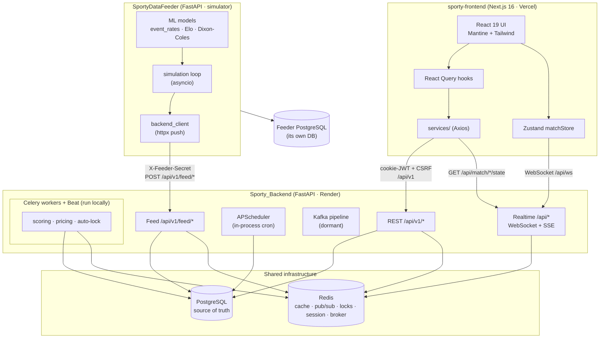
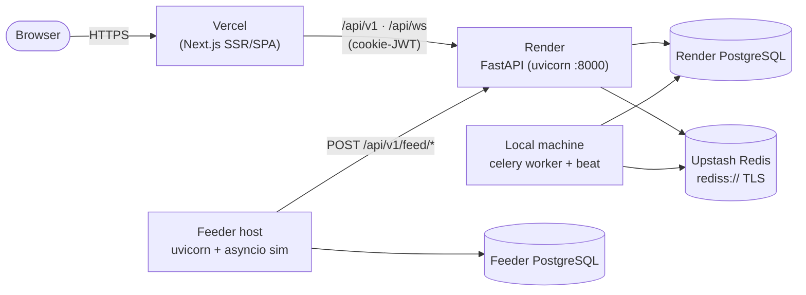
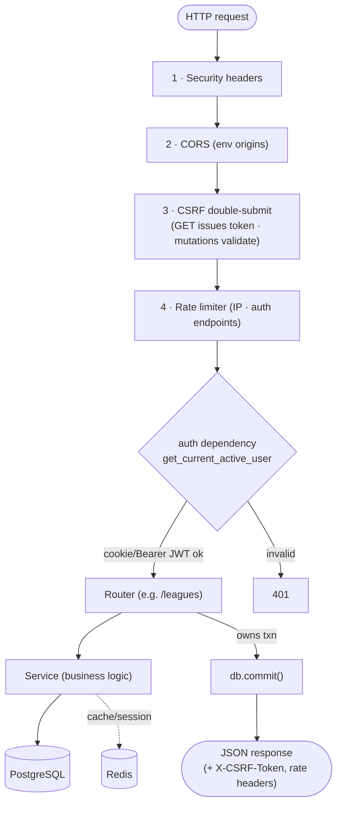
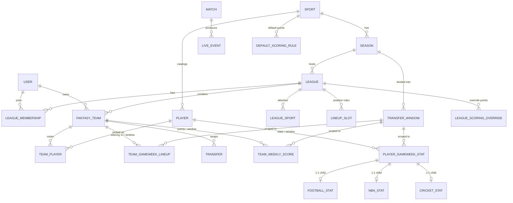
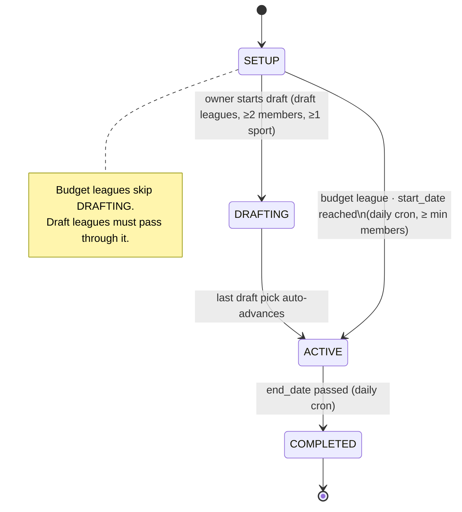
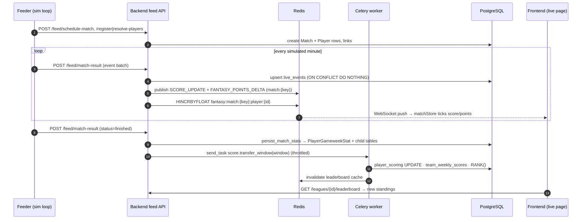
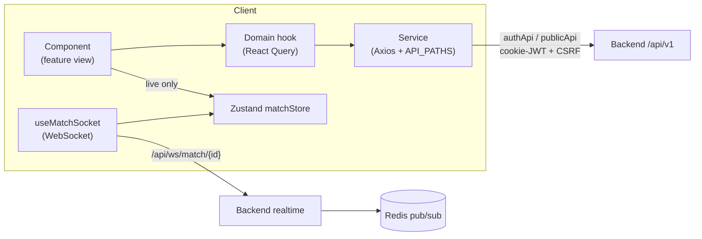

# 13 — System Architecture (with diagrams)

This is the top-down architecture reference: the components, how they're deployed, how a request
flows, how data moves, and the key lifecycles — all as diagrams with short explanations. It
complements [01 — System Overview](01-system-overview.md) (prose) by making the structure visual.

> Diagrams use [Mermaid](https://mermaid.js.org) (renders on GitHub and most Markdown viewers) plus
> ASCII where a quick sketch is clearer. Every box maps to a real path in the repos.

---

## 1. Component architecture (the whole platform)

Three deployable units. The **feeder** produces match data, the **backend** owns all state and
logic, the **frontend** is the UI. Redis and PostgreSQL are the shared infrastructure.



**Key relationships:**
- The frontend talks to the backend **only** over `/api/v1` (cookie-JWT + CSRF) and the realtime
  `/api` (WebSocket/SSE). It never touches the DB or the feeder directly.
- The feeder talks to the backend **only** over `/api/v1/feed/*` (shared-secret), server-to-server.
- The backend owns the one true PostgreSQL; the feeder has its **own** separate DB.
- Redis is the connective tissue: cache, pub/sub fan-out, distributed locks, transfer sessions, and
  the Celery broker/result backend.

---

## 2. Deployment topology

Where each process runs and how it's wired.



**Notes grounded in the code/config:**
- The Celery **worker + Beat are run locally** against the same production PostgreSQL + Upstash Redis
  as the deployed API — a deliberate cost choice (avoids paying for extra Render worker instances).
  Because they share the DB/broker, they operate on live data.
- Upstash Redis is TLS (`rediss://`), which is why Celery's broker/backend URLs need
  `?ssl_cert_reqs=CERT_REQUIRED`, and why `task_ignore_result=True` is set (to avoid false TLS-timeout
  task failures). See [07 — Background Jobs](07-background-jobs.md).
- In dev, `next.config.ts` rewrites `/api/*` → `BACKEND_SERVER_URL` (default `:8000`) so cookies are
  same-origin. In prod the two share a domain / reverse proxy with `SameSite=None; Secure` cookies.

---

## 3. Backend internal structure (vertical slices)

The backend is organized as **vertical feature slices** — each owns its `models / router / services /
schemas` — plus shared cross-cutting layers.

```
Sporty_Backend/app/
├── main.py ................ wires routers + middleware + APScheduler lifespan
├── core/ ................. config, security (JWT), redis, redis_lock, celery_app, database (async)
├── database.py ........... sync engine + SessionLocal + get_db
├── middleware/ ........... security_headers → CORS → CSRF → rate_limiter  (outer → inner)
│
├── auth/ ................. users, refresh tokens, login/register/google/reset
├── league/ .............. THE big slice: leagues, draft, transfers, lineup, leaderboard,
│                          auto_pick_service (ILP), sportConfigs
├── player/ .............. players, price history, gameweek stats + sport child tables (+ models_nba)
├── match/ ............... Match fixtures
├── scoring/ ............. DefaultScoringRule / LeagueScoringOverride config + router
├── notification/, user/, optimization/ (ILP endpoint)
│
├── services/
│   ├── scoring/ ......... engine, player_scoring, team_scoring, ranking, rules, trigger, window_locator
│   ├── optimization/ .... ilp_optimizer (lineup)
│   ├── pricing/ ......... repricing (form-based)
│   ├── sync/ ............ real-API pollers (football/nba live, stats, match, player) — gated off
│   ├── feed_scoring.py .. bridges live events → deltas + persisted stats
│   ├── price_update_service.py, transfer_service.py, league_status_service.py, …
│
├── api/
│   ├── v1/feed.py ....... inbound feeder push endpoints
│   ├── v1/transfers.py .. staged transfer session
│   └── routes/ .......... realtime: websocket.py, sse.py, match.py (state snapshot)
│
├── tasks/ ............... Celery tasks + celery_schedule (Beat)
├── adapters/ ............ ISportAdapter per sport (used by dormant Kafka pipeline)
├── consumers/, workers/ . Kafka pipeline (dormant)
└── models/ ............. shared schemas (events) + db/live_event
```

**Two conventions that shape everything** (from `Sporty_Backend/CLAUDE.md`):
- **Services never `commit()`** — the router or job that called them owns the transaction.
- **All models are imported up-front** in `main.py` *and* `core/celery_app.py`, so SQLAlchemy resolves
  the string-named cross-module relationships before any query runs.

---

## 4. Middleware & request lifecycle

Every REST request passes through the middleware stack (outermost first), then a router → service →
DB. Realtime requests take a different path (Redis pub/sub).



- The frontend's Axios interceptors capture `X-CSRF-Token` from GET responses (in memory) and attach it
  to mutations; a 401 triggers a de-duped `/auth/refresh` + retry. See
  [03](03-auth-and-security.md) / [09](09-frontend-architecture.md).

---

## 5. Data model (entity-relationship overview)

The core relationships (simplified — see [02 — Data Model](02-data-model.md) for every column). Note how
**`TransferWindow` (the gameweek)** is the hub that scoring, lineups, transfers, and eligibility hang off.



The `PlayerGameweekStat` → `FootballStat`/`NBAStat`/`CricketStat` **table-per-subtype** pattern keeps the
base stat sport-agnostic while each sport's detail (and its NOT-NULL rules) lives in its own child table.

---

## 6. League lifecycle (state machine)

`League.status` moves forward only. Draft and budget leagues take different paths, driven partly by the
owner and partly by the daily lifecycle cron.



See [04 — Leagues & Lifecycle](04-leagues-and-lifecycle.md).

---

## 7. The end-to-end live-match flow (sequence)

This is the platform's signature path: a simulated match becoming leaderboard points, streamed live.
(Full prose trace in [11 — End-to-End Flows](11-end-to-end-flows.md).)



**Why the live number matches the final number:** the per-event live deltas
(`feed_scoring.apply_live_points`) use weights tuned to the batch engine's, so the ticking total
converges on the authoritative gameweek score computed at finish. See [08](08-live-match-pipeline.md).

---

## 8. Background processing (the three systems)

```
┌────────────────────┬───────────────────────────┬──────────────────────────────┐
│  APScheduler        │  Celery + Beat             │  Kafka pipeline (dormant)     │
│  (in FastAPI proc)  │  (separate processes)      │  REALTIME_PIPELINE_ENABLED    │
├────────────────────┼───────────────────────────┼──────────────────────────────┤
│ 00:00 lifecycle     │ every 10m score active     │ MatchScheduler → Ingestion*   │
│ 00:05 cache warm    │ every  5m auto-lock ×2      │ normalizer → points_engine    │
│ 02:00 ranking       │ 04:30    repricing         │ → notifications               │
│ 08:00 window notify │ on-finish score.window     │ (Redis pub/sub + InfluxDB)    │
│ every 4h pricing    │ (external sync: commented) │                               │
└────────────────────┴───────────────────────────┴──────────────────────────────┘
        │                        │                             │
        └──── all guarded by ────┴──── Redis distributed locks ┘  (SET NX EX + Lua release)
```

Scoring is produced from **three** idempotent places (on-finish, 10-min sweep, daily ranking) so a
failure in one path is caught by another. See [07 — Background Jobs](07-background-jobs.md).

---

## 9. Frontend data flow (layers)



The rule (enforced by `AGENTS.md`): **Backend → services → hooks → store/UI**. Components never call
Axios directly; server-derived state lives in React Query; only genuinely-shared live state (the match)
lives in Zustand. See [09 — Frontend Architecture](09-frontend-architecture.md).

---

## 10. Trust boundaries (security view)

```
   Browser  ──cookie-JWT + CSRF──▶  Backend /api/v1        (user trust boundary)
   Browser  ──WebSocket (cookie)─▶  Backend /api/ws
   Feeder   ──X-Feeder-Secret────▶  Backend /api/v1/feed   (server-to-server boundary; no cookies/CSRF)
   Backend  ──DB creds───────────▶  PostgreSQL
   Backend  ──rediss:// TLS──────▶  Redis
   Frontend ── NEVER holds a token in JS (httpOnly cookies only)
```

Three distinct boundaries: **users** (cookie-JWT + CSRF + rate limits), the **feeder** (a shared secret,
CSRF-exempt because there's no browser session), and **infrastructure** (DB/Redis creds). See
[03 — Auth & Security](03-auth-and-security.md).

---

*For the "why/how" of the algorithms behind these flows, see [12 — Algorithms Index](12-algorithms-index.md).
For prose walkthroughs, see [01 — System Overview](01-system-overview.md) and [11 — End-to-End Flows](11-end-to-end-flows.md).*
