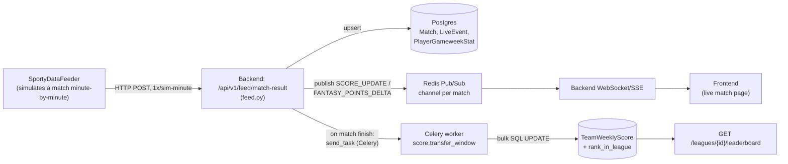

# Sporty — Architecture in Brief

One-page version of the full 14-chapter doc set (`docs/01...14_*.md`) — for
explaining the system out loud in a few minutes. No new claims here; it's a
condensed, code-grounded summary. Go to those chapters (or
`docs/03_REQUEST_FLOW.md` / `docs/architecture/feeder-backend-frontend-flow.md`)
for exact file/function citations.

## The three processes

```
SportyDataFeeder  →  Sporty_Backend  →  sporty-frontend
(match simulator)     (FastAPI API,        (Next.js SPA,
 own Postgres DB)      Postgres + Redis,    talks to backend
                       Celery workers)      only, no DB/feeder
                                            access)
```

- **Backend** owns all durable state and business logic. REST under
  `/api/v1`, realtime (WebSocket/SSE) under `/api`.
- **Frontend** never touches Postgres or the feeder directly — every write
  and read goes through the backend's HTTP/WS API.
- **Feeder** is a separate repo/deployment with its **own** Postgres DB
  (integer PKs, vs. the backend's UUIDs). It only talks to the backend
  over `POST /api/v1/feed/*`, authenticated by a shared `X-Feeder-Secret`
  header — no shared schema, no FK between the two databases.

## Data flow, end to end



**Two speeds of "live":**
- **Fast path (seconds):** feeder push → Redis pub/sub → WebSocket → browser.
  Fire-and-forget — a message published with no subscriber attached is lost —
  so the frontend also re-polls `GET /match/{id}/state` every 15s as a
  self-healing fallback. Applies to score/events/lineup changes and a live,
  provisional per-player fantasy-points number (`fantasy:match:{id}:player:{id}`
  Redis hash via `apply_live_points`).
- **Slow path (seconds-to-minutes, only on match finish):** the backend
  commits final stats to Postgres, then fires a Celery task that recomputes
  official `fantasy_points`, team totals, and league rank in bulk SQL. This is
  what the leaderboard actually reads — the live numbers during the match are
  a preview, this is the settled truth.
- Everything is idempotent: event upserts key on `(match_id, event_id)`; if
  the Celery enqueue fails (broker hiccup), a 10-min Beat sweep and a daily
  02:00 cron both independently re-score the same window, so a dropped
  message never permanently loses points.

## What Redis actually does (five jobs, one Redis)

Redis isn't one thing here — it's doing five unrelated jobs, which is worth
saying out loud because it explains why Redis being down breaks almost
everything at once:

1. **Cache** — leaderboard cache per league/window, player-price mirror,
   auto-pick candidate pool (30 min TTL).
2. **Pub/Sub** — live match fan-out to WebSocket/SSE connections (fire-and-forget,
   no persistence/replay — see above).
3. **Distributed locks** (`SET NX EX` + Lua release) — stops two scoring runs,
   two auto-pick jobs, or two waiver/trade sweeps racing on the same rows.
4. **Ephemeral session state** — staged-transfer sessions (1h TTL), CSRF
   tokens, rate-limit counters.
5. **Celery broker + result backend** — separate logical DBs (broker=1,
   results=2); this is what carries every background task, not just scoring.

There's no separate cache layer (no Memcached) — Redis is it.

## What the workers actually do (three systems, two of them live)

- **APScheduler** (in-process, inside the API pod) — daily/hourly cron: league
  lifecycle transitions, waiver/trade processing, gameweek ranking, cache
  warm. Redis-locked so multiple API instances don't double-run a job.
- **Celery + Beat** (separate worker process) — everything triggered *by an
  event* rather than a clock tick: scoring a finished match, pricing,
  transfers. This is the path in the diagram above.
- **Kafka realtime pipeline — dormant.** Fully coded, gated behind
  `REALTIME_PIPELINE_ENABLED=false`, deps commented out. Not part of how
  live data moves today — that's entirely the feeder → Postgres/Redis →
  WebSocket path above. Kept for a possible future real-matches API.

## Request lifecycle (any normal REST call)

```
Browser → CORS → CSRF (double-submit cookie) → rate limit → JWT auth
        → router → service (business logic, no commit)
        → Postgres (constraints are the last line of defense)
        → router commits → response
```

Auth is httpOnly-cookie JWT (no token ever touches JS) + a CSRF token the
frontend echoes back as `X-CSRF-Token`. The service layer does the business
rules; the router that called it owns and commits the transaction.

## One-breath summary

Three processes, one shared Postgres+Redis for the backend, one separate
Postgres for the feeder. Live match data is fire-and-forget over Redis
pub/sub with a REST poll as a safety net; a match finishing is what wakes up
Celery to do the "real" scoring in bulk SQL, with a cron fallback in case the
event trigger is missed. Everything downstream of Redis — cache, locks,
sessions, live updates, and the Celery queue itself — depends on that one
Redis instance being up.
