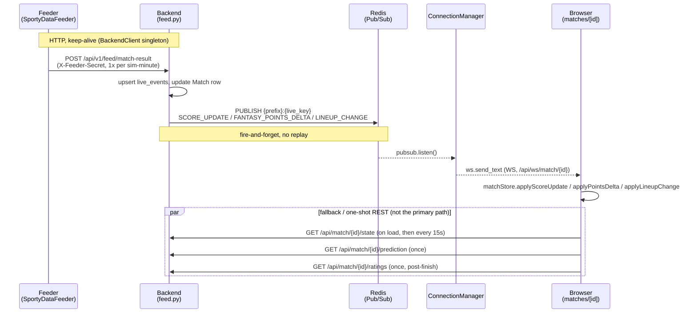

# Feeder → Backend → Frontend real-time flow

Status: describes what actually runs today (verified against code,
2026-07-14). Not to be confused with
`Sporty_Backend/docs/REALTIME_EVENT_PIPELINE_ARCHITECTURE.md`, which
specs a **Kafka-based target architecture that is dormant**
(`REALTIME_PIPELINE_ENABLED=false`, deps commented out — see
`Sporty_Backend/CLAUDE.md`). Today's live data flows feeder → Postgres/Redis
pub/sub → WebSocket, no Kafka involved.

## 1. End-to-end flow

### 1a. Feeder → backend (ingest)

The Sporty Data Feeder (`~/projects/SportyDataFeeder`) simulates a match
minute-by-minute and pushes state over plain HTTP POST — there is no queue
or socket on the feeder's outbound side.

- `app/services/simulation.py::run_simulation` drives the loop: one
  simulated minute at a time, substitutions/events/discipline computed,
  written to the feeder's own local DB, **then one HTTP push per minute
  tick that produced events** — never one push per event
  (`# One HTTP call per minute tick — never per-event (R-4.1 step 5)`).
  Kickoff and full-time also each get one dedicated push.
- The push goes through `app/services/backend_client.py::BackendClient`,
  which POSTs to `POST /api/v1/feed/match-result` on the Sporty backend with
  an `X-Feeder-Secret` header, 3 attempts with exponential backoff
  (`1.5^n` seconds), and never raises — a failed push logs `ERROR` and
  returns `False`; events stay in the feeder's local DB and can be
  re-sent later via `POST /matches/{id}/replay-push`.
- `BackendClient` is a **process-wide singleton** (`get_backend_client()`
  in the same file) holding one persistent `httpx.AsyncClient`, so the
  connection to the backend is kept alive and reused across every push —
  the simulation loop's per-minute pushes, and the one-off pushes from
  `predict.py`/`demo.py`/`matches.py` — instead of opening a fresh
  TCP+TLS connection per call. The client is closed once from
  `app/main.py`'s `lifespan` on process shutdown. (This was a latency
  investigation follow-up — see §3 for why the transport itself was never
  the real bottleneck.)

### 1b. Backend receipt → storage/processing

`Sporty_Backend/app/api/v1/feed.py`, `POST /feed/match-result`
(`verify_feeder_secret` dependency: 401 on mismatch, 503 if
`FEEDER_SECRET` unset):

1. Resolves the `Match` row by UUID or `external_api_id`
   (`find_match`).
2. Upserts each event into `live_events`, idempotent on
   `(match_id, event_id)` via `ON CONFLICT ... DO NOTHING` — safe for
   feeder retries/replays.
3. Updates `Match.home_score` / `away_score` / `status` /
   `current_minute`.
4. Computes `live_key = match.external_api_id or str(match.id)`
   (`_live_key`) — this is the key every downstream channel/consumer
   keys off of.
5. Publishes a `WSMessage(event="SCORE_UPDATE", ...)` to Redis:
   `redis.publish(f"{settings.REDIS_PUBSUB_PREFIX}:{live_key}", message.model_dump_json())`.
   This is Redis **Pub/Sub** — fire-and-forget, no persistence, no replay.
6. If any event is a substitution, additionally publishes a dedicated
   `LINEUP_CHANGE` message on the same channel.
7. On a live→finished transition: calls `persist_match_stats` (aggregates
   `live_events` into `PlayerGameweekStat`/`FootballStat`/`NBAStat`) and
   lazily imports + calls `enqueue_scoring_for_finished_match`
   (`app/services/scoring/scoring_trigger.py`) — lazy import because
   `scoring.trigger ↔ celery_app ↔ task modules` form an import cycle
   that only resolves if `celery_app` loads first.
8. Throughout, `app/services/feed_scoring.py::apply_live_points` applies
   the same `DefaultScoringRule` weights the batch gameweek engine uses,
   to the Redis hash `fantasy:match:{key}:player:{id}`, and separately
   publishes `FANTASY_POINTS_DELTA` on the same channel so per-player
   fantasy points update live without waiting for gameweek scoring.

`POST /feed/prediction` and `POST /feed/player-ratings` are simpler: they
`SETEX` into `prediction:match:{id}` / `ratings:match:{id}` (24h TTL) and
durably backstop into `MatchFeedCache` (`_persist_feed_cache`) — **they do
not publish anything to Redis pub/sub.** See §3b — this is the one
genuine gap in the design, not a deliberate optimization.

### 1c. Backend → frontend

`app/api/routes/websocket.py`, `WS /api/ws/match/{match_id}`
(mounted under `/api` in `app/main.py`, public — no auth, matching the
public match-detail page):

- Resolves the same `Match` row via `require_match_access_ws` →
  `ensure_user_can_access_match` (UUID or `external_api_id` — same
  resolution as the feed handler, so it always lands on the same
  `live_key` and thus the same channel).
- `app/services/connection_manager.py::ConnectionManager.connect` accepts
  the socket and spawns `_listen`, which opens its own
  `redis.pubsub().subscribe(channel)` and forwards every message it
  receives verbatim to the browser via `ws.send_text`.
- Both `feed.py` and `ConnectionManager` share the same singleton Redis
  client (`app/core/redis.py::get_async_redis`, one `REDIS_URL`) — no
  split-brain between publisher and subscriber.

Two REST endpoints exist alongside this for reads that don't need a live
push (`app/api/routes/match.py`):

- `GET /api/match/{match_id}/state` (`get_match_state`) — full snapshot
  (score, events, lineups, per-player fantasy points) read straight from
  Postgres/Redis. This is what the frontend calls on load and as its
  fallback poll (§1d).
- `GET /api/match/{match_id}/prediction` (`get_match_prediction`),
  `GET /api/match/{match_id}/ratings` (`get_match_ratings`),
  `GET /api/model-metrics` (`get_model_metrics`) — read the cached
  values `/feed/prediction`, `/feed/player-ratings`, and the global
  `model:metrics` key wrote. 404 until the feeder has pushed that
  resource, which the frontend treats as "not available yet," not an
  error.

### 1d. Frontend behavior on the match detail page

Both `sporty-frontend/src/app/(dashboard)/matches/[matchId]/page.tsx`
and `.../(public)/fixtures/[matchId]/page.tsx` render the same
`components/live/LiveMatchClient.tsx` — so everything below applies to
both routes identically.

**On WebSocket message** (`hooks/useMatchSocket.ts`, opened via
`lib/socket.ts::buildMatchSocketUrl`): parses each frame as a
`WSMessage` and dispatches by `event` into `store/matchStore.ts`
(Zustand):
- `SCORE_UPDATE` → `applyScoreUpdate` — merges score/status/minute/events.
- `FANTASY_POINTS_DELTA` → `applyPointsDelta` — updates one player's
  running total.
- `LINEUP_CHANGE` → `applyLineupChange`.

Components (`ScoreTicker`, `EventFeed`, etc.) read from `useMatchStore`
via selectors, so a WS message updates the UI with no REST round trip.
`useMatchSocket` auto-reconnects on close (2s backoff) and is skipped
entirely once `status === "finished"` (no more events will ever arrive,
so an idle reconnect loop would be pointless — matters most for
high-traffic historical fixtures on the public page).

**On polled REST** (`lib/realtimeApi.ts`, all hit the backend origin
directly — not the Next.js `/api/*` rewrite proxy, since auth is a
cookie set on the backend domain; see the comment at the top of that
file):
- `fetchMatchSnapshot` (`GET /match/{id}/state`) — called once on mount
  to hydrate the store, **then re-called every 15 seconds** while the
  match isn't finished (`LiveMatchClient.tsx`, the `setInterval(..., 15000)`
  effect). The code comment is explicit about intent: *"The WebSocket
  drives live updates; this periodic re-hydrate is a fallback so the
  page self-heals if the socket drops or misses a beat."* This is a
  deliberate reconciliation net against Pub/Sub's fire-and-forget
  delivery (§2b), not the primary data path.
- `fetchMatchPrediction`, `fetchMatchRatings`, `fetchModelMetrics` — each
  called **exactly once** on mount (prediction/model-metrics
  unconditionally; ratings only once `status === "finished"`). None of
  these are polled at any interval. They're treated as decorative:
  failures are swallowed (`catch { /* decorative */ }`) and never block
  the live view.

> Note: an earlier framing of this investigation assumed match state was
> polled every 3 seconds. That number doesn't match the code — the real
> fallback interval is 15s, and predictions/ratings aren't polled at all.
> (There *is* a genuine 3000ms `refetchInterval` in the codebase, but it's
> `hooks/leagues/useDraft.ts` — the draft room, unrelated to this page.)

## 2. Diagram



ASCII summary of the transport at each hop:

```
Feeder  --HTTP POST, keep-alive-------------> Backend (feed.py)
Backend --redis.publish (Pub/Sub, no persist)-> Redis channel {prefix}:{live_key}
Redis   --pubsub.listen()---------------------> ConnectionManager (per WS conn)
Backend --WS send_text-------------------------> Browser (useMatchSocket)
Browser --GET /state, 1x + every 15s (fallback)-> Backend (REST, reconciliation only)
Browser --GET /prediction, /ratings, 1x each----> Backend (REST, decorative, never pushed)
```

## 3. Key decisions and why alternatives were rejected

### 3a. Feeder → backend stays HTTP push, not a persistent WebSocket

Considered and rejected switching the feeder to a long-lived WS
connection streaming events to the backend. Reasons:

- **No real latency win at current volume.** The feeder already batches
  to one push per sim-minute (not per-event), and the actual
  per-request cost is DB write + Redis publish inside the backend
  handler, not connection setup — especially now that `BackendClient`
  holds a keep-alive connection (§1a), which already captures the one
  legitimate overhead a persistent transport would remove.
- **Reliability is worse, not better, with WS.** HTTP push gives a
  discrete, idempotent (`event_id`), retryable unit per call with a
  definite success/failure signal (status code). A WS stream has no
  per-message receipt by default — if the socket drops mid-match, the
  feeder doesn't know how far the backend actually got, and building
  that guarantee back (sequence numbers, resume/replay) is nontrivial,
  effectively reinventing at-least-once delivery on a transport that
  doesn't give it for free.
- **Backend complexity.** Would require an inbound-connection registry
  (distinct from `ConnectionManager`, which is outbound/browser-facing),
  reconnect/backoff logic, heartbeats to detect half-open sockets, and
  care to keep one slow event (e.g., the match-finish push that
  triggers gameweek scoring) from head-of-line-blocking the rest of that
  feeder's stream.
- **No backpressure problem exists at current scale.** A handful of
  scorable events per match per sport does not come close to needing
  flow control.
- **Security is a wash at best, arguably worse.** HTTP re-verifies
  `X-Feeder-Secret` on every single request
  (`verify_feeder_secret`, constant-time compare). A WS authenticates
  once at connect and trusts the connection for its whole lifetime — if
  the secret rotates or the feeder is compromised mid-connection, there's
  no per-message re-check without building one. WSS vs HTTPS is a wash
  (both are TLS); the standing-connection risk (hijack of an
  already-authenticated socket) has no HTTP equivalent.
- **Scaling** would require pinning a feeder's connection to one backend
  instance or a shared cross-instance registry — HTTP push needs neither;
  any instance behind the load balancer can take any event.

**Conclusion: keep HTTP push.** If per-request overhead is ever
genuinely the bottleneck, confirm connection reuse is actually working
(it is now, post-fix — §1a) before reaching for anything else.

### 3b. Backend → frontend: WebSocket for live updates, REST for the rest

The WS-for-`SCORE_UPDATE`/`FANTASY_POINTS_DELTA`/`LINEUP_CHANGE` +
REST-fallback-poll split **is a deliberate, documented choice** — the
15s re-hydrate exists specifically because Redis Pub/Sub is
fire-and-forget (a message published while no subscriber is attached,
e.g. during a backend restart or a WS reconnect race, is gone forever),
and Postgres is the real source of truth the fallback reconciles against.
This is a reasonable, load-bearing design, not an oversight.

**What is *not* a deliberate choice, and should be named honestly as a
gap:** `/feed/prediction` and `/feed/player-ratings` never publish to
Redis at all (§1b) — they only cache. There's no architectural reason
for this asymmetry with `/feed/match-result`; it looks like the push
was simply never added when those two endpoints were built. Practical
impact is currently low (predictions are set pre-match and rarely
change; ratings only exist after full-time), but it means a mid-match
prediction update won't reach an open tab until the next full page
load or a component re-mount — not until "the next poll," because there
isn't one. If this needs to be live, it's a small, additive fix: publish
a `PREDICTION_UPDATE` (or reuse `SCORE_UPDATE`'s pattern) from those two
handlers using the same `WSMessage`/channel plumbing `match-result`
already uses — not a new architecture.

### 3c. Tradeoffs explicitly accepted

- **Redis Pub/Sub over Streams** for `SCORE_UPDATE`/`FANTASY_POINTS_DELTA`/
  `LINEUP_CHANGE`: accepted the "message lost if no subscriber is
  attached at publish time" risk because the 15s REST fallback already
  bounds staleness to ≤15s, and nothing here needs true replay/audit of
  the event stream itself (only eventual consistency of *state*, which
  Postgres already guarantees). Streams' consumer-group offset tracking
  and `XTRIM`/`MAXLEN` bookkeeping would be real, currently-unjustified
  complexity.
- **One Redis subscription per open browser WebSocket**
  (`ConnectionManager._listen` calls `pubsub.subscribe` per connection,
  not once per channel shared across connections): accepted as simple
  and correct at current concurrent-viewer counts; revisit if a single
  popular match's viewer count starts to matter for Redis connection
  count.
- **Predictions/ratings/model-metrics fetched once, never polled or
  pushed**: accepted because they change rarely (prediction is
  essentially fixed pre-match; ratings only exist post-match) — actively
  *not* worth polling infrastructure for, separate from the gap noted in
  §3b about them also not being pushed.

## 4. When to revisit

- **Feeder→backend transport (§3a):** reopen only if a concrete
  profiling result shows connection/request overhead — not DB/Redis
  work inside the handler — dominating push latency *after* confirming
  keep-alive is actually active (it is, as of this doc); or if event
  volume moves from "a handful per sim-minute" to something like
  many events per second per match (real high-frequency sports data,
  not simulation), where per-event batching + reliable delivery
  actually starts to matter.
- **Redis Pub/Sub → Streams (§3c):** revisit if a requirement appears
  for guaranteed delivery / replay of the *event stream itself* (e.g.,
  an audit trail, or a consumer that must never miss an event even
  across a backend restart) rather than just eventual state consistency.
- **Removing or shortening the 15s REST fallback poll (§1d, §3b):**
  revisit only after WS delivery reliability is independently verified
  (e.g., dropped-message rate measured near zero across reconnects) —
  removing the fallback before that is trading a solved reliability
  problem for a marginal load reduction.
- **Publishing prediction/ratings updates over WS (§3b):** revisit if a
  product requirement appears for predictions to visibly update
  mid-match without a reload (currently no such requirement exists —
  this is a known gap, not an active bug).
- **Per-channel Redis subscription fan-out (§3c):** revisit if concurrent
  viewers on a single high-profile match get large enough that Redis
  connection count (one per open browser WS) becomes a measured
  resource concern — the fix would be one shared subscription per
  channel fanned out to N local WebSocket connections in-process,
  instead of N Redis subscriptions.
