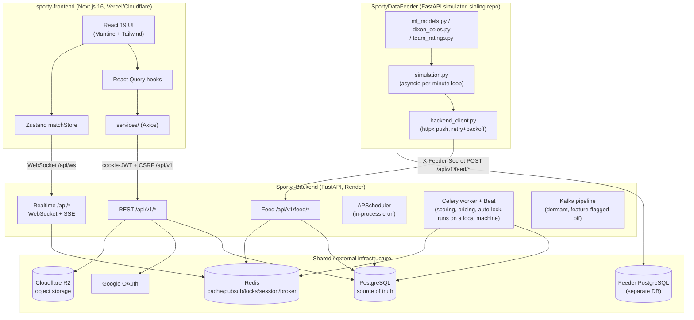
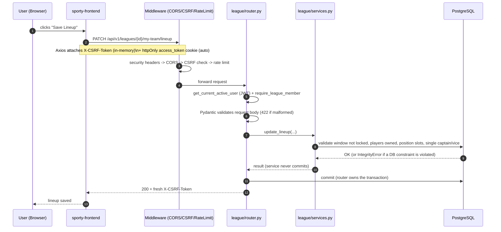
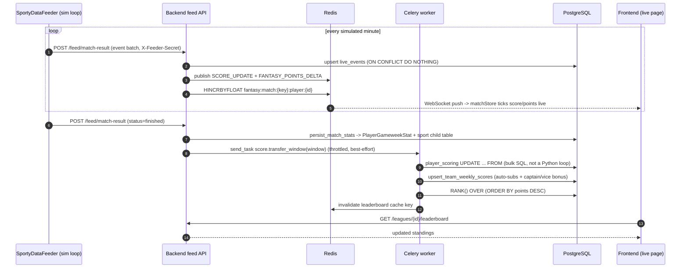

# Sporty — Presentation Guide

*A study document to prepare you to explain this entire project confidently, from
memory, to an audience of developers, professors, and classmates who have never
seen the code. Read it once end to end, then use it as your speaker notes during
the talk.*

> **How this guide is built:** every fact in this document is grounded in the
> actual codebase at `/home/sam069/projects/Sporty` (the `Sporty_Backend/` and
> `sporty-frontend/` apps) plus a sibling repository, `SportyDataFeeder`
> (`~/projects/SportyDataFeeder`), which supplies the machine-learning and
> simulation layer over HTTP. Wherever the code didn't provide enough evidence to
> state something as fact, this guide says **"Could not determine from the current
> implementation"** rather than guessing — treat those as honest gaps you can
> mention if asked, not things to make up on the spot.
>
> Two call-out boxes appear throughout:
> - 🎤 **Say this** — a sentence or two you can say almost verbatim while presenting.
> - 🧒 **Explain like I'm new** — the beginner-friendly analogy for that section.

---

## 1. Project Introduction

### What the project is

**Sporty** is a multi-sport fantasy sports platform covering **Football/Soccer**,
**NBA Basketball**, and **Cricket**. A user signs up, creates or joins a **league**,
assembles a **squad** of real players — either by **drafting** them one at a time
against other managers (snake draft) or by **building** a team directly under a
salary-cap **budget** — sets a weekly **starting lineup** with a **captain** and
**vice-captain**, and earns **fantasy points** based on how those real players
perform in real matches. Leagues can be single-sport or **mixed** (e.g. football
and basketball players inside one squad).

The whole system is actually **three cooperating codebases**:

| Codebase | Path | Role |
|---|---|---|
| Backend | `Sporty_Backend/` | FastAPI REST API, background workers, PostgreSQL — the single source of truth |
| Frontend | `sporty-frontend/` | Next.js 16 / React 19 web application the user actually sees |
| Data Feeder | `SportyDataFeeder` (a **separate sibling repository**, not in this monorepo's git history) | Generates realistic **simulated matches** using trained statistical/ML models and pushes play-by-play events into the backend, standing in for a paid live-sports-data subscription |

### The problem it solves

A fantasy sports platform actually needs *two* expensive things at once:

1. A correct, fair, auditable **game engine** — squads, budgets, transfers, drafts,
   scoring rules, leaderboards.
2. A **continuous supply of real-world match data** to score against.

Sporty solves (1) completely with the backend + frontend. For (2) — which normally
means paying for a live-sports-data subscription with rate limits — it generates
**statistically realistic simulated matches** (the Feeder) and pushes them through
the *exact same ingestion path* a real data provider would use. The backend also
has fully-written (but currently switched off) code paths to pull from real
providers like API-Football and API-NBA — flipping one feature flag
(`LIVE_POLLING_ENABLED`) is the intended migration path, and nothing downstream of
"a match produced events" would need to change.

### Why it was built

To demonstrate a **complete, realistic fantasy-sports product** — not a toy CRUD
app — including the parts that are usually the hardest to get right: constrained
optimization (squad building under a budget), concurrency-safe scoring at scale,
real-time updates, and a defensible way to demo the product live without needing a
paid data subscription during development.

### Who the users are

- **Fantasy managers** — the primary end user: register (picking a favourite
  team and player per sport during onboarding, which drives goal
  notifications), join/create leagues, draft or buy players, set lineups, make
  transfers, claim free agents, propose trades, watch live matches, check the
  leaderboard or head-to-head standings, open support tickets.
- **League owners** — a manager with extra privileges scoped to a league they
  created: start the draft, generate transfer windows (gameweeks), toggle
  mid-season joining, veto trades, renew the league into the next season
  (optionally as a dynasty, carrying rosters over), delete the league.
- **Platform administrators** — a modeled role tier on `users.role`
  (`user`/`support`/`admin`/`super_admin`, enforced by `require_admin_role`).
  A dedicated `/api/v1/admin` router plus a frontend `/admin` console cover
  user suspension/roles, league/season overrides, scoring recalculation,
  repricing, feature flags, and support-ticket triage — and **every admin
  action is written to an immutable `admin_audit_logs` table**. Admins land on
  `/admin` after login instead of the manager dashboard.
- **The Sporty Data Feeder** — a non-human, server-to-server actor, trusted (via a
  shared secret) to create matches/players and push events, with no user-level
  access at all.

### Real-world use cases

- A group of friends drafts a fantasy Premier League squad at the start of a
  season and competes over 38 gameweeks with transfers, captains, and a live
  leaderboard.
- A university esports/sports society runs a mixed football+basketball league.
- A demo/investor pitch runs entirely on simulated matches, with realistic
  scorelines, live commentary-style events, and pre-match predictions — no live
  data subscription required.

### Key features

- Draft **and** budget-based league modes, including mixed-sport squads.
- Two competition formats: classic cumulative points, or opt-in
  **head-to-head** — weekly one-vs-one matchups on a round-robin schedule with
  W-L-T standings (the format Yahoo/ESPN/Sleeper default to).
- Weekly lineups with captain (points double) / vice-captain (fallback) rules.
- Formation-aware **automatic substitution** when a starter doesn't play.
- Free agents, rolling-priority **waivers**, and manager-to-manager **trades**
  with a commissioner veto window — all for draft leagues.
- **Season renewal / dynasty leagues** — a completed league rolls into the next
  season as a new linked league, optionally carrying every roster over.
- An **ILP-based** ("Integer Linear Programming") squad auto-pick and lineup
  optimizer — a real combinatorial-optimization solver, not a guess.
- Live match pages with WebSocket score/point ticking, pre-match predictions, and
  post-match player ratings; per-sport **favourite team/player** picks drive
  personalized "your player scored" notifications.
- Two independent, rule-driven player **pricing** algorithms, and a
  "pay a budget overage with league points" transfer option backed by an
  immutable penalty ledger.
- A full **admin console** (users, leagues, seasons, scoring recalcs, feature
  flags, support tickets) with an append-only audit log.

> 🎤 **Say this:** *"Sporty is a fantasy sports platform — think Fantasy Premier
> League, but built from scratch, covering football, basketball, and cricket, and
> designed so leagues can even mix sports in one squad. The interesting
> engineering isn't the CRUD — it's the squad-optimization algorithm, the
> concurrency-safe scoring pipeline, and the fact that we generate our own
> statistically-realistic match data instead of paying for a live feed."*

> 🧒 **Explain like I'm new:** Think of Sporty as a "build your own dream team"
> game — you pick real football or basketball players and score points based on
> how they actually play each week. Three separate programs work together to make
> this happen: the website you click around on (the **frontend**), the "brain"
> that remembers everyone's teams and does the math (the **backend**), and a
> "pretend TV broadcast" that invents realistic-looking matches (the **Feeder**)
> so the game has something to score against, even without a real sports-data
> subscription.

---

## 2. System Overview

Sporty is **three independently-deployed processes** plus shared infrastructure.



- **Frontend** — Next.js SPA. Never touches the database or the Feeder directly;
  never holds an auth token in JavaScript.
- **Backend** — owns all durable state (PostgreSQL) and all business logic.
  Exposes REST under `/api/v1` and realtime (WebSocket + SSE) under `/api`.
- **Database** — PostgreSQL is the single source of truth. The Feeder has its own,
  **completely separate** PostgreSQL database — the two are bridged only by a
  small `entity_links` table inside the Feeder's DB mapping its own integer IDs to
  the backend's UUID strings. No shared schema, no foreign key between them.
- **Cache / pub-sub / sessions / broker** — one Redis deployment doing five jobs:
  cache, pub/sub fan-out for live matches, distributed locks, ephemeral session
  storage (staged transfers, CSRF tokens), and the Celery broker + result backend.
- **Message queues** — Celery + Redis (production, always on) for scoring,
  pricing, and auto-lock jobs; a fully-coded but **dormant** Kafka pipeline for a
  future higher-throughput realtime path (off by default, explicitly "not
  prod-tested" in the codebase).
- **Machine learning models & simulation engine** — live entirely in the sibling
  `SportyDataFeeder` repository, not in `Sporty_Backend`. Covered in depth in
  [Section 8](#8-machine-learning-models) and [Section 9](#9-simulation-engine).
- **External services** — Google OAuth (sign-in), Cloudflare R2 (avatar/logo
  storage), Resend (transactional email), and dormant/disabled integrations with
  real sports-data providers (API-Football, API-NBA, Cricbuzz, BallDontLie).

### How it all connects (data flow, narrative)

```
SportyDataFeeder (ML models + simulation loop)
        │  HTTP push, X-Feeder-Secret
        ▼
Sporty_Backend  /api/v1/feed/*  →  PostgreSQL (Match, LiveEvent, PlayerGameweekStat, …)
        │                              │
        │  Redis pub/sub               │  Celery send_task
        ▼                              ▼
WebSocket/SSE → sporty-frontend   Celery worker → scoring engine → TeamWeeklyScore + RANK()
        (live match page)                              │
                                                         ▼
                                        GET /leagues/{id}/leaderboard (frontend)
```

> 🎤 **Say this:** *"Picture three offices. The Backend office keeps every record —
> who owns which players, everyone's scores, all the rules — in one filing
> cabinet, PostgreSQL, and has a fast notepad, Redis, for things it needs to
> remember briefly or broadcast to many people at once. The Frontend office is the
> reception desk — it never touches the filing cabinet itself. The Feeder office
> is a separate building that phones in play-by-play commentary for matches it's
> simulating, and the Backend only answers that phone if the caller knows the
> password — a shared secret."*

> 🧒 **Explain like I'm new:** If you've ever used a website that has a "server"
> behind it, that's the Backend. The "cache" (Redis) is like a whiteboard the
> server keeps next to its desk for things it needs to remember for just a few
> minutes or share instantly with everyone watching — much faster than digging
> through the filing cabinet (the database) every time.

---

## 3. Technology Stack

| Technology | What it is | Why chosen / role | Alternatives | Advantages here |
|---|---|---|---|---|
| **FastAPI** (Python) | Async-capable Python web framework | Backend REST + realtime framework; auto-generates OpenAPI docs from Pydantic schemas | Flask, Django REST Framework | Type-validated request/response via Pydantic, native async, fast to iterate |
| **SQLAlchemy 2.0** | Python ORM (**Object-Relational Mapper** — maps Python classes to DB tables) | Typed `Mapped[...]` models for every table | Raw SQL, Django ORM, Tortoise | Type safety, mature ecosystem, works with both sync and async drivers |
| **Alembic** | Schema migration tool for SQLAlchemy | Every schema change is a versioned, reviewable migration file | Manual SQL scripts | Reversible, linear history, autogenerate diffing (used carefully — enum ordering is a known footgun) |
| **PostgreSQL** | Relational database | The single source of truth; sync driver `psycopg2`, async driver `asyncpg` | MySQL, MongoDB | Strong constraint support (`CheckConstraint`, `ExcludeConstraint`, partial unique indexes) used heavily to enforce invariants *in the database itself* |
| **Redis** | In-memory key-value store | Cache, pub/sub fan-out, distributed locks, session storage, Celery broker/backend — five roles from one deployment | Memcached (cache-only) | One infrastructure piece serving many needs; atomic ops (`SET NX EX`, `HINCRBYFLOAT`) make several algorithms trivial |
| **PuLP + CBC solver** | Python **ILP** (Integer Linear Programming) modeling library + open-source solver | Squad auto-pick and lineup optimization | Hand-written greedy heuristics, Google OR-Tools | A greedy "pick the best value players" heuristic can't respect many simultaneous constraints at once (budget + positions + club caps); ILP finds a *provably optimal* answer in milliseconds at this scale |
| **APScheduler** | In-process Python cron scheduler | 7 daily/periodic jobs (lifecycle transitions, cache warming, notifications) | Celery Beat only, OS cron | Runs inside the same process as the API — simple to deploy, no separate infra, though it doesn't scale past one instance without extra lock-guarding |
| **Celery + Celery Beat** | Distributed task queue + scheduler | Scoring, pricing, transfer/lineup auto-lock — run in a **separate worker process** | RQ, Dramatiq, arq | Reliable retries, a mature ecosystem; separates slow/background work from the request-response cycle |
| **Kafka (`aiokafka`)** | Distributed event-streaming platform | A **dormant** (feature-flagged off) realtime pipeline, coded but not production-tested | Redis Streams, AWS Kinesis | Designed as "the scale-up path" if Redis pub/sub ever becomes a bottleneck |
| **JWT (`python-jose`) + httpOnly cookies** | JSON Web Token auth | Access + refresh tokens, never exposed to JavaScript | Session-based auth, LocalStorage tokens | httpOnly cookies mean even a successful XSS attack can't steal the token |
| **bcrypt (`passlib`)** | Password hashing | Local-account password storage | Argon2, scrypt | Industry-standard, slow-by-design hashing resists brute force |
| **Google OAuth** | Third-party identity provider | "Sign in with Google" | Auth0, other OAuth providers | Offloads password management for users who prefer it |
| **Cloudflare R2** | S3-compatible object storage | Avatar and team-logo uploads via `boto3` | AWS S3, Google Cloud Storage | S3-API-compatible without S3's egress costs |
| **Prometheus (`prometheus-fastapi-instrumentator`)** | Metrics exposition | Exposes `/metrics` | Datadog, New Relic | Lightweight, open standard — **though no scraper/dashboard was found in this repo**, so the metrics currently have no confirmed consumer |
| **Next.js 16 (App Router)** | React meta-framework | The entire frontend | Remix, plain React + Vite | File-based routing, route groups, SSR/streaming, first-class TypeScript |
| **React 19** | UI library | Component model for the whole frontend | Vue, Svelte | Huge ecosystem; hooks model fits the services→hooks→store layering used here |
| **TypeScript** | Typed superset of JavaScript | Every frontend file | Plain JavaScript | Catches type mismatches between frontend and backend contracts at compile time |
| **Mantine** | React component library | Buttons, modals, steppers, forms | Chakra UI, MUI | Batteries-included accessible components, fast to build with |
| **Tailwind CSS** | Utility-first CSS framework | Layout and spacing | Styled-components, plain CSS | Keeps styling co-located and consistent without a separate stylesheet per component |
| **Zustand** | Minimal React state library | **Only** used for live-match state (`matchStore.ts`) | Redux Toolkit (mentioned in conventions, not actually used), Jotai | Small footprint, no boilerplate, appropriate for the one genuinely cross-component piece of client state |
| **TanStack (React) Query** | Server-state cache for React | The real data-fetching layer, wrapping every service call | SWR, plain `useEffect` + fetch | Automatic caching, deduping, and invalidation of server data by query key |
| **Axios** | HTTP client | Two configured instances (`public-api-client.ts`, `auth-api-client.ts`) | Fetch API | Interceptors make the CSRF-token capture and 401-refresh-and-retry logic clean to implement |
| **Zod** | Runtime schema validation | Form/request validation (`src/lib/validations.ts`) | Yup, manual validation | Schemas double as TypeScript types via `z.infer<...>` — one definition, two uses |
| **@dnd-kit** | Drag-and-drop toolkit | The lineup pitch / bench drag-and-drop UI | react-beautiful-dnd | Actively maintained, accessible, works well with React 19 |
| **Yarn 4** | Frontend package manager | Pinned via `packageManager` in `package.json` | npm, pnpm | Deterministic installs via Corepack |
| **scikit-learn** (Feeder) | Python ML library | Logistic regression outcome models | PyTorch, XGBoost | The problem (3-class outcome from 1–2 features) doesn't need deep learning; a simple, interpretable linear classifier is the right tool |
| **NumPy / SciPy** (Feeder) | Numerical computing | Bernoulli/binomial event sampling; `scipy.optimize` for Dixon-Coles fitting | — | Standard, fast, well-tested numerical primitives |
| **Docker** | Containerization | Separate Dockerfiles for backend and frontend | Bare-metal deploy, VMs | Consistent runtime; the backend image runs `alembic upgrade head` as a boot-time gate |

> 🎤 **Say this:** *"Every piece here was picked to match the actual shape of the
> problem — Redis because we needed cache, pub/sub, locking, and a task queue all
> at once; PuLP/ILP because squad-building is a textbook constrained-optimization
> problem, not something a greedy heuristic can solve correctly; and a simple
> logistic regression for match prediction because with only one or two features,
> a fancier model would just be overfitting."*

> 🧒 **Explain like I'm new:** Think of the tech stack like a kitchen. FastAPI is
> the stove (does the actual cooking/business logic). PostgreSQL is the pantry
> (permanent, organized storage). Redis is the counter space (fast, temporary,
> shared by everyone in the kitchen at once). Next.js/React is the dining room
> where the food is actually served to the guest (the browser). Nobody grabbed a
> fancier tool than the job needed — a hand mixer, not an industrial machine, for
> a task that doesn't call for one.

---

## 4. Architecture Walkthrough

### 4a. A standard authenticated request (e.g. "set my lineup")



Every request passes through, in order: **security headers → CORS → CSRF
double-submit → rate limiting → auth dependency (`get_current_active_user`) →
router → service (business logic, no commit) → PostgreSQL**, with the router
committing the transaction on the way out. If the server responds `401`, the
frontend's Axios interceptor transparently refreshes the token and retries once.

### 4b. The full flow that actually shows off the system: "a match finishes → the leaderboard updates"

This is the single most important trace to know cold, because it touches
validation, business logic, the database, **and** background workers in one path.



Step by step, in plain terms:

1. **Auth (server-to-server, not user auth)** — the Feeder proves it's allowed to
   push by sending `X-Feeder-Secret`, compared with a **constant-time** comparison
   (`secrets.compare_digest`) so an attacker can't guess the secret one character
   at a time by timing responses.
2. **Idempotent ingestion** — every event carries a UUID `event_id`; the insert is
   `ON CONFLICT (match_id, event_id) DO NOTHING`, so a network retry of the same
   minute's events never double-counts anything.
3. **Live fan-out** — the backend publishes to a Redis channel; every connected
   browser's WebSocket is subscribed to that same channel, so Redis (not the API
   process) does the work of broadcasting to N viewers.
4. **On the live→finished transition**, the backend folds the raw event stream
   into permanent per-player statistics, then asks a Celery worker to re-score
   that gameweek — but this ask is **best-effort**: if the message broker is
   briefly down, the request still succeeds, and a periodic sweep or daily cron
   catches the missed scoring run later. This "layered redundancy" idea — the same
   outcome reachable by three independent paths — shows up repeatedly in the
   codebase.
5. **Scoring itself is bulk SQL**, not a per-row Python loop: one `UPDATE ...
   FROM` statement rewrites thousands of players' fantasy points in one round
   trip.
6. **Ranking** uses PostgreSQL's own `RANK() OVER (...)` window function, computed
   once after scoring and stored — not recomputed every time someone views the
   leaderboard.

### 4c. Validation happens at three deliberately redundant layers

1. **Pydantic schema validation** at the FastAPI boundary — type/shape checks,
   before any handler code runs (`422` on failure).
2. **Service-layer business validation** — rules a static schema can't express
   ("is this league in the right status?", "does this squad meet position
   minimums?").
3. **Database constraints** — the last line of defense (`CheckConstraint`,
   `UniqueConstraint`, partial unique indexes, `ExcludeConstraint`). By the time
   one of these fires, it's treated as a bug, not expected user input.

> 🎤 **Say this:** *"I want to walk you through the one request that really shows
> the system off: a simulated match finishes. It has to survive an idempotent,
> retry-safe ingestion path, fan out live to every browser watching via Redis
> pub/sub, and then trigger a background worker that rewrites thousands of rows in
> one SQL statement rather than a slow per-row loop — and if that background
> trigger fails for any reason, two other independent jobs will catch it later
> anyway."*

> 🧒 **Explain like I'm new:** Think of a request like a letter mailed through
> several checkpoints. First a guard checks the envelope isn't forged (CSRF), then
> checks you're not sending too many letters too fast (rate limiting), then checks
> your ID badge (login token). Only then does the "caseworker" (the service
> function) read the letter, consult the permanent records room (the database),
> and — for some letters, like "a match just finished" — page a separate team (a
> Celery worker) to do slower follow-up work in the background, so you get your
> receipt back immediately without waiting for that follow-up to finish.

---

## 5. Folder Structure

### Repository layout (top level)

```
Sporty/
├── Sporty_Backend/     FastAPI API + Celery/APScheduler workers + data ingestion
├── sporty-frontend/    Next.js 16 / React 19 UI
├── EPL/, basketball/   Raw CSV stat datasets used by seeders/ingestion scripts
├── docs/               This documentation set (14 chapters)
├── diagrams/           UML/Mermaid diagrams referenced throughout
├── graphify-out/       Knowledge-graph extraction tooling output (not app code)
└── CLAUDE.md           Root guidance file for AI coding assistants
```

### Backend (`Sporty_Backend/app/`) — vertical feature slices

Each business domain owns its own `models.py` / `router.py` / `services.py` /
`schemas.py`, rather than one horizontal "all models here" layout:

| Slice | Owns |
|---|---|
| `auth/` | Users, refresh tokens, login/register/OAuth |
| `league/` (the largest, ~2700-line `services.py`) | Leagues, draft, transfers, lineups, leaderboard, `sportConfigs.py` |
| `player/` | Players, price history, per-sport stat tables, user favourites |
| `match/` | Match discovery |
| `scoring/` | Default scoring rules (per-league overrides were retired 2026-07) |
| `notification/`, `user/`, `optimization/` | Notifications, profiles + favourites endpoints, the ILP lineup endpoint |
| `admin/` | The platform-admin API — user/league/season management, scoring recalcs, feature flags, ticket triage; every action audit-logged |
| `support/` | User-facing support tickets with threaded messages |

Cross-cutting layers sit alongside the slices:

- `app/database.py` (sync engine) vs. `app/core/database.py` (async engine, used
  **only** by realtime routes).
- `app/middleware/` — security headers, CSRF, rate limiting.
- `app/services/` — logic spanning slices: `scoring/` (the gameweek engine),
  `optimization/` (ILP), `pricing/`, `sync/` (dormant real-API pollers),
  `feed_scoring.py`, `draft_roster_service.py`, `waiver_service.py`,
  `trade_service.py`, `storage_service.py`, `connection_manager.py`.
- `app/tasks/` — Celery task + Beat schedule definitions.
- `app/adapters/`, `app/consumers/`, `app/workers/` — the **dormant** Kafka
  pipeline.
- `app/models/db/` — shared models not owned by one slice (`live_event.py`,
  `match_feed_cache.py`).

**Two conventions worth knowing cold:**
1. **Services never call `db.commit()`** — the router or scheduled job that
   invoked them owns the transaction.
2. **Every model module is imported up front** in both `app/main.py` and
   `app/core/celery_app.py`, because SQLAlchemy resolves string-named
   relationships (`relationship("User")`) only once every model class has loaded
   — and a Celery worker process never runs `main.py`.

### Frontend (`sporty-frontend/src/`) — strict one-directional layering

**Backend → services → hooks (React Query) → store/UI.** A UI component never
calls Axios directly; business logic never lives in a component.

| Layer | Folder | Responsibility |
|---|---|---|
| Routing | `src/app/` | Route groups `(auth)`, `(dashboard)`, `(public)` + `match/[matchId]` |
| API transport | `src/api/` | Two Axios instances + `apiPath.ts` (the endpoint registry) |
| Services | `src/services/` | One module per domain — `LeagueService`, `TeamService`, `PlayerService`, `ScoringService`, `OptimizationService`, `UserService`, `MatchService` — the **only** place Axios is called |
| Hooks | `src/hooks/` | Generic React Query wrappers + domain hooks |
| Store | `src/store/` | Zustand — only `matchStore.ts` |
| Cross-cutting | `src/lib/` | `realtimeApi.ts`/`socket.ts`, `storage.*`, `sanitize.ts`, `validations.ts` |
| Features | `src/features/` | `create-league`, `create-team`, `my-team`, `transfers`, `waivers`, `trades`, `free-agents`, `leagues`, … |
| Components | `src/components/` | Presentational + semi-smart components, incl. `components/live/` |

> 🎤 **Say this:** *"The backend is organized by feature, not by layer — a
> 'vertical slice' — so everything about leagues lives in one folder. The
> frontend is the opposite: organized by layer, with a strict one-way data flow,
> so a component can never accidentally call the API directly and bypass caching
> or validation."*

> 🧒 **Explain like I'm new:** The backend's folders are like departments in a
> company — the League department handles everything about leagues, top to
> bottom. The frontend's folders are more like an assembly line — data always
> flows one direction, from "fetch it" to "store it" to "show it," so nobody skips
> a step.

---

## 6. Database

The backend uses **SQLAlchemy 2.0** typed models against **PostgreSQL**, schema
evolution entirely via **Alembic**. Almost every table uses a `uuid.uuid4()`
primary key (never a sequential integer exposed to clients), timezone-aware
timestamps, and heavy use of `CheckConstraint` / `UniqueConstraint` / partial
indexes / `ExcludeConstraint` — invariants are pushed into the database itself,
not trusted to application code alone. Money and points columns are always
`Numeric`/`Decimal`, **never** `float` (binary floating point makes `0.1 + 0.2 =
0.30000000000000004`, unacceptable for a budget ledger).

### Key tables and why each exists

| Table | Why it exists |
|---|---|
| `sports` | The three sport slugs (football/basketball/cricket); soft-disable only |
| `seasons` | Date-ranged; overlap prevented **three ways** — check constraint, unique constraint, and a PostgreSQL GiST `ExcludeConstraint` on `daterange(...) &&` |
| `transfer_windows` | The **gameweek**. Two deadlines (`transfer_deadline_at < lineup_deadline_at <= end_at`) so transfers lock before lineups; two explicit lock-flag booleans set by a scheduler |
| `leagues` | Owner, season, 8-char invite code, lifecycle `status`, `budget_per_team` (`Numeric`), `draft_mode` |
| `league_sports` | Join table enabling **mixed-sport leagues** |
| `lineup_slots` | Per-league per-sport position min/max — the source of truth the ILP solver and lineup validation both read |
| `league_memberships` | User↔league; `eligible_from_window_id` handles mid-season joiners fairly (they don't retroactively score points from before they joined) |
| `fantasy_teams` | One per (league, user); live `current_budget` vs. immutable `starting_budget` snapshot |
| `team_players` | Roster ownership history; a **partial unique index** enforces "a player belongs to at most one team per league at once" — but **only for draft leagues** (budget leagues intentionally allow the same real player on multiple managers' squads, since there's no scarcity model there) |
| `transfers`, `roster_moves`, `draft_picks` | Immutable audit logs — every points-affecting action is traceable |
| `waiver_order`, `waiver_claims`, `trade_offers` | The draft-league free-agent/waiver/trade system (see [Section 10](#10-algorithms)) |
| `team_gameweek_lineups` | The lineup **per window**; `is_starter`/`bench_order` (added later) is what makes automatic substitution possible |
| `team_weekly_scores` | Denormalized points + `rank_in_league`, computed once and read many times |
| `players` | `position` is a free string, not an enum — position vocabulary differs too much across sports to justify one |
| `player_gameweek_stats` + `football_stats`/`cricket_stats`/`nba_stats` | A **table-per-subtype** pattern: one sport-agnostic base row, three 1:1 child tables — chosen over one wide table with hundreds of nullable columns, or single-table inheritance (same width problem) |
| `matches`, `live_events` | Fixture + the append-only in-match event stream; idempotent on `(match_id, event_id)` |
| `match_feed_cache` | A durable Postgres backstop for Feeder-pushed prediction/ratings data that's otherwise Redis-only with a 24-hour TTL |
| `default_scoring_rules` | Platform scoring config. (A `league_scoring_overrides` tier existed but was **retired** — `fantasy_points` feeds league-unaware consumers like auto-pick valuation and pricing, so per-league values would have poisoned those; a good "we removed a feature deliberately" story) |
| `league_matchups` | The full-season H2H schedule — one row per pairing per gameweek; `away_team_id` NULL = bye; `result` NULL until that window's scoring lands |
| `points_penalties` | Immutable ledger of league-point deductions (currently: paying a transfer's budget overage with points) |
| `user_favourite_teams`, `user_favourite_players` | One favourite per user **per sport** (unique constraint), `ON DELETE CASCADE` so a deleted club/player silently clears the favourite — no trigger needed |
| `support_tickets`, `ticket_messages` | In-app support with threaded replies; admin messages can be internal-only notes |
| `system_config`, `admin_audit_logs` | Runtime feature-flag overrides (no redeploy needed) and the append-only admin action trail |
| `users`, `refresh_tokens` | Identity (incl. the `role` admin tier); refresh tokens store only a **SHA-256 hash** of the token, never the raw value |

### Relationships (the key structural insight)

**`TransferWindow`** (the gameweek) is the hub nearly every time-scoped table hangs
off — lineups, scores, stats, and eligibility are all keyed to a window.

### A real, documented data-quality bug (good "challenges faced" material)

Migration `e6f7a8b9c0d1_dedupe_players`: different importers assigned different
`external_api_id` namespaces to the **same real player** (roster syncs used
`"nba:<id>"`, the Feeder used `"feeder:player:<id>"`), and each importer only
deduped against its own namespace — so a player synced under two namespaces
produced **two rows** with two different costs. The migration groups rows by
`(sport_id, folded name, real_team)`, picks a canonical row, repoints every
foreign key, and deletes the duplicates — idempotent, but **not reversible**, and
it deliberately does **not** add a uniqueness constraint yet, because the
importers themselves still need to be fixed to match by name+team first.

> 🎤 **Say this:** *"We push a lot of business rules into the database itself, not
> just application code — things like 'a team can't have two captains' or 'seasons
> can't overlap' are enforced by PostgreSQL constraints, so even a bug in our
> Python code can't violate them."*

> 🧒 **Explain like I'm new:** Think of PostgreSQL as an extremely strict filing
> cabinet. Instead of trusting the person filing things to remember every rule
> ("a team can't have two captains"), the cabinet itself refuses to file a folder
> that breaks the rule — even if the person filing forgot to check first.

---

## 7. APIs

All REST endpoints live under `/api/v1`; realtime (WebSocket + SSE) under `/api`.
Full request/response schemas are auto-generated at `/docs`/`/openapi.json` from
the Pydantic models — this section covers the business rules a schema alone can't
show. **Auth key:** 🔓 none · 🔒 cookie-JWT · 🔒+M league member · 🔒+O league owner ·
🔒+A admin-tier role (`support`/`admin`/`super_admin`) · 🔑 Feeder shared-secret
(a distinct trust boundary from user auth).

### Endpoint counts (grep of `@router.` decorators)

`league/router.py` **41** (largest — leagues, draft, squads, renewal) ·
`admin/router.py` **39** · `user/router.py` **13** (profiles + favourites) ·
`auth/router.py` **12** · `api/v1/feed.py` **10** · `player/router.py` **9** ·
`api/v1/trades.py` **8** · `api/v1/waivers.py` **5** · `api/v1/transfers.py`
**4** · `support/router.py` **4** · `api/v1/matchups.py` **2** ·
`match/router.py` **2** · `notification/router.py` **2** ·
`scoring/router.py` **1** · `optimization/router.py` **1** — ~150 routes total.

### The endpoints that tell the story

| Method | Path | Auth | Purpose |
|---|---|---|---|
| POST | `/auth/login` | 🔓 (10/min) | Sets httpOnly `access_token`/`refresh_token` cookies |
| POST | `/leagues` | 🔒 | Create a league (auto-enrols owner) |
| POST | `/leagues/{id}/draft/start` | 🔒+O | Randomize snake-draft order, → `DRAFTING` |
| POST | `/leagues/{id}/draft/pick` | 🔒+M | Make a draft pick (turn-order enforced) |
| POST | `/leagues/{id}/auto-pick` | 🔒+M | PuLP ILP squad suggestion (doesn't persist) |
| PATCH | `/leagues/{id}/my-team/lineup` | 🔒+M | Set starting XI + captain/vice |
| GET | `/leagues/{id}/leaderboard` | 🔒+M | Standings, per-window or season-total |
| POST | `/transfers/stage-out` / `stage-in` / `confirm` | 🔒+M | The staged (Redis-session) transfer flow |
| POST | `/optimization/lineup` | 🔒 | Stateless ILP lineup + captain/vice optimizer |
| POST | `/leagues/{id}/free-agents/claim` | 🔒+M | Immediate add+drop |
| POST | `/leagues/{id}/waivers` | 🔒+M | Submit a rolling-priority waiver claim |
| POST | `/leagues/{id}/trades` → `/accept` → (24h) → executed | 🔒+M/🔒+O | Manager-to-manager trade state machine, with commissioner veto |
| GET | `/leagues/{id}/matchups` + `/standings` | 🔒+M | H2H weekly scoreboard + W-L-T standings |
| POST | `/leagues/{id}/renew` | 🔒+O | Roll a completed league into the next season (`dynasty=true` carries rosters) |
| POST | `/users/me/favourites/teams/{sport}` | 🔒 | Set a favourite team (one per sport; drives notifications) |
| POST | `/admin/...` (39 routes) | 🔒+A | The admin console API — every mutation audit-logged |
| WS | `/ws/match/{match_id}` | 🔒 | Live score/points event stream |
| GET | `/match/{match_id}/prediction` / `/ratings` | 🔒 | Feeder-pushed pre-/post-match data |
| POST | `/feed/match-result` | 🔑 | Core per-minute event push from the Feeder (idempotent, triggers scoring) |

### Cross-cutting conventions

- **Validation errors** → `422` before any handler code runs.
- **Business-rule errors** → `400` (bad input a schema can't catch), `403`
  (not authorized), `404` (not found — deliberately **not** distinguished from
  "not visible to you" on several league routes, so membership can't be probed),
  `409` (state conflict — wrong status, window locked, already claimed).
- **Uncaught exceptions** → generic `500`, no internal detail leaked; a
  `ValueError` handler maps specifically to `400` (used by the ILP solvers'
  validation failures).
- **Rate-limited responses** → `429` + `Retry-After`, only on auth endpoints.

> 🎤 **Say this:** *"An API is a menu of things you're allowed to ask the backend
> to do — the interesting part isn't the list of endpoints, it's the auth
> boundaries: regular users go through cookie-JWT, but the Feeder — a whole
> separate system — goes through a completely different, simpler trust boundary,
> a shared secret, because there's no browser session to protect there."*

> 🧒 **Explain like I'm new:** An API is like a restaurant menu — a list of things
> you're allowed to order, each with its own rule about who's allowed to order it.
> A regular customer needs a reservation (login); the kitchen's food supplier
> (the Feeder) comes in through a completely different, staff-only door with a
> badge instead.

---

## 8. Machine Learning Models

### Where the models live, and where they don't

**`Sporty_Backend` has no statistical or machine-learning models.** Its
"intelligent" behavior — squad auto-pick, lineup optimization — is **Integer
Linear Programming**: a deterministic combinatorial optimizer, not a model fit to
data (see [Section 10](#10-algorithms)). All statistical/ML modeling lives in the
sibling repository **`SportyDataFeeder`**, whose job is to generate realistic
simulated matches and pre-match predictions.

> **Abbreviation key:** ML = Machine Learning, EWMA = Exponentially Weighted
> Moving Average, Elo = the Elo rating system (named after its creator Arpad Elo,
> not an acronym), MOV = Margin Of Victory, SoT = Shots on Target, OOS = Out Of
> Sample.

### Model 1 — EWMA Form Index (feature engineering, not a predictive model)

- **Full name:** Exponentially Weighted Moving Average.
- **Purpose:** compress a player's recent match history into one "current form"
  number, feeding Model 2 and Model 3.
- **Why chosen:** a plain average treats a match from six weeks ago the same as
  last week's — it can't track hot/cold streaks. EWMA weights recent observations
  exponentially more.
- **Inputs:** the last up to 20 match stat-rows' points, newest first (or
  points-per-36-minutes for basketball, since raw totals aren't directly
  comparable).
- **Outputs:** one float, `form_index`; a neutral fallback (`7.5`) for cold-start
  players.
- **Training:** none — it's a deterministic transform (`form = Σwᵢ·valueᵢ / Σwᵢ`,
  `wᵢ = α(1−α)ⁱ`, `α = 0.4`), recomputed on every call, not fit or persisted.
- **Evaluation:** none directly — its quality is only visible through the models
  that consume it.
- **Advantages:** trivially cheap, no training pipeline, adapts naturally to
  injuries/loss of form.
- **Weaknesses:** `α` and the row cap are hand-picked, not tuned; no
  opponent-strength adjustment; the cold-start fallback isn't position-aware.
- **Real-world analogy:** like a sports commentator saying "this player is in
  great form" based mostly on their last few games, not their whole career.

### Model 2 — Team Strength Score (heuristic aggregate, not trained)

- **Purpose:** collapse a whole roster's form indices into one 0–1 "how good is
  this team right now" number.
- **Math:** `strength = clamp(mean(form_index for the roster) / 15, 0, 1)`.
- **Weaknesses:** a plain mean, not minutes-weighted — a big squad of unused
  fringe players at neutral form drags the number toward 0.5 regardless of how
  strong the actual starting XI is. The later Elo-based models sidestep this by
  rating the *team*, not an average of individually-rated players.

### Model 3 — Logistic Regression Outcome Model v1 (`outcome_v1_logistic`)

- **Full name of the technique:** Logistic Regression — a linear classifier
  modeling log-odds as a linear function of inputs, producing class
  probabilities via a softmax/sigmoid link.
- **Purpose:** predict a 3-class match outcome (home win / draw / away win) from
  the two teams' strength scores — the earliest model in the codebase, now a
  *fallback* behind the Elo-based production model.
- **Why chosen:** with only 2–3 engineered features and a modest amount of
  training data, a simple, low-variance linear classifier avoids overfitting and
  is fast, interpretable, and easy to serve.
- **Inputs:** `[home_strength, away_strength, 1.0]` (bias term).
- **Outputs:** `{home_win_prob, draw_prob, away_win_prob, model_version}`.
- **Training:** `sklearn.pipeline.Pipeline(MinMaxScaler, LogisticRegression)`,
  trained on every finished match in the Feeder's own database, labeled by actual
  simulated result. Skipped entirely under 5 finished matches; a stratified 80/20
  train/test split runs once ≥20 matches exist.
- **Evaluation:** **Precision, Recall, F1-score** per class
  (`sklearn.metrics.classification_report`) — held-out validation, not
  cross-validation.
- **Advantages:** simple, fast, robust to little data, interpretable, and
  degrades gracefully — a hand-written heuristic fallback runs if no `.pkl` model
  file is loaded at all.
- **Weaknesses:** trained only on the Feeder's **own simulated** match history (a
  contained circularity); only two real features; no home-advantage term.
- **Real-world analogy:** like a rookie sports analyst who only has two stats to
  go on — "which team's players are, on average, playing better right now" — and
  makes a reasonable, if simplistic, guess from just that.

### Model 4 — Elo + Logistic Regression Outcome Model v2/v4/v5 (current production model)

- **Full name:** Elo rating system (named for creator Arpad Elo, originally
  chess) feeding a binary/multinomial Logistic Regression.
- **Purpose:** predict pre-match win/draw/loss (football) or win/loss
  (basketball, no draws) from **real historical results** — the model actually
  shown on the frontend's prediction card.
- **Why chosen over alternatives:** Elo compresses an entire season's results
  into one slowly-updating number per team — statistically efficient and
  interpretable. The training scripts explicitly **benchmarked several real
  alternatives** on the same leakage-free, walk-forward evaluation harness:
  plain Elo, Elo + rolling form, Elo + absolute-difference, Dixon-Coles (Model
  5), several stacked ensembles, and a **real bookmaker-odds ceiling** (Bet365,
  de-margined) as an upper bound. The production choice — margin-of-victory Elo +
  shots-on-target form — beat plain Elo on pooled out-of-sample log loss
  (**0.9661 vs 0.9709**), while the bookmaker ceiling was **0.9527** — i.e. it
  gets meaningfully closer to real bookmaker pricing without beating it, which is
  the honestly-expected outcome for a model at this scope.
- **Inputs:** football production bundle: `['elo_diff', 'sot_net_diff']`.
  Basketball: `['elo_diff']` only (rest-day features were proven useful in
  backtesting but **excluded from production** because they need a live schedule
  feed that isn't wired up — a documented, deliberate scope cut).
- **The Elo update rule itself:**
  `expected_home = 1 / (1 + 10^(-((rating_home + home_advantage) - rating_away)/400))`
  — the classic Elo expected-score formula. After each match:
  `new_rating = rating + K · mov_multiplier · (actual − expected)`. A **season
  regression** pulls every rating partway back toward the base rating (1500) at
  each new season, so a historically dominant team's rating doesn't stay
  inflated forever.
- **Production hyperparameters:** football `K=40`, season regression `0.10`, MOV
  rule `"wfe"` (World Football Elo convention); basketball `K=20`, home advantage
  `60.0`, season regression `0.40`, MOV rule `"fte"` (FiveThirtyEight convention).
- **Training:** offline, one-off scripts (`finalize_outcome_v2.py`), **not** run
  at app startup or on a schedule — a developer manually places the resulting
  `.pkl` bundle.
- **Validation:** **expanding-window walk-forward validation** — the correct
  strategy for time-ordered sports data (a random split would leak future
  information into the past).
- **Evaluation metric:** **pooled out-of-sample log loss** (cross-entropy) — a
  proper scoring rule that penalizes confident-and-wrong predictions harshly.
- **Advantages:** genuinely rigorous, leakage-free, benchmarked against a real
  bookmaker ceiling rather than an arbitrary internal baseline.
- **Weaknesses:** trained and finalized **offline** — no automatic retraining or
  drift-monitoring loop; a hand-maintained team-name alias map means a
  new/renamed club falls back to the base rating until someone updates it.
- **Real-world analogy:** like a chess ranking system, but for football/
  basketball teams — updated after every match based on how *surprising* the
  result was (an upset moves ratings a lot more than an expected result).

### Model 5 — Dixon-Coles Bivariate-Poisson Goal Model (research-grade candidate, football only)

- **Full name / origin:** named for the 1997 paper by Mark Dixon and Stuart
  Coles, "Modelling Association Football Scores and Inefficiencies in the
  Football Betting Market." "Bivariate Poisson" = modeling the two teams' goal
  counts as a correlated pair of Poisson-distributed variables, not two
  independent ones.
- **Purpose:** predict the **full scoreline probability distribution**, not just
  win/draw/loss.
- **Why this model:** goals are well-approximated by a Poisson process, but a
  plain independent-Poisson model under-counts certain low, correlated
  scorelines (0-0, 1-0, 0-1, 1-1) — Dixon-Coles adds a correction term (`τ`, tau)
  specifically for those four cells.
- **Math (simplified in English):** each team has an **attack** strength and a
  **defence** strength. A team's expected goals come from its own attack combined
  with the opponent's defence, plus a home-advantage constant. Goals are
  Poisson-distributed around that expectation, with the low-score correction
  applied.
- **Training:** maximum-likelihood fitting via `scipy.optimize.minimize`
  (L-BFGS-B), with **exponential time-decay weighting** (older matches count for
  less, half-life 180 days) and light L2 regularization to stabilize
  newly-promoted teams' estimates.
- **Evaluation:** same walk-forward harness and log-loss metric as Model 4, for a
  fair head-to-head comparison.
- **Outcome of the comparison:** it **lost** to the Elo+SoT model on this
  specific win/draw/loss task, so it is **not currently wired into any live
  endpoint** — but it's a fully working, tested, legitimate alternative kept in
  the codebase, not dead/abandoned code.
- **Advantages:** produces a full scoreline distribution (useful for anything
  beyond win/draw/loss); well-established, peer-reviewed methodology.
- **Weaknesses:** more parameters to fit than the 1–2-feature Elo-logistic
  models, needing more data per team; football-only (no basketball analogue —
  basketball's much higher scoring makes a discrete goal-count Poisson model a
  poor fit).
- **Real-world analogy:** like a second tipster who, instead of just guessing
  who'll win, tries to guess the *exact final score*, using the idea that goals
  happen at a roughly steady random rate throughout a match.

### Model 6 — Rule-Based Post-Match Player Rating (heuristic, not ML)

- **Purpose:** produce a 1–10 post-match rating per player and identify the
  man-of-the-match, without training another model.
- **Why rule-based:** a match's events (goals, assists, cards) are already a
  strong, interpretable, instantly-available signal — training an ML model would
  need labeled "true rating" data that doesn't exist for simulated matches.
- **Math:** `rating = clamp(6.0 + Σ weight(event_type), 1.0, 10.0)`. Football:
  goal +2.0, assist +1.2, yellow −0.5, red −2.5. Basketball: 2-point basket +0.8,
  3-pointer +1.2, free throw +0.3, assist +0.7, rebound +0.4, steal +0.6, block
  +0.5.
- **Training/evaluation:** none — a fixed heuristic, not fit to data.
- **Weaknesses:** no context sensitivity (a goal against a weak side counts the
  same as a stunner in a final); position-blind (a defender's clean sheet isn't
  in the weight table).
- **Real-world analogy:** like a simple, transparent report card — "+2 for the
  goal, +1.2 for the assist" — rather than an opaque black-box score.

> 🎤 **Say this:** *"It's important to be precise here: the fantasy-league
> backend itself has zero machine learning in it — its one 'smart' algorithm is
> Integer Linear Programming, which is deterministic operations research, not a
> trained model. All the real ML — a logistic regression, an Elo rating system, a
> peer-reviewed Dixon-Coles goal model — lives in a separate companion service
> that simulates matches for us, specifically so we don't need a paid live-data
> subscription during development."*

> 🧒 **Explain like I'm new:** Imagine a horse-racing tipster who keeps a personal
> notebook of every team's current "form" — that's the Elo rating, like a chess
> ranking but for football/basketball teams — and updates it after every match
> based on how surprising the result was. A second tipster (Dixon-Coles) instead
> tries to guess the exact scoreline, using the idea that goals happen somewhat
> randomly at a steady rate. The project tried both, graded them fairly against
> real results (never letting a tipster "peek" ahead), and kept the better one for
> the live app.

---

## 9. Simulation Engine

### What "simulation" means in this project — and what it doesn't

This is one of the biggest sections deliberately, because it's easy to
over-claim or under-claim what's happening here. `SportyDataFeeder` runs a
**minute-by-minute statistical simulation** of a football or basketball match —
not "random numbers," and not a full physics/tactics engine either. It's a
**pure event-rate model**: every player has a per-minute probability for every
event type (goal, assist, card, rebound, …), and every minute the engine rolls
the dice for every player, every event type, independently.

### Why simulation is needed

A fantasy platform needs a continuous stream of match data to score against.
Real sports-data subscriptions are expensive and rate-limited. Rather than wait
on that, the project built a data source that produces **statistically
realistic** — calibrated to real league scoring averages — matches on demand, and
pushes them through the exact same ingestion API a real provider would use. This
means the backend's ingestion, scoring, and live-update code is exercised
end-to-end without needing a live subscription at all.

### How one simulation starts

`POST /simulate` accepts either an existing match, or two team IDs — creating a
new match on the fly. It returns `202 Accepted` **immediately**; the actual
simulation runs as a background `asyncio.Task`, not inline in the request.
Callers can poll for status or request an early, graceful stop.

### Initialization — before the first minute

1. **Select the on-field/on-court lineup**: 11 players for football, **only 5**
   for basketball (deliberately not the full 10-man roster — playing 10 players
   for the full 48 minutes would double real on-court minutes and inflate every
   stat roughly 2×).
2. **Select the bench**: 9 for football (mirrors real EPL squads naming 9 subs),
   5 for basketball.
3. **Assign each player their trained per-minute event rates**; a player with no
   trained data (cold start) gets the sport's league-average fallback rate.
4. **Calibrate scoring rates**: scale **only** the scoring-event rates (not
   cards, not assists) so each side's *expected total* matches its real league
   home/away average — **football 1.55 home / 1.25 away goals; basketball 104.9
   home / 102.2 away points**. Home and away scale **independently**, which is
   precisely what bakes in home advantage — and each player keeps their own
   *share* of the scoring, only the overall level moves.
5. Bench players inherit their own team's calibration factor, so a substitute
   scores at the same calibrated level as the starter they replace.

### The per-minute loop — every step, in order

For each simulated minute (90 football / 48 basketball):

1. **Substitutions/rotation run first** — so a player subbed on this minute can
   register an event in the very same minute (a same-minute cameo goal is
   possible by construction).
2. **Event sampling** — every on-field player, every event type, an independent
   Bernoulli (coin-flip) trial.
3. **Discipline applied last** — a second yellow card this match converts into a
   red card and the player is sent off with **no replacement**.
4. **Clocks advance** — every on-field player's minutes-played counter ticks up.
5. **Persist + score** — events are written to a database table; the running
   score updates.
6. **One HTTP push per minute** to the Sporty backend — **never** one call per
   event, an explicit efficiency decision.
7. **Pace the loop** — a configurable sleep; `0` runs at maximum speed for demos.

### Event generation, probability, and randomness — in detail

- **Bernoulli sampling**: for every player, every event type with per-minute
  probability `p`, draw `numpy.random.binomial(1, p)`; the event fires if the
  draw is 1. Summed over 90/48 minutes, this produces an **approximately
  Poisson-distributed** total event count per player — statistically realistic
  and occasionally streaky, not a fixed script.
- **Coupled assist model**: assists are **never** sampled on their own. Whenever
  a scoring event fires, a *separate* draw with probability 0.75 (football) or
  0.58 (basketball) decides whether it gets an assist at all; if so, a
  **weighted random draw** picks one teammate (never the scorer), weighted by
  that teammate's own assist rate — so a team's most creative players end up
  credited with more assists.
- **No random seed is ever set anywhere** in this module. **Consequence:
  simulations are not reproducible** — running the same match twice produces a
  different result every time. This is a deliberate product choice (variety for
  a demo/game) but it does mean a reported "impossible stat line" bug can't be
  reproduced exactly from a bug report alone.

### Substitutions and rotation — deliberately different per sport

- **Football (permanent, timed):** up to 5 subs per team; substitution minutes
  are **pre-drawn** at kickoff (8% chance in the first half, 25% chance exactly
  at half-time, 67% chance in the realistic 55th–85th-minute tactical window). A
  substituted player is removed from the lineup entirely — no return, matching
  the real laws of the game.
- **Basketball (rotating stints):** a rotation checkpoint fires every 4 simulated
  minutes; the player with the longest current stint comes off, the
  most-rested bench player comes on — but unlike football, a benched player can
  **come back on later**, exactly like a real NBA rotation. This produces
  roughly 30–40 substitution events per game with starters landing in the
  mid-30s total minutes — both cited in the code's own comments as close to real
  NBA box-score patterns.

### Discipline (cards)

Cards are ordinary sampled events, not a hand-scripted mechanic. What's added on
top is the *consequence*: a player's first yellow is just recorded; a **second**
yellow converts into a **derived red card**, and the player is removed from the
lineup for the rest of the match with **no substitution permitted** — correctly
mirroring the real laws of football. Basketball has no discipline mechanic at
all (no foul-outs, no technical fouls).

### Overtime (the one "extra time" mechanic that exists)

Basketball has no draws in reality — a tied regulation score triggers a
10-minute overtime period, run through the exact same per-minute loop, repeated
up to 6 times as a safety cap. **Football has no extra time or stoppage time
modeling at all** — it always runs exactly 90 minutes (Sporty's football
fixtures are league matches, which can end in a draw; extra time is a knockout
concept that doesn't apply here).

### Explicitly NOT modeled (verified by direct inspection, not assumed)

- **Injuries** — no injury event type or mechanism exists at all; an early
  substitution is just one of the pre-drawn slots, not a distinguishable
  "injury."
- **Penalties** (kicks or shootouts) — zero occurrences anywhere in the
  simulation code. The backend's database *does* have columns for
  `penalties_saved`/`penalties_missed`, but they're always zero from the current
  (simulated) data source.
- **Possession-based modeling** — there is no concept of "which team has the
  ball," no passing sequences, no field position. It's purely independent
  per-minute event probabilities.

### Result storage & finishing a match

When the match ends: **post-match ratings** are computed (Model 6) and
man-of-the-match derived (highest rating, ties broken to the lowest player ID —
deterministic, not random). A **final push** with an empty event list ensures
the backend's finish-transition logic fires even if the very last simulated
minute happened to have zero events; then ratings are pushed, and a
model-accuracy scorecard is refreshed opportunistically. The entire simulation
loop is wrapped in one `try/except` — an unhandled exception is logged and
marks the match `error`, but **never crashes the process** — a stated design
goal in the module's own comments.

> 🎤 **Say this:** *"This isn't 'fake random data' — every minute, for every
> player, we're drawing from a probability that's been calibrated against real
> league scoring averages, so a striker's chance of scoring is meaningfully
> higher than a goalkeeper's, and the final scoreline distribution looks like
> real football, not noise. What we deliberately don't model — on purpose — is
> injuries, penalties, and possession; those were out of scope."*

> 🧒 **Explain like I'm new:** Imagine a very detailed dice-rolling game: every
> minute, for every player on the field, the game rolls a weighted die to decide
> "did this player score a goal this minute? Get a card? Get subbed off?" —
> weighted so a striker's "score" die is far more likely to land on yes than a
> goalkeeper's. There's no "save file" for a specific outcome, though — run the
> same match twice and you'll get two different games, on purpose, so it feels
> fresh rather than scripted.

---

## 10. Algorithms Used

Every non-trivial algorithm in the system, with complexity.

### 10a. The two PuLP ILP solvers — the system's signature algorithm

**ILP** = Integer Linear Programming: maximize/minimize a linear objective
subject to linear constraints, with some/all variables restricted to integers.
Solved with **PuLP** using the bundled **CBC** (Coin-or Branch and Cut) solver.

- **Why ILP at all:** squad selection is a constrained combinatorial problem —
  "pick the best 15 players under budget, with position and club-count limits."
  A greedy "sort by value, take the top N" heuristic can't respect multiple
  constraints simultaneously — it might blow the budget or pick six
  goalkeepers. Brute force over all combinations is astronomically infeasible
  for realistic pool sizes.
- **Time complexity:** ILP is **NP-hard** in general (0/1 knapsack with side
  constraints is a classic NP-hard class). In practice, branch-and-bound with
  CBC solves problems of this size (dozens to a few hundred binary variables) in
  well under a second, because the constraint structure prunes the search tree
  aggressively.
- **Auto-pick squad** — one binary variable per candidate player. Objective:
  maximize `Σ jittered_value_i · x_i` (value = historical average fantasy
  points ÷ cost). Constraints: exact squad size, budget, per-sport quota,
  per-position minimums, per-club maximum (default 3), locked players forced in.
  **The jitter**: because ILP is deterministic, pressing "auto-pick" twice would
  return the identical squad — each player's value is perturbed by a random
  factor (±55%) before solving, trading a little optimality for variety while
  every result stays a hard-constraint-legal squad.
- **Lineup optimizer with captain/vice** — three binary variables per player:
  selected, captain, vice. The captain's points count **twice** in the
  objective (once as a selected player, once as captain), so the solver
  *chooses* the captain that maximizes total points rather than an arbitrary
  starter. A tiny cost term breaks ties toward cheaper, equally-good squads.
- **Infeasibility diagnosis**: a bare "infeasible" solver status is useless to a
  user, so a diagnostic function re-checks each constraint family in plain
  Python and returns a human reason ("Budget too low," "Locked and banned
  player sets overlap") instead of an opaque failure.

### 10b. Snake draft ordering

For `N` members and `squad_size` rounds, the draft order **reverses each round**
(serpentine) so the first-pick manager doesn't get a permanent advantage — the
standard fantasy-draft fairness mechanism. `O(1)` per turn lookup (pure
arithmetic).

### 10c. Scoring, auto-substitution, captain/vice, ranking

- **Effective-rule resolution**: `platform default → hardcoded fallback → 0`,
  `O(1)` per action. *(A per-league override tier used to sit at the top of
  this chain and was deliberately retired — `fantasy_points` also feeds
  auto-pick valuation, pricing, and "my team" display, none of which are
  league-aware, so per-league values would have silently corrupted those.
  Great cross-question answer: "we removed a feature to protect correctness.")*
- **Per-sport point formulas** run as **one SQL `UPDATE ... FROM`** per sport,
  not a Python row loop — orders of magnitude faster for thousands of rows.
  Football: `goals·5 + assists·3 + yellow·(−1) + red·(−2)`. Basketball uses
  fractional per-10 scaling (mirrors real per-10 fantasy conventions).
- **Formation-aware automatic substitution**: when a starter records 0 minutes,
  the highest-priority bench player who *did* play replaces them — but only if
  the resulting XI still satisfies the league's position rules. `O(S×B)` worst
  case (non-playing starters × played bench candidates) — small, bounded
  constants in practice.
- **Captain-doubles / vice-fallback**: captain's points are added a **second**
  time if they played; if the captain recorded 0 minutes, the vice-captain's
  points are added instead — mirroring real fantasy-football rules.
- **Ranking**: PostgreSQL's own `RANK() OVER (ORDER BY points DESC)`, computed
  once after scoring, not on every leaderboard read. `O(n log n)` (a sort) over
  a small team count.

### 10d. Pricing — two independent models writing the same column

- **Form-based recency-weighted repricing**: weight the last 3 gameweeks by
  recency, compute a weighted-average, then `raw_delta = (weighted_points −
  baseline) × factor`, clamped and quantized to the nearest 0.10.
- **Demand + performance blend**: `blended = 0.70·demand_score +
  0.30·performance_score`, where demand is `(transfers_in − transfers_out) /
  total`. Both write an immutable price-history row.

### 10e. Draft-league roster management — waivers and trades

- **Rolling waiver-priority resolution**: the standard FPL-Draft mechanic — a
  team that wins a claim moves to the **back** of the priority queue, avoiding
  both first-come-first-served chaos and the complexity of a bidding-budget
  (FAAB) system. Claims are sorted by team priority, then the team's own
  declared preference order, then submission time; `O(C log C)` to sort `C`
  pending claims.
- **Trade propose → accept → 24-hour veto window → execute**: a state machine
  giving a league commissioner a real chance to catch a lopsided/collusive
  trade before it's irreversible, without requiring pre-approval of every
  proposal.

### 10f. Live ingestion & the scoring bridge

- **Idempotent event upsert**: `INSERT ... ON CONFLICT (match_id, event_id) DO
  NOTHING` — a network retry of the same minute's push never double-counts.
- **Name folding + team-tiebreak matching**: the simulator and backend don't
  share player IDs, so a simulated player must resolve to the real DB player by
  Unicode-normalized, accent-stripped, lowercased name matching, with a club
  substring match to break collisions.
- **Enqueue throttling**: a Redis `SET NX EX 300` key ensures a burst of
  matches finishing close together enqueues only one scoring job per window
  per 5 minutes.

### 10g. Concurrency & infrastructure algorithms

- **Redis distributed lock**: `SET key token NX EX ttl` to acquire; release via
  a Lua script that deletes the key **only if its value still matches the
  caller's token** — the textbook-correct single-instance Redis lock pattern,
  preventing a lock whose TTL expired mid-run from being deleted by its
  original, now-stale holder.
- **Sliding-window rate limiting**: a Redis counter per (IP, endpoint); fails
  **open** if Redis is down.
- **401 auto-refresh with a de-duped promise** (frontend): ten simultaneous
  401s trigger exactly one refresh call, not ten.

### 10h. Head-to-head matchups — circle-method round robin

- **The algorithm**: fix one team, arrange the rest in a circle, rotate the
  circle one position per round — `n−1` rounds of `n/2` pairings in which every
  team meets every other team exactly once. Odd team counts are padded with a
  `None` slot, and whoever draws it that round gets a **bye**. If the season
  has more gameweeks than rounds, the schedule simply cycles. `O(n²)` pairs
  total — trivial at league scale.
- **Why circle-method over random weekly pairing**: random pairing can give one
  team the same opponent twice before meeting everyone once — round robin is
  provably fair and is what every real H2H platform (Yahoo/ESPN/Sleeper) uses.
- **Why the schedule is generated once and never regenerated**: it's created at
  the league's ACTIVE transition and frozen; `is_head_to_head` is **mutually
  exclusive** with `allow_midseason_join`, because a mid-season joiner would
  silently rewrite everyone else's future opponents — the same reason real
  platforms lock schedules at season start.
- **Resolution is piggybacked on scoring, not scheduled separately**: after the
  scoring engine writes a window's `TeamWeeklyScore` rows it compares each
  pairing's points → win/loss/tie. A matchup whose scores haven't landed stays
  `NULL` and the *next* scoring pass naturally retries it — idempotent, zero
  extra infrastructure.
- **Standings tiebreaker**: wins desc, then **points-for** — chosen because
  it's the most common real-league tiebreaker and can't be gamed defensively
  (points-against is displayed but never sorted on).

> 🎤 **Say this:** *"If there's one algorithm to remember from this whole
> project, it's Integer Linear Programming for squad selection — it's the same
> class of problem as 'pack a suitcase to maximize value without exceeding the
> weight limit,' and a solver explores the combinations intelligently instead of
> one at a time, guaranteeing the mathematically best answer in milliseconds.
> Almost everything else in the system is disciplined bookkeeping — making sure
> the same event is never counted twice, and that two processes never step on
> each other."*

> 🧒 **Explain like I'm new:** Picking a legal, good fantasy squad under a
> budget is the same kind of problem as packing a suitcase to maximize value
> without going over the weight limit — computers solve this extremely well with
> a technique where a solver tries combinations intelligently instead of one by
> one.

---

## 11. Design Patterns

| Pattern | Where it appears | Why it's used |
|---|---|---|
| **Adapter** | `app/adapters/` — `ISportAdapter` interface + `ADAPTER_REGISTRY` for football/cricket/basketball | Normalizes three different sports' raw data shapes behind one interface, so the (dormant) realtime pipeline stays sport-agnostic |
| **Vertical-slice / service layer** | Every backend module (`models.py`/`router.py`/`services.py`/`schemas.py`) | Keeps each business domain's data, routes, and logic together instead of scattered across horizontal layers |
| **Dependency Injection** | FastAPI `Depends` — `get_db`, `get_async_db`, `require_league_member`/`require_league_owner` | Testable, composable request-scoped dependencies without global state |
| **Strategy-like dispatch** | `POINTS_RULES`/effective-rule resolution — per-sport scoring formulas selected at runtime | New sports plug in without branching logic scattered everywhere |
| **Circuit Breaker** (`pybreaker`) | External-API adapters (currently dormant/disabled paths) | After N consecutive failures, stop hammering a dead API and fail fast for a cooldown, then test recovery |
| **Retry with exponential backoff** | Feeder's `backend_client.py` (3 attempts, 1.5ⁿ), the (dormant) points-engine consumer | A transient network blip doesn't lose data — non-fatal, logs and moves on |
| **Distributed lock** | `app/core/redis_lock.py` | Prevents two overlapping runs of the same scheduled job across processes |
| **Idempotency key** | UUID `event_id` on every event, `ON CONFLICT DO NOTHING` upserts | Retries and replays converge on the same state instead of double-counting |
| **Fail-open middleware** (contrasted with fail-closed auth) | CSRF and rate-limiting skip enforcement if Redis is unreachable | A deliberate availability-over-enforcement trade for these two specific concerns — auth token checks, by contrast, fail **closed** |
| **Pub/Sub** | Redis channels for live match fan-out | One `PUBLISH` regardless of how many browsers are watching; Redis (not the API process) handles fan-out |
| **Layered redundancy** | The same scoring outcome reachable via on-finish enqueue, a periodic sweep, and a daily cron | A failure in one path is caught by another — all three are independently idempotent |
| **De-duped in-flight promise** | Frontend's 401 auto-refresh (`auth-api-client.ts`) | Ten simultaneous 401s share one refresh call instead of firing ten |
| **Table-per-subtype** | `player_gameweek_stats` + `football_stats`/`cricket_stats`/`nba_stats` | Avoids one enormous, mostly-null table or single-table inheritance's same width problem |

> 🎤 **Say this:** *"None of these patterns were adopted for their own sake — each
> one solves a concrete problem that shows up when you actually run a
> multi-sport, real-time system: the Adapter pattern exists because football,
> cricket, and basketball data genuinely look different; the circuit breaker
> exists because a real external API really can go down."*

> 🧒 **Explain like I'm new:** A design pattern is just a name for "a smart way to
> solve a problem that comes up again and again." A circuit breaker is like a
> real household circuit breaker — if something keeps failing, it trips and stops
> trying for a bit, instead of hammering away and making things worse.

---

## 12. Security

### Authentication

**httpOnly-cookie JWT** — the frontend never holds a token in JavaScript, the
single biggest XSS-mitigation decision in the stack: even a successful
script-injection attack can't steal a token that was never accessible to JS.

- **Access token** — short-lived JWT, `HS256`-signed.
- **Refresh token** — an *opaque* random string (not a JWT), looked up by its
  **SHA-256 hash** — the raw value is never stored, so a database leak alone
  can't forge a session.
- **Google OAuth** — a second, parallel identity path; a database `CheckConstraint`
  prevents a user row that's neither fully local nor fully Google-backed.
- Passwords hashed with **bcrypt**.

### Authorization

Three scopes, each a FastAPI dependency:

- **League-scoped** — `require_league_member` / `require_league_owner` gate
  league mutations; self-only checks on user-profile updates.
- **Platform-admin** — `require_admin_role` enforces the `users.role` tier
  (`user < support < admin < super_admin`); destructive actions (role changes,
  user deletion, platform-wide recalcs) need `super_admin`. **Why a role column
  instead of a permissions table:** four fixed tiers with a strict ordering
  don't justify a many-to-many RBAC model — a ranked enum is simpler, faster to
  check, and impossible to misconfigure. Every admin mutation is written to an
  append-only `admin_audit_logs` table (who, what, target, when).
- **Server-to-server** — the Feeder's shared-secret header, a completely
  separate trust boundary.

Post-login routing is also role-aware: admin-tier users land on `/admin`, not
the manager dashboard.

### Input validation (three layers, deliberately redundant)

1. **Pydantic schema validation** at the FastAPI boundary (`422` before any
   handler runs).
2. **Service-layer business validation** (rules a schema can't express).
3. **Database constraints** — the last line of defense; a violation here is
   treated as a bug, not expected user input.

### CSRF protection — header-only double-submit

Because cookie auth means the browser auto-attaches credentials, a malicious
site could otherwise ride a victim's session. On a GET, the server generates a
random token, stores its **hash** in Redis (1-hour TTL), and returns the raw
token in a response header; mutating requests (POST/PUT/PATCH/DELETE) must echo
it back. Deliberately **header-only, no CSRF cookie** — works cross-origin
without `SameSite` friction. **Fails open** if Redis is unreachable (an explicit
availability trade-off).

### Rate limiting

IP-based sliding-window counters in Redis, applied only to auth endpoints:
login (10/min), register (5/min), refresh (20/min), forgot-password (3/min),
reset-password (5/min). Also fails open on a Redis outage.

### The Feeder's separate trust boundary

`/api/v1/feed/*` uses **none** of the user-auth machinery — a shared secret
(`X-Feeder-Secret`) compared with **constant-time comparison**
(`secrets.compare_digest`, preventing a timing side-channel), `503` if the
secret isn't configured at all (**fails closed** on misconfiguration, unlike
CSRF/rate-limiting), `401` on mismatch, and the secret value is never logged.

### Error handling

A global exception handler returns a generic `500` and **never leaks a stack
trace** to the client; a `ValueError → 400` mapper is used by the ILP solvers'
validation failures.

### Secrets management

All secrets are environment variables (`.env`, git-ignored locally; the
hosting platform's own secret store in deployment). **Could not determine**
whether a dedicated secrets-manager/vault is used — no such integration is
referenced in the codebase.

### OWASP Top 10 — how each is addressed

| Risk | Handling |
|---|---|
| Injection (SQL) | ORM/parameterized queries throughout; the few raw SQL statements use bound parameters, never string interpolation |
| Broken authentication | httpOnly cookies, bcrypt, opaque hashed refresh tokens, session revocation on password change |
| Sensitive data exposure | Reset/refresh tokens stored as hashes only; generic 500s never leak stack traces |
| XXE | Not applicable — the system exchanges JSON, not XML |
| Broken access control | `require_league_member`/`require_league_owner` dependencies |
| Security misconfiguration | Boot-time `validate_production()` fails the boot on unsafe cookie combos or a too-short JWT secret |
| XSS | No token in JS-readable storage; CSP header on every response |
| Insecure deserialization | Pydantic validates/deserializes JSON; the Feeder's `.pkl` files are loaded locally, never accepted over HTTP |
| Known-vulnerable components | **Could not determine** — no `pip-audit`/`npm audit`/Dependabot config found |
| Insufficient logging/monitoring | Structured logging exists; `/metrics` is exposed, but **no centralized log aggregation or alerting was found** |

> 🎤 **Say this:** *"The single biggest security decision in this stack is that
> the frontend never has an auth token in JavaScript at all — it's httpOnly
> cookies only. That one decision closes off an entire class of XSS-based token
> theft before it can even start."*

> 🧒 **Explain like I'm new:** The CSRF token is like a wristband handed out at
> the door and checked before you're allowed to make any changes — it proves the
> request actually came from the real website, not a copycat site tricking your
> browser into sending your login cookie somewhere it shouldn't.

---

## 13. Performance

### Caching

Redis caches leaderboard results, player-price mirrors, and the auto-pick
candidate pool. The leaderboard cache is **explicitly invalidated** (not just
left to expire) the instant new scores are written. Feeder-pushed
prediction/ratings data uses a 24-hour Redis TTL with PostgreSQL as a durable
fallback once the cache entry expires.

### Batching over per-row work — the single most consistent pattern

Do the work in **one SQL statement**, not a Python loop over rows:

- Gameweek scoring — one `UPDATE ... FROM` per sport rewrites every player's
  points for a window in one round trip (the difference between one query and
  thousands, for a busy window).
- Ranking — one `RANK() OVER (...)` window-function query, not N queries for N
  teams.
- Bulk user loading avoids N+1 query patterns when starting a draft.

### Connection pooling

The sync engine uses a **20+20** pool (20 persistent + 20 overflow) with
`pool_pre_ping=True` — a lightweight check before handing out a pooled
connection, so a silently-dead connection (e.g. reaped by a managed Postgres
provider) is detected and replaced rather than surfacing mid-request.

### Distributed-lock scoping, not global locks

Locks are scoped tightly — per (league, window) for scoring, per (user, league)
for auto-pick — so scoring league A never blocks scoring league B, even on the
same Redis instance and code path.

### Queues & async tasks

Celery handles scoring, pricing, and auto-lock as background tasks so the
request-response cycle isn't blocked by slow work; the on-finish scoring
enqueue is deliberately **best-effort** — a broker failure doesn't fail the
ingest request, since a periodic sweep and daily cron independently catch it
later.

### Frontend caching and request efficiency

**React Query** is the primary client-side cache — server data is fetched once
per query key and reused across components until invalidated. `AbortSignal`
plumbing cancels in-flight requests on unmount. Zustand is used **only** for
live-match state, avoiding a second, competing cache for server-derived data.

### Realtime efficiency

- **One HTTP push per simulated minute**, never per event.
- **Redis pub/sub fan-out** — one `PUBLISH` regardless of viewer count; Redis
  itself handles delivering to N subscribers.
- **`HINCRBYFLOAT`** for live point accumulation — an atomic O(1) increment,
  not a read-modify-write round trip.

### Scalability caveats (honest, not hidden)

- The API process is largely stateless (session/lock state lives in Redis), so
  it's structurally horizontally-scalable — **except** the in-process
  APScheduler jobs, which are **not evidenced to be lock-guarded** against
  multi-instance duplication the way the Celery/waiver/trade jobs are. Running
  more than one API instance today would likely fire the daily lifecycle/ranking
  jobs once **per instance**.
- The Celery worker + Beat currently run on a **local developer machine**, not
  the hosting platform — a real single point of failure for everything except
  the immediate on-finish scoring path (see [Section 15](#15-challenges-faced)).

> 🎤 **Say this:** *"The biggest performance idea in this codebase, repeated in a
> dozen places, is 'ask the database to do the heavy lifting in one big
> instruction instead of asking it a thousand small questions.' Updating a whole
> gameweek's player scores is one SQL statement, not a thousand round trips."*

> 🧒 **Explain like I'm new:** It's much faster to give the database one big
> instruction — "update everyone's score at once" — than to ask it the same
> small question a thousand times in a row. Databases are built to be extremely
> good at bulk work like that.

---

## 14. Deployment

### Containerization

- **Backend Dockerfile** — `python:3.11-slim`, runs as a non-root user. Boot
  sequence: `alembic upgrade head` as a **hard gate** (won't start if migrations
  fail) → idempotent baseline seeders (failure swallowed, since they're just
  reference-data upserts) → `exec uvicorn ...` (the `exec` matters — it lets the
  hosting platform's `SIGTERM` reach Uvicorn directly for graceful shutdown).
- **Frontend Dockerfile** — two-stage build (`node:20-alpine`), copies only
  Next.js's `standalone` output — a much smaller production image than a full
  `node_modules` copy.
- **`docker-compose.yml` exists only for the frontend** — there is **no**
  compose file for the backend, Postgres, or Redis; local backend development
  talks to real external Postgres/Redis via `.env`.

### Inferred production topology

| Component | Where |
|---|---|
| Frontend | Vercel or Cloudflare (**could not determine** which is the current actual target from this repo alone) |
| Backend | Render (binds `$PORT`, matching Render's convention) |
| Backend PostgreSQL | Render-managed Postgres or Neon |
| Redis | Upstash (TLS `rediss://` connection evidence in code) |
| Celery worker + Beat | **A developer's local machine** — a deliberate cost-avoidance choice |
| Object storage | Cloudflare R2 |
| Feeder | A separate host, its own PostgreSQL |

### Environment variables (grouped)

- **Database/cache** — `DATABASE_URL`, `REDIS_URL`, `CELERY_BROKER_URL`/`CELERY_RESULT_BACKEND` (all required at boot for their respective processes).
- **Auth** — `JWT_SECRET_KEY` (≥32 chars, boot-fatal if short), `JWT_ALGORITHM`, token lifetimes, `GOOGLE_CLIENT_ID`.
- **CORS/cookies** — `CORS_*_ORIGINS`, `COOKIE_SECURE`/`COOKIE_SAME_SITE`/`COOKIE_DOMAIN` (an unsafe combination fails the boot).
- **CSRF/rate limiting** — `CSRF_*`, `RATE_LIMIT_*`.
- **External providers** — `RAPIDAPI_FOOTBALL_KEY`/`RAPIDAPI_NBA_KEY`/etc. (inert while `LIVE_POLLING_ENABLED=False`).
- **Feeder** — `FEEDER_SECRET` (empty → every `/feed/*` route returns `503` by design, rather than accepting unauthenticated pushes).
- **Realtime** — `REALTIME_PIPELINE_ENABLED` (default `False`), `KAFKA_BOOTSTRAP_SERVERS`, `INFLUXDB_*`.
- **Storage/email** — `R2_*`, `RESEND_API_KEY`, `FROM_EMAIL`.

### CI/CD

**None exists.** No `.github/workflows/`, no `.gitlab-ci.yml`, no Jenkinsfile
anywhere in the monorepo. Tests (`pytest`) and lint (`yarn lint`) exist as
documented manual commands, but **nothing runs them automatically** on push or
PR. Deployment is push-to-deploy (Render/Vercel-style auto-deploy on a tracked
branch), not a gated pipeline.

### Observability

`prometheus-fastapi-instrumentator` exposes `/metrics` — but **no
scraper/dashboard/alerting configuration was found in the repository**, so this
endpoint currently has no confirmed consumer.

> 🎤 **Say this:** *"There's no CI/CD pipeline at all right now — deployment is
> push-to-deploy. And the Celery worker that does scoring and pricing actually
> runs on a developer's own laptop rather than the hosting platform, purely to
> save on hosting costs — which is a real, honestly-documented trade-off, not an
> oversight nobody noticed."*

> 🧒 **Explain like I'm new:** Deploying this app is like three separate moving
> trucks — frontend, backend, Feeder — each driving to their own destination,
> plus one extra worker who does background chores but currently works from home
> rather than the office, purely to save on rent. There's no automatic inspector
> checking the trucks before they leave.

---

## 15. Challenges Faced

Every item here is a real, concretely-observed situation in the codebase — not a
generic list.

- **A cross-namespace player-duplication bug.** Different data importers
  assigned different ID namespaces to the *same* real player (one for roster
  syncs, one for the Feeder), and each importer only deduped against its own
  namespace — producing duplicate player rows with different costs. **Solved**
  with a one-time, idempotent (but irreversible) data migration that groups by
  normalized name+team, picks a canonical row, and repoints every foreign key —
  while honestly leaving the underlying importer behavior as a still-open
  follow-up, since a permanent uniqueness constraint can't be added until the
  importers themselves match by name+team first.
- **The Celery worker is a single point of failure.** It runs on a developer's
  own machine rather than the hosting platform, to avoid paying for a separate
  worker instance. If that machine is off, only the *immediate* on-finish
  scoring path still works; the periodic sweep, daily ranking, repricing, and
  auto-lock jobs all stop until it's back. **Mitigated**, not solved, by the
  layered-redundancy pattern — but it's a real, acknowledged risk.
- **A dev-environment port mismatch.** The backend's own quick-start docs use
  port 10000; the frontend's dev proxy and `docker-compose.yml` both default to
  port 8000. Following the backend's own instructions literally breaks the
  frontend's dev proxy unless you know to override one side — a recurring
  onboarding trap.
- **Two overlapping sport-configuration dictionaries** (`SPORT_CONFIGS` and
  `SPORT_CONFIG_REGISTRY`) serve different call sites (squad-build quotas vs.
  lineup starter minimums) but look like they should be one source of truth —
  flagged as a known point of confusion in the code's own comments.
- **Two independent pricing algorithms silently write the same column.**
  Form-based repricing (Celery, daily) and a demand+performance blend
  (APScheduler, every 4 hours) both update `players.cost` — real, documented,
  but a real challenge for reasoning about *why* a price moved on a given day.
- **A provider-specific false-failure mode.** Upstash's Redis (TLS) had a
  documented false-failure behavior with Celery's default result-backend
  handling; the fix — `task_ignore_result=True` globally — was a targeted
  workaround for that one provider's behavior, not a general "we don't care
  about results" policy.
- **Non-reproducible simulations.** No random seed is ever set, which is the
  right product choice (variety) but makes a specific reported simulation bug
  impossible to reproduce exactly from a bug report alone.
- **A basketball feature had to be cut from production** despite proving useful
  in backtesting: rest-day/back-to-back-game features improved the basketball
  outcome model in offline testing, but were **excluded from the production
  bundle** because the live serving path has no schedule feed wired up — an
  honestly-documented scope cut rather than a silent omission.
- **No CI/CD and no dependency-vulnerability scanning.** A real gap: nothing
  automatically runs the existing test suite or lint step before code reaches
  production, and no `pip-audit`/`npm audit`/Dependabot config was found despite
  a real, pinned dependency surface.

> 🎤 **Say this:** *"I want to be upfront about a few real trade-offs rather than
> pretend everything's perfect: the background worker runs on a laptop to save
> money, there's no CI pipeline yet, and simulations aren't reproducible by
> design. None of these are hidden — they're documented, deliberate trade-offs
> the team made and can point to directly."*

> 🧒 **Explain like I'm new:** None of these are "this code is broken" — they're
> "here's a thing the project already knows about itself, worth revisiting before
> it causes a surprise." A lot of real software has trade-offs like this; the
> healthy version is writing them down, which this project actually does.

---

## 16. Future Improvements

Grouped the same way the codebase's own internal review groups them:

**Architecture**
- Move the Celery worker + Beat off a local machine and onto a managed process.
- Consolidate the two overlapping sport-config dictionaries into one source of
  truth.
- Unify the two pricing algorithms into one pipeline, or clearly document their
  precedence.
- Lock-guard the in-process APScheduler jobs so the API can be horizontally
  scaled safely.

**Performance**
- Extend the periodic scoring sweep to also cover recently-**closed** windows,
  not just currently-active ones, closing a small backfill gap.
- Build an automated retraining/monitoring loop around the Feeder's
  `/model-metrics` scorecard, which today is "a number a human has to go look
  at."

**Security**
- Add dependency-vulnerability scanning (`pip-audit`/`npm audit`/Dependabot).
- Stand up a CI/CD pipeline so tests and lint actually gate deployment.
- Wire up the frontend's Playwright dependency into a real, running test suite.

**Modeling / Simulation**
- Accept an optional random seed on `POST /simulate` for reproducible debugging,
  while keeping unseeded behavior as the default.
- Actually gate the form-index cold-start on `MIN_FORM_ROWS` (currently defined
  but unused) rather than the current all-or-nothing check.
- Wire a real schedule feed into the basketball prediction path so the
  already-validated rest-day features can ship to production.
- Give the fully-working Dixon-Coles model a real serving path — e.g. for a
  "predicted scoreline" UI feature.

**Code quality**
- Consolidate the two places a club's logo URL can live.
- Fix the backend/frontend dev-port convention mismatch.
- Follow through on the players-dedup migration's own flagged follow-up: fix
  the importers to match by name+team so a permanent uniqueness constraint can
  finally be added.

> 🎤 **Say this:** *"Every one of these is already known to the team — several
> are literally comments the original authors left in the code admitting the
> trade-off. That's a healthier state than a system with silent, undiscovered
> gaps."*

---

## 17. Possible Questions & Answers

### Basic

**Q1. What does Sporty actually do, in one sentence?**
It's a fantasy sports platform where users build squads of real football,
basketball, or cricket players and earn points based on those players' real
match performance.

**Q2. What are the three codebases and how do they relate?**
`Sporty_Backend` (FastAPI, owns all data and logic), `sporty-frontend` (Next.js,
the UI), and `SportyDataFeeder` (a separate sibling repo that simulates matches
and pushes events into the backend over HTTP).

**Q3. Why does the project need a "Feeder" instead of just using a real sports
data API?**
Real live-sports-data subscriptions are expensive and rate-limited. The Feeder
generates statistically realistic simulated matches and pushes them through the
exact same ingestion path a real provider would use, so development and demos
don't depend on a paid subscription. The backend's real-API integration code
exists and is fully written — it's just switched off (`LIVE_POLLING_ENABLED`).

**Q4. What's a "gameweek"?**
The product term for what the database models as a `TransferWindow` row — a
week-long period with its own transfer deadline and lineup deadline.

**Q5. Can a league mix sports?**
Yes — a league can attach multiple sports (`league_sports` join table), and a
single squad can hold both football and basketball players.

**Q6. What's the difference between a draft league and a budget league?**
In a draft league, managers take turns picking real players one at a time
(snake order), and each player can only belong to one team in that league at
once. In a budget league, managers spend a shared salary cap to build a squad
directly, and the same real player *can* be owned by multiple managers' squads
simultaneously, since there's no scarcity model.

### Intermediate

**Q7. What does the captain/vice-captain mechanic do?**
The captain's points count double. If the captain records zero minutes played
(injured, rested, not subbed on), the vice-captain's points are used as an
automatic fallback bonus instead.

**Q8. What happens if a starter doesn't play in a given gameweek?**
An automatic, formation-aware substitution swaps in the highest-priority bench
player who *did* play — but only if doing so keeps the resulting lineup within
the league's position rules (e.g. it won't leave the team with zero
goalkeepers).

**Q9. How does a manager's player price change over time?**
Two independent algorithms write the same `players.cost` column: a form-based
recency-weighted repricing job (weights recent gameweeks more) and a
demand+performance blend (based on recent transfer activity and average
points).

**Q10. What is a waiver claim, and why not just let anyone grab a free agent
instantly?**
Free agents can be claimed instantly in some contexts, but waivers exist for
**contested** situations: multiple managers wanting the same player. Claims are
resolved once per gameweek in rolling-priority order — a team that wins a claim
moves to the back of the queue, so priority rotates fairly over the season.

**Q11. Why does a trade have a 24-hour delay before executing?**
It gives a league commissioner (owner) a window to veto an obviously lopsided
or collusive trade, without requiring them to pre-approve every proposal before
the two managers can even agree.

**Q12. Why can the same real player be on multiple squads in a budget league
but not a draft league?**
Draft leagues model scarcity — you draft a specific player, and nobody else in
that league can have them. Budget leagues have no scarcity concept; everyone
buys from the same pool independently, more like a stock market than a draft.

**Q13. What's the difference between the "batch" and "realtime" scoring
layers?**
Batch/gameweek scoring (`app/services/scoring/`) is what actually determines
official fantasy points and leaderboards, computed via bulk SQL after a match
finishes. Realtime event scoring (`app/scoring/rules.py`) is a much simpler,
independent set of point values used only to make the live match page's point
counter tick up in real time — the two layers use **different point values**
and are not reconciled, because the realtime pipeline is gated off by default
and explicitly "not prod-tested."

### Advanced technical

**Q14. Walk me through what happens, technically, when a simulated match
finishes.**
The Feeder posts a final `match-result` with `status: finished` and an empty
event list (guaranteeing the finish-transition logic runs even if the last
minute had no events). The backend folds accumulated `live_events` into
permanent `PlayerGameweekStat` rows, then best-effort-enqueues a Celery task to
re-score the covering gameweek. The worker runs one bulk SQL `UPDATE ... FROM`
per sport to recompute fantasy points, computes each team's effective starting
XI (applying auto-subs), sums points with the captain/vice rule, upserts
`TeamWeeklyScore`, and finally applies `RANK() OVER (...)` for standings. The
leaderboard cache key is invalidated at the end.

**Q15. What happens if the Celery broker is down when a match finishes?**
The best-effort enqueue call fails silently (logged, not fatal) — the ingest
request still succeeds. Two independent, idempotent fallbacks exist: a periodic
sweep of currently-active windows (every 10 minutes) and a daily ranking cron —
so the scoring eventually happens regardless.

**Q16. How does the ILP solver decide who to make captain?**
The captain decision variable's points are added to the objective function a
**second** time (in addition to the player being selected), so the solver
naturally gravitates toward captaining whichever selected player has the
highest projected points — it's not a separate rule bolted on afterward, it
falls out of the optimization itself.

**Q17. Why is squad selection "jittered" before solving?**
ILP is deterministic — the same inputs always produce the same optimal squad.
For a repeatable "suggest me a team" button, that's poor UX (pressing it twice
gives an identical answer). Each player's value is perturbed by a random factor
(±55%) before solving, trading a small amount of optimality for variety while
every result remains fully constraint-legal.

**Q18. How does the system avoid double-counting events from a retried push?**
Every simulated event carries a UUID `event_id` minted once by the Feeder. The
insert is `INSERT ... ON CONFLICT (match_id, event_id) DO NOTHING` — a retried
push of the same events is a no-op on the already-inserted rows.

**Q19. How do the backend and the Feeder, which have completely separate
databases, refer to the same player or match?**
Via an `entity_links` table inside the Feeder's own database, mapping the
Feeder's integer IDs to the backend's UUID strings. There's no foreign key or
shared schema between the two databases at all.

**Q20. What's the actual mathematical formulation of the lineup ILP?**
Three binary variables per player (`x` selected, `c` captain, `v` vice).
Objective: maximize `Σ[x·points + c·points + v·points·vice_multiplier] −
ε·Σ(x·cost)`. Constraints: exact squad size, budget ceiling, per-position
min/max/exact, per-sport min/max/exact, per-club maximum, exactly one captain
and one vice, both inside the selected squad, and a player can't be both.

**Q21. Why is Redis used for so many different things instead of separate
tools?**
Because each use case is small and Redis's atomic primitives map cleanly onto
it: `SET NX EX` for locks, pub/sub for fan-out, `HINCRBYFLOAT` for live point
accumulation, and simple key-value with TTL for caching and sessions. One piece
of infrastructure serving five roles is simpler to operate than five separate
systems.

**Q22. What is `pool_pre_ping` and why does it matter here?**
A lightweight `SELECT 1` check performed before handing out a pooled database
connection. Managed Postgres providers sometimes silently reap idle
connections; without this check, using a dead connection would surface as a
confusing mid-request failure instead of transparently reconnecting.

### Architecture questions

**Q22a. Why REST instead of GraphQL?**
The API has one consumer — our own frontend — with well-known, stable query
shapes, so GraphQL's main selling point (letting many unknown clients shape
their own queries) buys nothing here. REST + Pydantic gives auto-generated
OpenAPI docs, dead-simple caching semantics, and per-endpoint auth boundaries
(member/owner/admin/feeder) that are much harder to reason about through one
GraphQL resolver graph. Under-/over-fetching is handled the boring way: purpose-
built endpoints like `/dashboard/stats`.

**Q22b. Why offer BOTH WebSocket and SSE for live matches?**
WebSocket is the primary channel (bidirectional, lowest latency). SSE
(Server-Sent Events) is a one-directional fallback that's plain HTTP — it
survives corporate proxies and restrictive networks that silently kill
WebSocket upgrades, and auto-reconnects natively in the browser. Both consume
the **same Redis pub/sub channel**, so the fallback costs almost no extra code
— it's a different pipe on the same firehose.

**Q22c. Why UUID primary keys instead of auto-increment integers?**
Three reasons: (1) sequential IDs exposed in URLs invite enumeration attacks
("try /users/1, /users/2, …") and leak business volume; (2) UUIDs can be
generated app-side before the INSERT, which simplifies building object graphs;
(3) rows from different environments/sources can merge without collision — which
matters here because the Feeder maps its own integer IDs onto backend UUIDs via
`entity_links`. Cost acknowledged: 16 bytes vs 4/8 and slightly worse index
locality — irrelevant at this scale.

**Q22d. Why TWO background-job systems (APScheduler AND Celery)?**
Different job shapes. APScheduler runs **in-process** cron — cheap, zero extra
infrastructure — for light, time-based housekeeping (lifecycle transitions,
cache warming, notifications), with Redis locks so multiple API instances don't
double-fire. Celery runs **out-of-process** for the heavy, latency-sensitive
work (scoring, pricing, sync) so a long scoring run can never block an API
request. Collapsing everything into Celery would force us to run a worker for
trivial cron jobs; collapsing into APScheduler would put bulk scoring inside
the API process. (The third system, Kafka, is dormant by choice — coded as the
scale-up path but not needed at current load.)

**Q23. Why is the backend organized by feature ("vertical slices") instead of
by layer?**
So everything related to one business domain — models, routes, services,
schemas — lives together. A developer working on leagues doesn't need to jump
between five different top-level folders to find all the league-related code.

**Q24. Why does the frontend enforce such a strict one-directional layering?**
To guarantee a UI component can never accidentally bypass caching, validation,
or the endpoint registry by calling Axios directly — every request is
guaranteed to go through the same service → hook → store pipeline.

**Q25. Why are there two separate database sessions (sync and async) in the
backend?**
Most of the codebase uses the mature, synchronous `psycopg2` driver via
`SessionLocal`. Only the realtime WebSocket/SSE routes use the async `asyncpg`
driver, because those routes need to hold a connection open concurrently with
other I/O (like a Redis subscription) without blocking a worker thread.

**Q26. Why must every model module be imported before any router is
registered?**
SQLAlchemy relationships are declared with **string targets**
(`relationship("User")`) to avoid circular imports between modules. Those
strings only resolve once every model class has been loaded into SQLAlchemy's
registry — so if a router's first query touches a cross-module relationship
before all models are imported, it fails with "failed to locate a name." A
Celery worker process never runs `main.py`, so `celery_app.py` has to
independently re-import every model module too.

**Q27. Why is there a dormant Kafka pipeline in the codebase at all, if it's
switched off?**
It's the documented "path to scale" if Redis pub/sub per match ever becomes a
bottleneck under heavier live-match traffic — fully coded so it's ready to test
and turn on, but explicitly not production-tested yet, so it stays off by
default rather than risk a half-verified realtime path in production.

### Database questions

**Q28. Why are almost all primary keys UUIDs instead of auto-incrementing
integers?**
UUIDs never leak information about row counts or creation order to clients, and
they let multiple systems (like the Feeder, which has its own integer-keyed
database) generate IDs independently without collision risk.

**Q29. Why are money and points columns `Numeric`, never `float`?**
Binary floating-point arithmetic is inexact — `0.1 + 0.2` literally equals
`0.30000000000000004` in most languages. That's unacceptable precision loss for
a budget ledger or points total, so the schema uses exact decimal (`Numeric`)
types throughout.

**Q30. What is an `ExcludeConstraint` and where is it used?**
A PostgreSQL constraint (backed by a GiST index) that prevents overlapping
ranges — used here to guarantee, at the database level, that two seasons for
the same sport can't have overlapping date ranges, and two transfer windows in
the same season can't overlap either. It's a redundant, database-enforced
backstop behind the application-level checks.

**Q31. Why does `player_gameweek_stats` split into three child tables instead
of one wide table?**
Football, cricket, and basketball have very different stat shapes. One wide
table would need hundreds of mostly-null columns; single-table inheritance has
the same width problem. A shared base row plus three 1:1 child tables (one per
sport) keeps each table narrow and meaningful.

**Q32. Why are cricket stat columns nullable while football's aren't?**
Because `NULL` (didn't bat/bowl) and `0` (batted/bowled and scored nothing) are
meaningfully different outcomes in cricket — collapsing them to zero would
distort leaderboards/sorting.

### Machine Learning questions

**Q33. Does the Sporty backend use any machine learning?**
No. Its one "smart" algorithm — squad auto-pick / lineup optimization — is
Integer Linear Programming, a deterministic optimizer, not a model fit to data.
All ML lives in the separate `SportyDataFeeder` repository.

**Q34. Why use Elo ratings instead of a more complex model?**
Elo compresses an entire season of results into one slowly-updating number per
team — statistically efficient (needs little data per update) and highly
interpretable. Feeding the Elo *difference* into a small logistic regression
converts that rating gap into calibrated probabilities, a standard,
well-understood combination in sports analytics.

**Q35. How was the production prediction model actually chosen, not just
picked arbitrarily?**
Several real alternatives — plain Elo, Elo+form, Elo with margin-of-victory,
Dixon-Coles, and stacked ensembles of these — were benchmarked on the same
leakage-free, walk-forward evaluation harness, against a real de-margined
bookmaker-odds ceiling as an upper bound. The margin-of-victory Elo +
shots-on-target variant won on pooled out-of-sample log loss and was promoted to
production.

**Q36. What is "walk-forward validation" and why does it matter for sports
data?**
Refitting the model repeatedly using only data up to a point in time, then
testing on the immediately following (still-unseen) matches, sliding forward
through the dataset. A random train/test split would leak future information
into the past through shared season-level patterns — walk-forward validation
respects the true time order of the data.

**Q37. Why wasn't Dixon-Coles used in production if it's a legitimate model?**
It lost the head-to-head comparison against the Elo+shots-on-target model on
pooled out-of-sample log loss for the specific win/draw/loss task needed. It
remains in the codebase as a fully working, tested alternative — not because it
doesn't work, but because a different model won this particular comparison.

**Q38. What evaluation metric is used, and why that one instead of plain
accuracy?**
Log loss (cross-entropy) for the production outcome models — a "proper scoring
rule" that penalizes confident-and-wrong predictions much more harshly than
plain accuracy would, which matters for a probabilistic prediction, not just a
single "who wins" guess.

**Q39. Is the outcome model retrained automatically?**
No — training happens offline via one-off scripts, and a developer manually
places the resulting model file. A monitoring scorecard (`/model-metrics`)
exists, but nothing in the repository automatically triggers retraining from
it — that's a known, documented gap.

### Simulation questions

**Q40. Is the simulated match data literally random, or is it realistic?**
It's calibrated randomness — every player's per-minute event probability is
either trained from data or a league-average fallback, and scoring rates are
specifically scaled so each side's *expected* goal/point total matches real
league home/away averages. The result is statistically realistic (streaky,
variable) rather than either scripted or pure noise.

**Q41. Can you reproduce the exact same simulated match twice?**
No — no random seed is ever set, so every run draws from a fresh random state.
This is a deliberate product choice for variety, though it does mean a specific
reported bug can't be reproduced exactly from a report alone (a known,
documented limitation).

**Q42. How are assists generated, and why not sample them directly like
goals?**
An assist only exists because a teammate scored, so it's never sampled as its
own event. When a scoring event fires, a separate probability check decides if
it gets an assist at all, and if so, a weighted random draw picks one teammate
(weighted by their own assist rate) — so a team's most creative players
naturally end up credited with more assists.

**Q43. Are injuries or penalty kicks simulated?**
No — verified directly by inspection, neither exists anywhere in the simulation
code. Early substitutions are just one of the pre-planned substitution slots,
not a distinguishable "injury," and there is no penalty-kick mechanic at all.

**Q44. Why does basketball use a rotating substitution model while football
uses permanent substitutions?**
Because that's how the real sports work: football substitutions are final (a
substituted player can't return), while real NBA rotations constantly cycle
players on and off the bench throughout the game. The simulation mirrors both
mechanics faithfully rather than using one generic substitution rule for both
sports.

### Deployment questions

**Q45. Is there a CI/CD pipeline?**
No. No `.github/workflows/`, no other CI configuration exists anywhere in the
monorepo. Tests and lint exist as manual commands; deployment is push-to-deploy.

**Q46. Where does the Celery worker run, and why does that matter?**
On a developer's own local machine, not the hosting platform — a deliberate
cost-avoidance choice. It means background scoring/pricing/auto-lock jobs (other
than the immediate on-finish scoring path) stop running if that machine is
powered off, which is a real, acknowledged single point of failure.

**Q47. What would need to change to switch from simulated matches to a real
sports-data provider?**
Flip the `LIVE_POLLING_ENABLED` feature flag — the code paths for API-Football
and API-NBA integration are fully written, just currently disabled. Nothing
downstream of "a match produced events" (scoring, live updates, leaderboards)
would need to change, since both sources push through the same ingestion API.

### Performance questions

**Q48. What's the single biggest performance pattern in this codebase?**
Doing work in one bulk SQL statement instead of a Python loop over rows — most
visibly in gameweek scoring, which rewrites thousands of players' points with
one `UPDATE ... FROM` per sport rather than fetching, computing, and writing
back row by row.

**Q49. How does the live match page stay responsive with many viewers watching
at once?**
The backend publishes exactly one message per event batch to a Redis channel;
Redis itself fans that single publish out to every subscribed WebSocket
connection — the API process's work doesn't scale with the number of viewers.

### Security questions

**Q50. Why does the frontend never store the auth token in JavaScript?**
So that even a successful XSS (script injection) attack can't steal it — the
token lives only in an httpOnly cookie the browser manages and JavaScript
literally cannot read.

**Q51. What's the difference in how CSRF/rate-limiting and the auth check
handle a Redis outage?**
CSRF and rate-limiting **fail open** (skip enforcement, log a warning) if Redis
is unreachable — an explicit choice to prioritize availability for those two
concerns. The Feeder's shared-secret check, by contrast, **fails closed**
(`503`) if its secret isn't configured — refusing to accept unauthenticated
pushes no matter what.

> 🎤 **Say this before Q&A starts:** *"I'd rather give you an honest 'I'm not
> sure, let me check' than guess — there are a few things in this system I've
> flagged as genuinely undetermined from the code, and I'll tell you which ones
> those are if they come up."*

---

### Newer-feature questions (H2H, admin, favourites, dynasty, penalties)

**Q. How does the head-to-head format work, and why round robin?**
Each gameweek every team is paired against one opponent; more fantasy points
that week = a win, and standings are W-L-T. The schedule is a circle-method
round robin — provably fair, everyone meets everyone before any rematch —
generated **once** when the league activates and never regenerated. That's why
H2H is mutually exclusive with mid-season joining: a new team would silently
rewrite everyone's future opponents. Results resolve automatically after
scoring runs — no separate scheduler.

**Q. Why did you REMOVE per-league scoring overrides?**
Because `fantasy_points` is consumed by league-unaware systems — auto-pick
valuation, pricing, "my team" display. A per-league value would have silently
corrupted all of them, so we retired the feature to protect correctness. (Strong
answer to give proactively: deleting a feature for integrity reads as maturity.)

**Q. How does admin access control work? Why not a full permissions table?**
A ranked role enum on `users.role` — `user < support < admin < super_admin` —
checked by one dependency, `require_admin_role`. Four fixed tiers with strict
ordering don't justify many-to-many RBAC; the enum is simpler and impossible to
misconfigure. Every admin mutation lands in an append-only audit log, and the
admin frontend is a separate role-gated `/admin` console.

**Q. What happens when a league's season ends?**
The owner can renew it: a **new** League row is created for the next season,
linked by a `season_group_id` lineage (so history stays intact and queryable),
with `dynasty=true` optionally carrying every roster over as auditable
`dynasty_carryover` moves. We chose a new-row-plus-lineage design over mutating
the same league so past seasons remain immutable records.

**Q. What's the points-penalty system?**
In budget leagues a manager can confirm a transfer they can't quite afford by
paying the shortfall in **league points** at a global conversion rate. Each
deduction is a row in an immutable `points_penalties` ledger — same auditability
philosophy as transfers and trades. We chose a single global rate over
per-league configuration deliberately (YAGNI — no league had asked for it).

**Q. What are favourites for?**
One favourite team + player per sport, chosen in a skippable onboarding step
right after signup (editable later in settings). They drive personalized "your
player scored" notifications. Modeled as their own tables with `ON DELETE
CASCADE` — deleting a club/player silently clears the favourite, no trigger.

## 17b. Live demo script — a click-path that shows everything

A ~10-minute end-to-end route through the running product (`docker compose up`
locally, or the deployed stack). Each step names what to *say* while clicking.

1. **Landing page → Register** — point out Google sign-in exists too. Register
   fresh; you land on **Pick your favourites** (onboarding). Pick a team +
   player: *"these drive personalized goal notifications — and note it's
   skippable, onboarding is never a hard gate."*
2. **Dashboard** — *"httpOnly-cookie JWT + CSRF; no token ever touches
   JavaScript."* If you skipped favourites, show the dismissible nudge card.
3. **Create a league** — walk the stepper: draft vs budget mode, single vs
   mixed sport, and toggle **head-to-head**: *"a second competition format on
   top of the same scoring engine."*
4. **Build a squad** — use **Auto-Pick** and say the ILP line: *"this is an
   integer-linear-programming solver finding the provably optimal squad under
   budget, position, and club constraints — not a greedy heuristic."* Then edit
   it manually to show the live budget/position validation.
5. **Set the lineup** — drag-and-drop pitch, captain/vice: *"captain doubles;
   if he doesn't play, the vice inherits it; if a starter doesn't play at all,
   a formation-aware auto-sub replaces him at scoring time."*
6. **Start a simulated match** (feeder) — open the live match page side by
   side: *"the feeder rolls calibrated per-minute probabilities and pushes
   events over a shared-secret API; Redis pub/sub fans them out to every open
   browser over WebSocket — watch the points tick."* Show the pre-match
   prediction card (*"Elo + logistic regression, benchmarked against bookmaker
   odds"*).
7. **After it finishes** — leaderboard updated (*"bulk-SQL scoring, RANK() in
   the database, three independent retry paths"*); in an H2H league, show the
   weekly matchup result and W-L-T standings.
8. **Transfers** — stage out/in (Redis-staged session), and if over budget,
   show the **pay-with-points** option: *"every deduction is an immutable
   ledger row."*
9. **Admin console** (log in as an admin — note you land on `/admin`, not the
   dashboard) — show users, a scoring recalculation, feature flags, tickets,
   and the **audit log**: *"every admin action you just watched me do is in
   this append-only table."*
10. **Close on the docs/diagrams** — *"everything I showed is documented in 14
    chapters and 12 UML diagrams, reverse-engineered from the code."*

**Prep checklist (do before the talk, not during):** `docker compose up` and a
feeder health check; one pre-made league already ACTIVE with scores (so the
leaderboard isn't empty if a live sim misbehaves); one admin account and one
fresh throwaway email for the signup step; the live-match page and admin
console open in background tabs as fallbacks.

## 18. Presentation Tips — quick-reference cheat sheet

Use this as your at-a-glance script while presenting; the fuller version of each
line is the 🎤 **Say this** box already in that section above.

| # | Section | One-line transition to say |
|---|---|---|
| 1 | Introduction | *"Let me start with what problem this actually solves, before showing you how."* |
| 2 | System Overview | *"Zooming out — this is really three separate programs working together."* |
| 3 | Tech Stack | *"Every tool here was picked to match the actual shape of a problem we had, not for its own sake."* |
| 4 | Architecture | *"Let's trace one real request end to end — this is the best way to see how the pieces connect."* |
| 5 | Folder Structure | *"If you opened this repo right now, here's how you'd find your way around."* |
| 6 | Database | *"The database itself enforces a surprising number of our business rules, not just the application code."* |
| 7 | APIs | *"The interesting part of the API isn't the endpoint list — it's the different trust boundaries."* |
| 8 | ML Models | *"I want to be precise here about what is and isn't actually machine learning in this system."* |
| 9 | Simulation Engine | *"This is one of the most detailed parts of the system, so let's go step by step."* |
| 10 | Algorithms | *"If you remember one algorithm from this talk, make it this one — Integer Linear Programming."* |
| 11 | Design Patterns | *"None of these patterns are academic — each solves a real, concrete problem we hit."* |
| 12 | Security | *"The single biggest security decision in this stack is one sentence, so let me say it clearly."* |
| 13 | Performance | *"There's one performance idea repeated a dozen times in this codebase — here it is."* |
| 14 | Deployment | *"Let me be upfront about what's actually automated here versus what still needs a human."* |
| 15 | Challenges | *"I want to talk about real trade-offs, not pretend everything here is perfect."* |
| 16 | Future Improvements | *"None of this is secret — it's already written down in the project's own documentation."* |
| 17 | Q&A | *"Happy to take questions — and where I genuinely don't know, I'll say so rather than guess."* |

> **Delivery tips:**
> - Lead with the *problem*, not the tech — audiences remember "why" far longer
>   than "what."
> - When you hit a section with a diagram, pause and let people actually look at
>   it before you keep talking.
> - It is completely fine — even a credibility booster — to say "this part is
>   currently disabled" or "this is a known trade-off" when that's the honest
>   answer. It signals you actually understand the system rather than reciting
>   a script.
> - If a question goes somewhere this guide marks "Could not determine," say
>   exactly that, plus what you *do* know that's adjacent to it.

---

## 19. Explain Like I'm Teaching Beginners — the one big analogy

If you only have thirty seconds to explain the whole system to someone who has
never touched software before, use this:

> Imagine a group of friends running a fantasy sports league the old-fashioned
> way — on paper. One person (the **backend**) is the strict record-keeper: they
> hold the master filing cabinet of who owns which players, do all the point
> math, and enforce every rule ("you can't have two captains," "you can't go over
> budget") so carefully that a mistake is physically impossible to file. A second
> person (the **frontend**) is the friendly receptionist everyone actually talks
> to — they never touch the filing cabinet themselves, they just relay requests
> to the record-keeper and show you the answer nicely.
>
> Now, normally this game needs *real* football and basketball matches happening
> to score against — which usually means paying a company for live data. Instead,
> a third friend (the **Feeder**) sits in a back room with a very detailed
> weighted-dice set, calibrated using real historical statistics, and "plays out"
> realistic-feeling matches minute by minute, phoning the results in to the
> record-keeper through a private, password-protected line — never walking in
> the front door like a regular player would.
>
> When it's time to build a squad under a budget, instead of the record-keeper
> guessing or checking every possible combination by hand, they hand the problem
> to a mathematical solver that's *provably* the best packer of a suitcase under
> a weight limit — it finds the single best legal squad in a fraction of a
> second, the same way you'd solve "which items get me the most value without
> going over my luggage's weight allowance."
>
> Everything else in the system — locks so two people don't edit the same thing
> at once, retries so a hiccup on the phone line doesn't lose data, a "wristband"
> check so nobody can impersonate the real website — is disciplined bookkeeping
> in service of that same core promise: **the record-keeper's filing cabinet is
> never wrong, even when a lot of people are using it at once.**

Per-section beginner analogies are inlined throughout this guide as 🧒 **Explain
like I'm new** boxes — use the one above as your opening/closing hook, and the
inline ones when a specific question drills into one topic.

---

## 20. Glossary

Every abbreviation used in this guide, spelled out. Grouped by theme;
alphabetical within a group.

**General software / web**
- **API** — Application Programming Interface.
- **REST** — Representational State Transfer.
- **HTTP/HTTPS** — HyperText Transfer Protocol (Secure).
- **JSON** — JavaScript Object Notation.
- **JSONB** — PostgreSQL's binary-storage JSON column type (indexable, faster to
  query than plain JSON).
- **SPA** — Single-Page Application.
- **SSR** — Server-Side Rendering.
- **UI/UX** — User Interface / User Experience.
- **CI/CD** — Continuous Integration / Continuous Deployment.
- **SDK** — Software Development Kit.
- **CDN** — Content Delivery Network.

**Backend / data**
- **ORM** — Object-Relational Mapper (SQLAlchemy, here).
- **SQL** — Structured Query Language.
- **DB** — Database.
- **PK/FK** — Primary Key / Foreign Key.
- **UUID** — Universally Unique Identifier.
- **CRUD** — Create, Read, Update, Delete.
- **TTL** — Time To Live (an expiration duration).
- **NX/EX** — Redis `SET` flags: `NX` = only set if the key does **N**ot e**X**ist;
  `EX` = set an expiration in seconds.
- **GiST** — Generalized Search Tree, a PostgreSQL index type used for the
  overlap-prevention constraints.
- **ACID** — Atomicity, Consistency, Isolation, Durability.

**Auth / security**
- **JWT** — JSON Web Token.
- **OAuth** — Open Authorization (the protocol behind "Sign in with Google").
- **CSRF** — Cross-Site Request Forgery.
- **XSS** — Cross-Site Scripting.
- **CORS** — Cross-Origin Resource Sharing.
- **CSP** — Content Security Policy.
- **HSTS** — HTTP Strict Transport Security.
- **SQLi** — SQL Injection.
- **XXE** — XML External Entity (not applicable — this system uses JSON, not XML).
- **TLS** — Transport Layer Security.
- **HS256** — HMAC using SHA-256, the JWT signing algorithm used here.
- **OWASP** — Open Web Application Security Project.

**Optimization / algorithms**
- **ILP** — Integer Linear Programming.
- **NP-hard** — a complexity class believed to have no known polynomial-time
  worst-case solving algorithm — the theoretical category ILP belongs to.
- **CBC** — Coin-or Branch and Cut, the open-source ILP solver bundled with PuLP.

**Machine learning / statistics**
- **ML** — Machine Learning.
- **Elo** — the Elo rating system (not an acronym; named after creator Arpad
  Elo).
- **EWMA** — Exponentially Weighted Moving Average.
- **MOV** — Margin Of Victory.
- **SoT** — Shots on Target.
- **OOS** — Out Of Sample.
- **MLE** — Maximum Likelihood Estimation.
- **L2 (regularization)** — the L2-norm (sum-of-squares) penalty, also called
  ridge/Tikhonov regularization.
- **Precision/Recall/F1** — classification evaluation metrics: Precision = of the
  predictions for a class, how many were correct; Recall = of the actual
  instances, how many were found; F1 = the harmonic mean of the two.
- **Log loss** (cross-entropy) — a proper scoring rule for probabilistic
  predictions, penalizing confident-and-wrong predictions harshly.
- **xG** — Expected Goals, a well-known football analytics metric. **Not used
  anywhere in this codebase** — Sporty's outcome modeling uses Elo and
  Dixon-Coles instead.

**Domain-specific (Sporty)**
- **GKP/DEF/MID/FWD** — football lineup positions: Goalkeeper, Defender,
  Midfielder, Forward.
- **FPL** — Fantasy Premier League, the design inspiration for Sporty's
  draft/waiver/substitution/captain rules.
- **FAAB** — Free-Agent Acquisition Budget, a waiver-bidding system Sporty
  deliberately did **not** implement (it uses rolling-priority waivers instead).
- **Gameweek** — the product term for what the database models as a
  `TransferWindow` row.

**Infrastructure**
- **R2** — Cloudflare R2, an S3-API-compatible object storage service.
- **S3** — Amazon Simple Storage Service.
- **Redis** — REmote DIctionary Server, the in-memory data store used for cache,
  pub/sub, sessions, and the Celery broker/backend.
- **Kafka** — Apache Kafka, a distributed event-streaming platform (used in
  Sporty's dormant realtime pipeline).
- **WS/SSE** — WebSocket / Server-Sent Events, the two realtime transports used
  to stream live match data.

---

*End of guide. Good luck tomorrow — you now know this system better than most
people who've only read the code once.*
